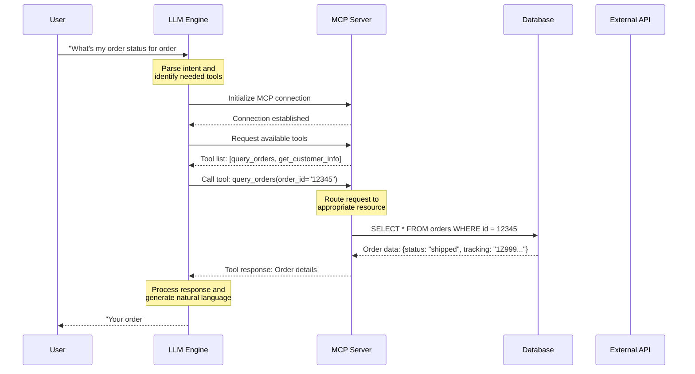

# Basic MCP-LLM Communication Flow

This diagram illustrates the fundamental communication pattern between an LLM and external tools via the Model Context Protocol (MCP).

## Use Case: Simple Database Query Assistant

A customer service AI assistant that can query a customer database to retrieve account information and order history.

## Architecture Diagram

## Key Components

### 1. **User Interface Layer**
- Receives natural language queries
- Displays formatted responses
- Handles authentication and session management

### 2. **LLM Engine**
- Processes natural language understanding
- Determines which tools to invoke
- Generates human-readable responses
- Manages conversation context

### 3. **MCP Server**
- Implements standardized tool discovery
- Handles tool execution and routing
- Manages resource connections
- Provides error handling and logging

### 4. **Resource Layer**
- Databases for persistent data
- External APIs for real-time information
- File systems for document storage
- Third-party services integration

## Communication Flow Details

1. **Request Initiation**: User submits natural language query
2. **Intent Recognition**: LLM analyzes request and identifies required tools
3. **Tool Discovery**: MCP server provides available tool capabilities
4. **Tool Execution**: Specific tools are invoked with parsed parameters
5. **Data Retrieval**: External resources return requested information
6. **Response Generation**: LLM synthesizes natural language response
7. **User Delivery**: Formatted response presented to user

## Implementation Benefits

- **Standardization**: Consistent tool interface across different LLMs
- **Modularity**: Easy addition of new tools and data sources
- **Security**: Centralized access control and audit logging
- **Scalability**: Horizontal scaling of tool servers
- **Maintainability**: Clear separation between AI logic and data access

## Common Variations

- **Cached Responses**: Adding Redis cache layer for frequently accessed data
- **Async Processing**: Non-blocking tool execution for long-running operations
- **Tool Chaining**: Sequential tool calls building on previous results
- **Parallel Execution**: Concurrent tool invocation for independent data sources
