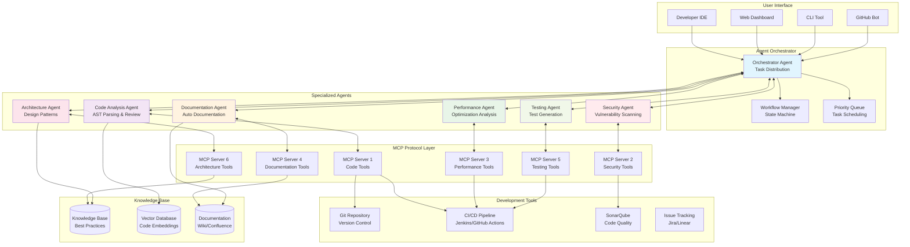
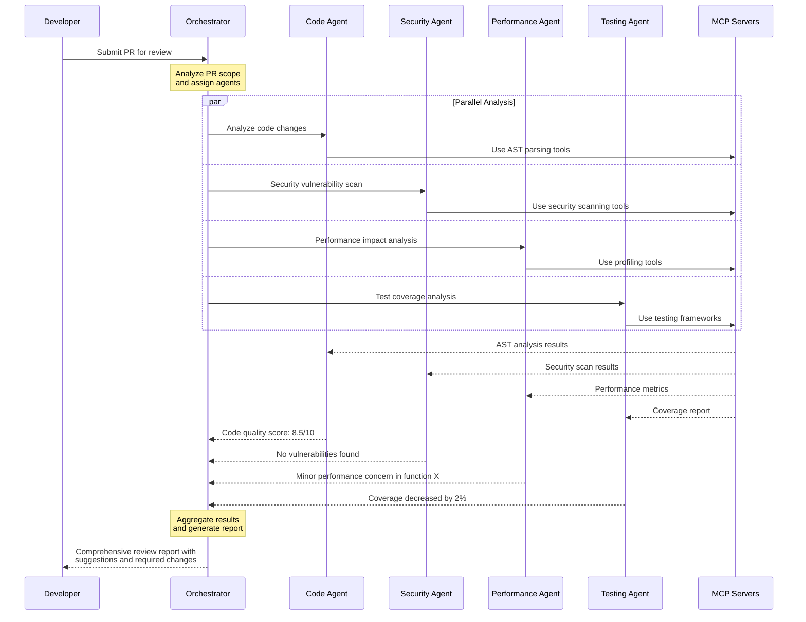
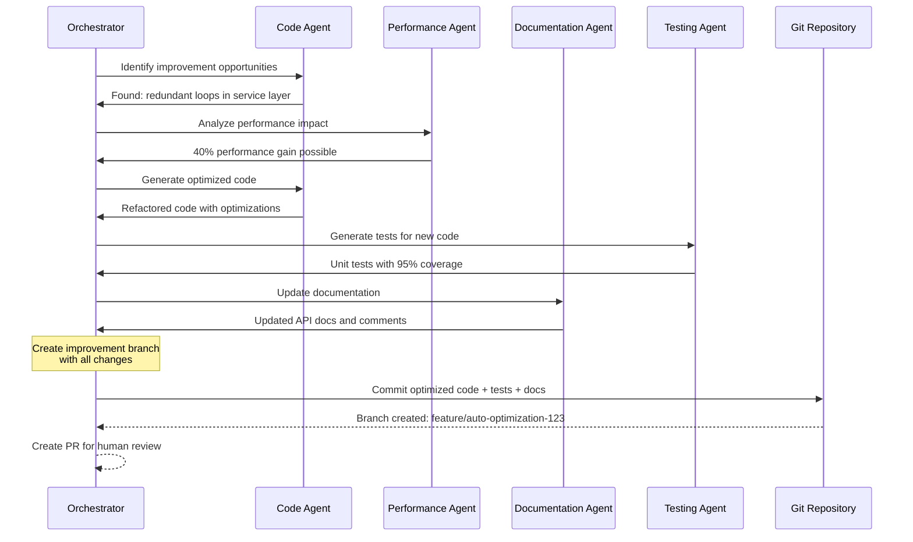
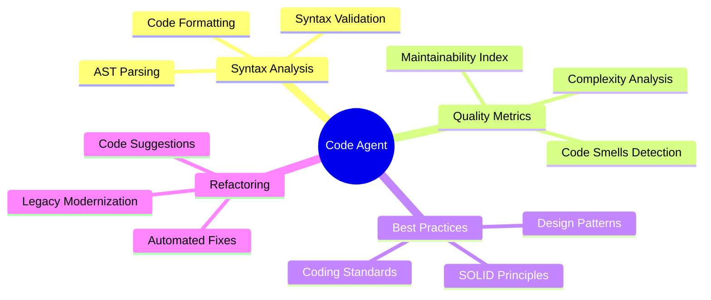
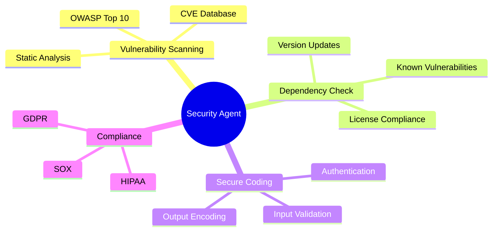
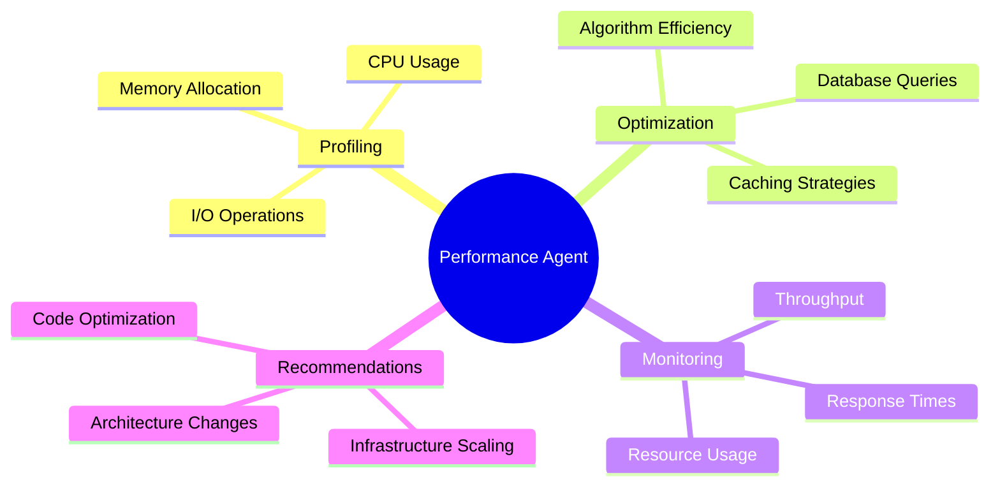
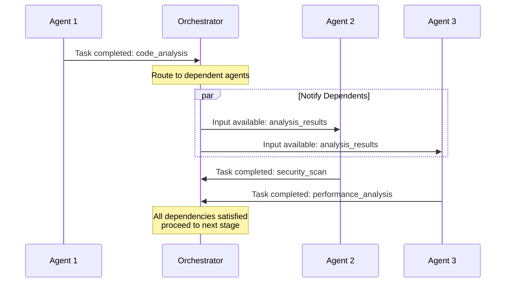
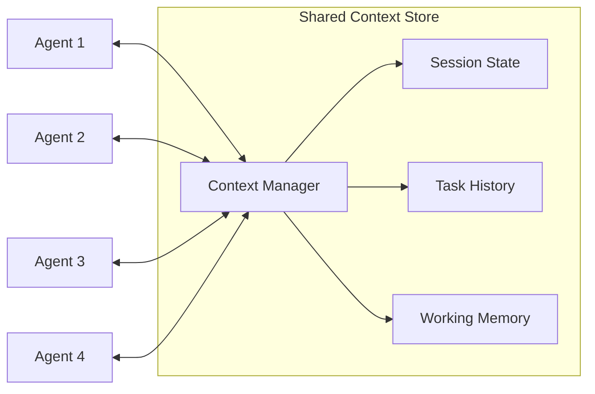

# Multi-Agent System with MCP

This diagram illustrates how multiple AI agents collaborate through MCP to handle complex, multi-domain tasks requiring specialized expertise.

## Use Case: Intelligent Software Development Assistant

A system of specialized AI agents that collaborate to analyze code, review pull requests, suggest improvements, and coordinate development workflows.

## Architecture Diagram

## Agent Collaboration Workflow

### Pull Request Review Process

### Automated Code Improvement Workflow

## Specialized Agent Capabilities

### 1. Code Analysis Agent

### 2. Security Agent

### 3. Performance Agent

## Inter-Agent Communication Patterns

### Message Passing

### Shared Context Management

## Benefits of Multi-Agent Architecture

### Specialization Advantages
- **Domain Expertise**: Each agent focuses on specific technical areas
- **Parallel Processing**: Multiple agents work simultaneously
- **Scalable**: Add new agents without modifying existing ones
- **Maintainable**: Clear separation of responsibilities

### Collaboration Benefits
- **Comprehensive Analysis**: Multiple perspectives on the same code
- **Cross-Domain Insights**: Security implications of performance optimizations
- **Quality Assurance**: Multiple verification layers
- **Knowledge Sharing**: Agents learn from each other's findings

### Implementation Patterns
- **Event-Driven**: Agents respond to code change events
- **Pipeline**: Sequential processing with handoffs
- **Ensemble**: Multiple agents vote on decisions
- **Hierarchical**: Supervisor agents manage worker agents
