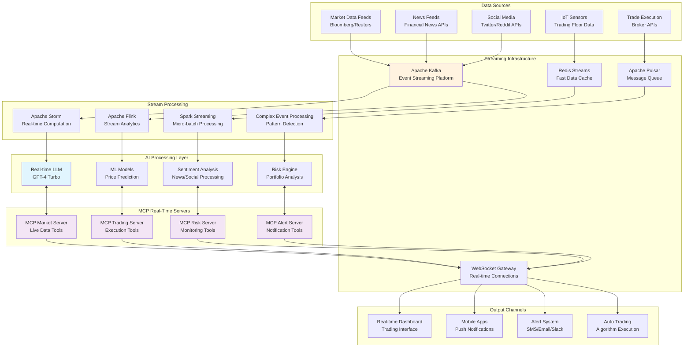
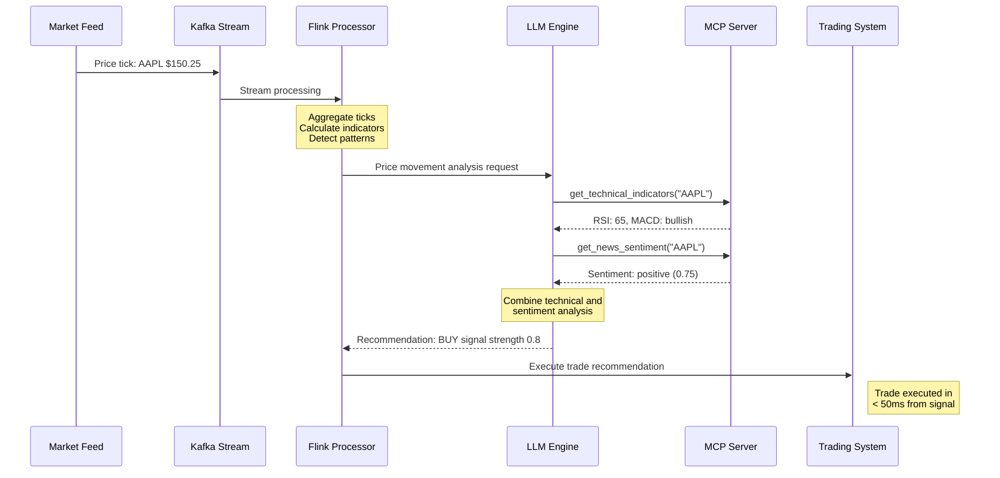
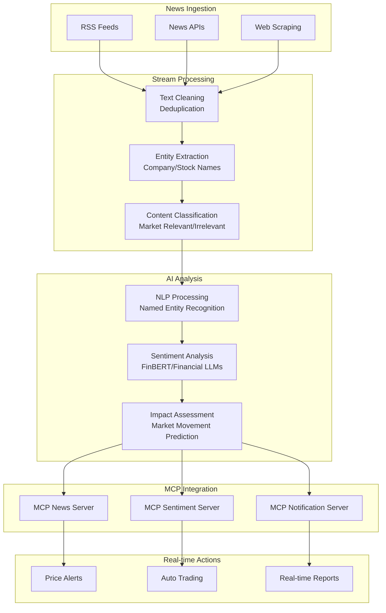
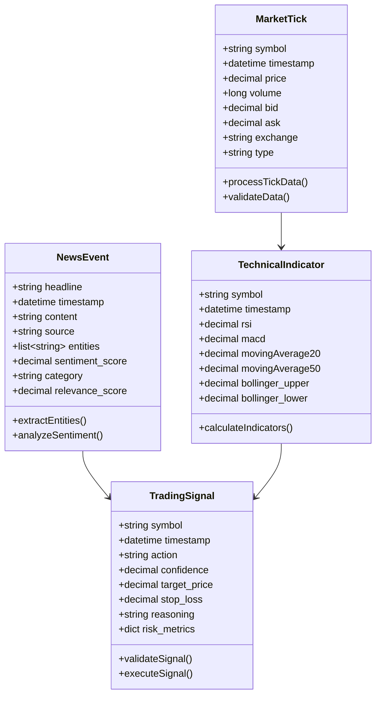
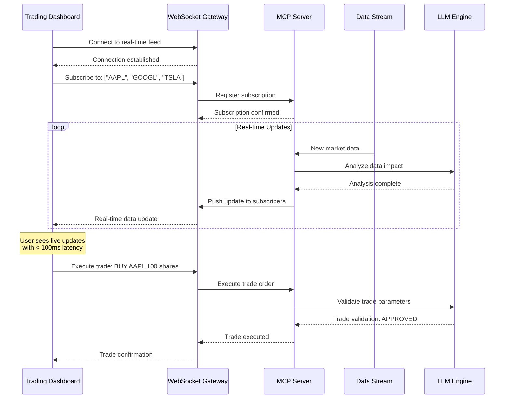
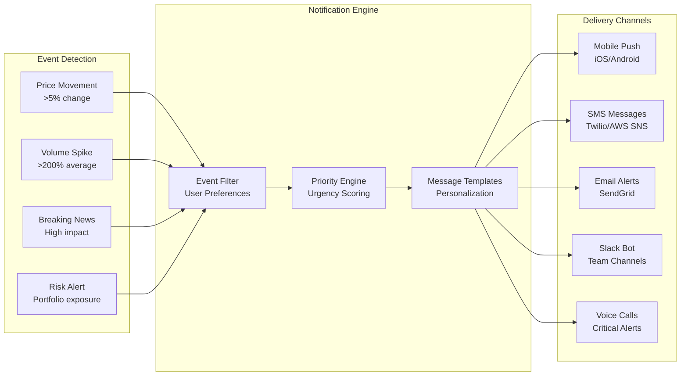
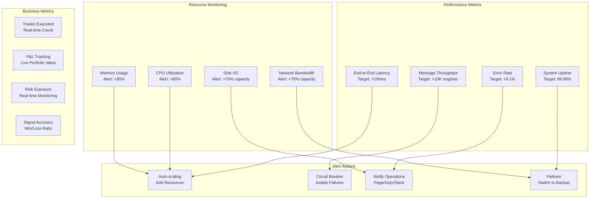

# Real-Time Streaming MCP Architecture

This diagram demonstrates how MCP enables real-time data streaming and processing for AI applications requiring immediate responses to live data feeds.

## Use Case: Real-Time Financial Trading and Risk Management System

An AI-powered trading system that processes live market data, news feeds, and social media sentiment to make real-time trading decisions while continuously monitoring risk exposure.

## Real-Time Architecture Overview



## Real-Time Processing Pipelines

### Market Data Processing Pipeline


### News and Sentiment Processing


## Streaming Data Models

### Market Data Stream Schema


## WebSocket Real-Time Communication

### Client-Server WebSocket Flow


### Push Notification System


## Performance Optimization Strategies

### Latency Optimization
```mermaid
graph TB
    subgraph "Network Optimization"
        CDN[Content Delivery Network<br/>Edge Locations]
        COMPRESS[Data Compression<br/>Message Pack/Gzip]
        BATCH[Micro-batching<br/>Optimal Batch Sizes]
    end
    
    subgraph "Caching Strategy"
        L1[L1 Cache<br/>In-Memory (Redis)]
        L2[L2 Cache<br/>SSD Storage]
        PRECOMP[Pre-computed Results<br/>Popular Queries]
    end
    
    subgraph "Processing Optimization"
        PARALLEL[Parallel Processing<br/>Multi-threading]
        PIPELINE[Pipeline Processing<br/>Overlap I/O and Compute]
        ASYNC[Async Operations<br/>Non-blocking I/O]
    end
    
    subgraph "Infrastructure"
        SSD[SSD Storage<br/>Low Latency I/O]
        NETWORK[High-speed Network<br/>10Gbps+]
        CPU[High-frequency CPUs<br/>Optimized for Latency]
    end
    
    CDN --> L1
    COMPRESS --> L2
    BATCH --> PRECOMP
    
    L1 --> PARALLEL
    L2 --> PIPELINE
    PRECOMP --> ASYNC
    
    PARALLEL --> SSD
    PIPELINE --> NETWORK
    ASYNC --> CPU
```

## Real-Time Monitoring and Alerting

### System Health Dashboard


## Benefits of Real-Time MCP Architecture

### Speed and Responsiveness
- **Sub-100ms Latency**: From market event to trading decision
- **High Throughput**: Process 10,000+ events per second
- **Real-time Analytics**: Live dashboard updates with minimal delay
- **Instant Notifications**: Immediate alerts on critical events

### Reliability and Fault Tolerance
- **Circuit Breakers**: Prevent cascade failures during high load
- **Auto-recovery**: Automatic restart of failed components
- **Data Durability**: No message loss during system failures
- **Graceful Degradation**: Maintain core functionality during outages

### Scalability
- **Horizontal Scaling**: Add processing nodes during high volume
- **Dynamic Resource Allocation**: Scale based on real-time demand
- **Global Distribution**: Process data close to its source
- **Load Balancing**: Distribute load across multiple instances
