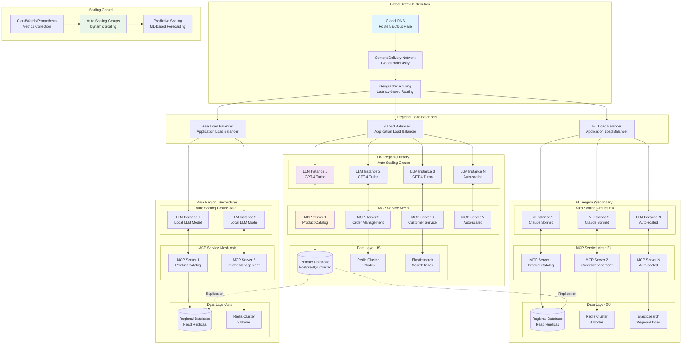
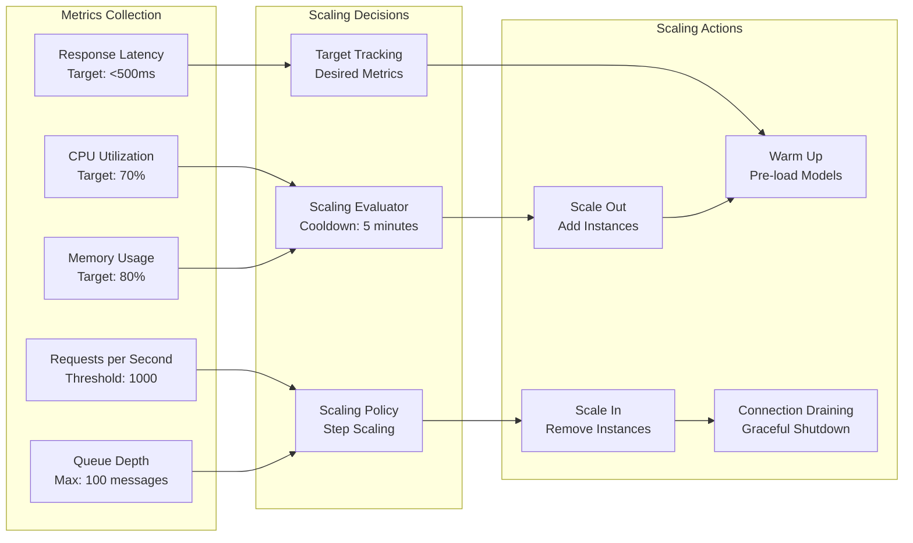
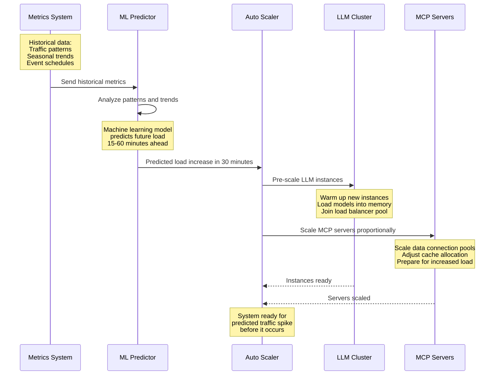
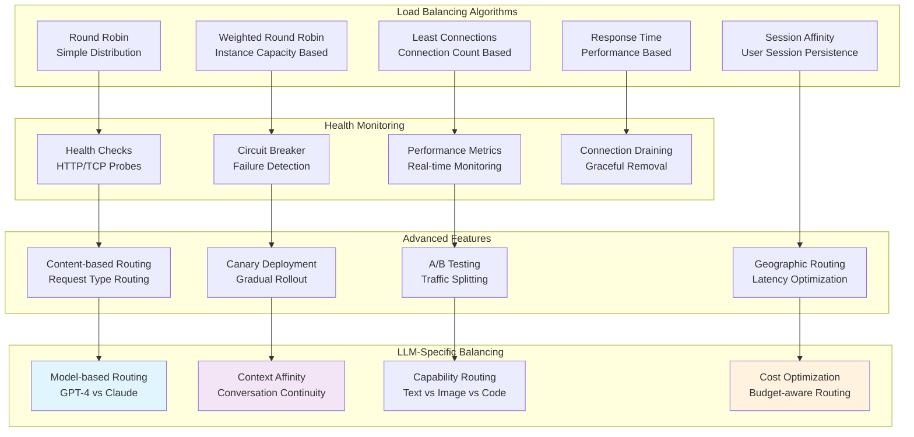
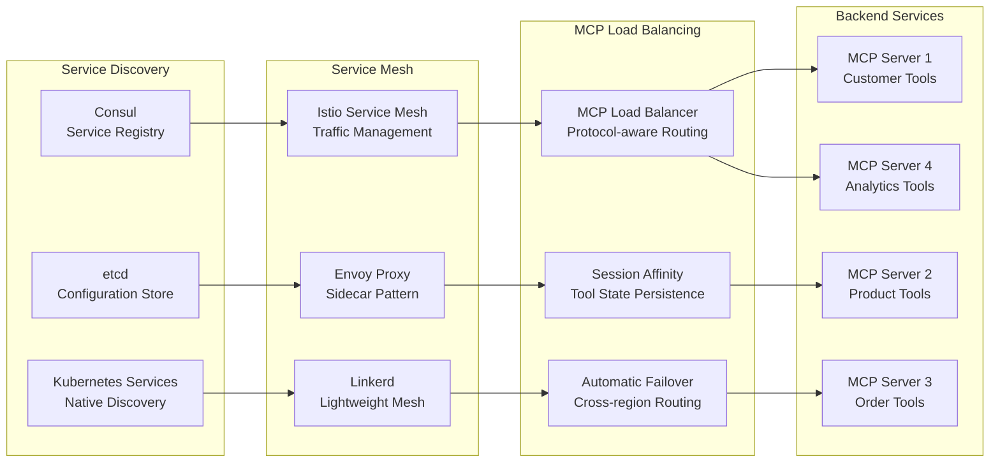
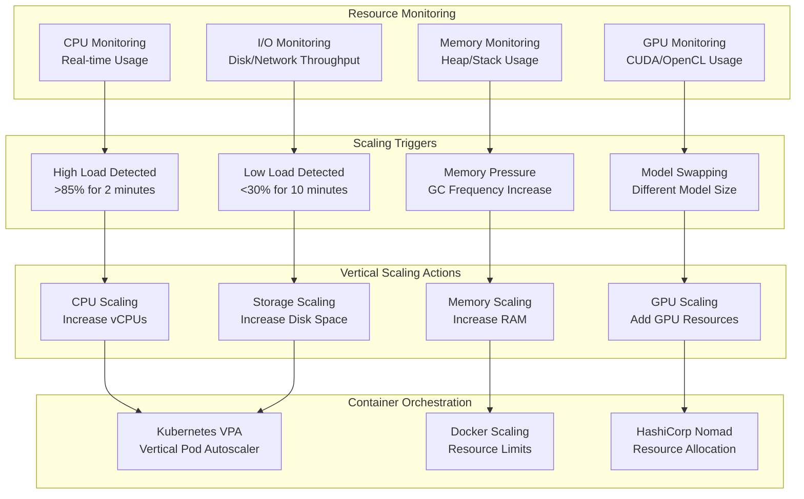
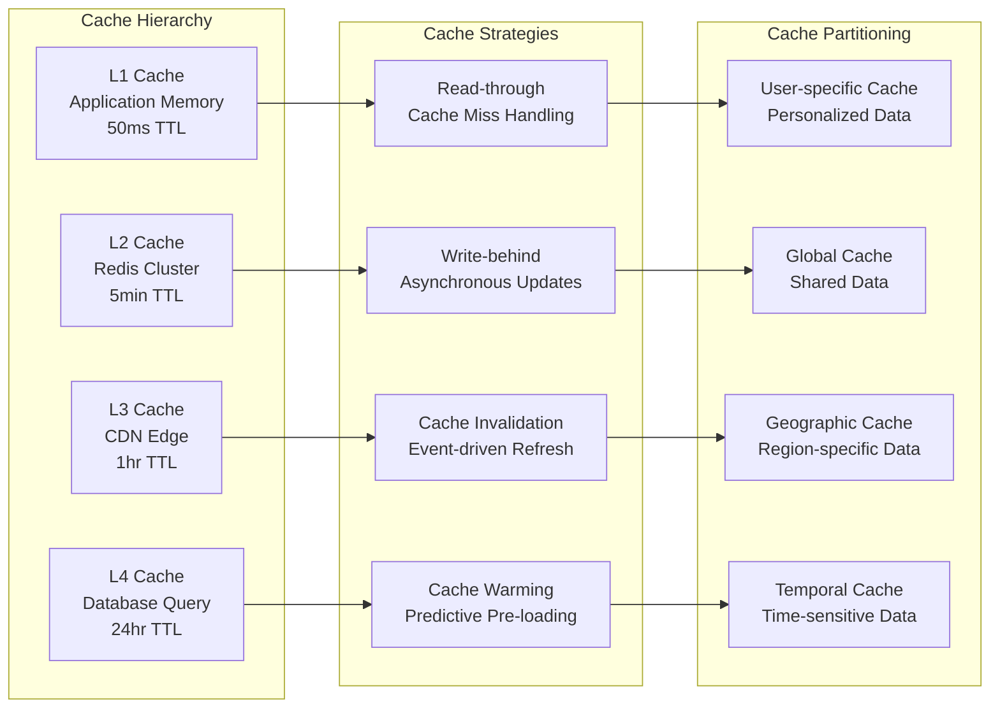
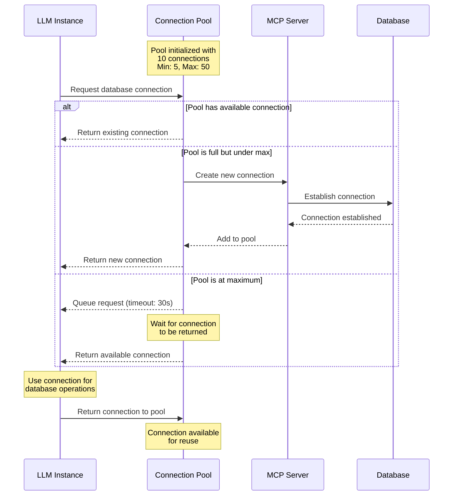
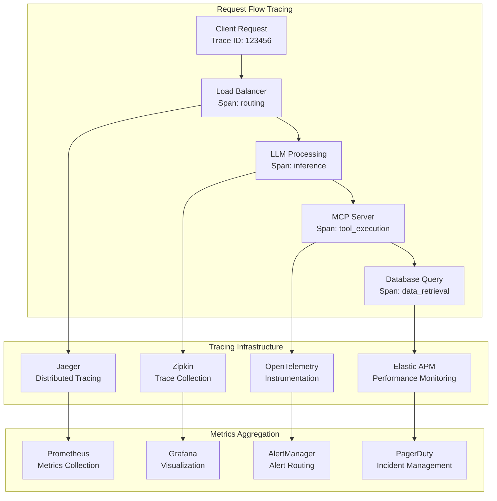

# Scaling and Load Balancing Patterns

This diagram demonstrates how MCP-enabled AI systems scale horizontally and vertically to handle varying loads while maintaining performance and reliability.

## Use Case: Global E-commerce AI Assistant Platform

A worldwide e-commerce platform's AI assistant system that handles millions of customer inquiries, product recommendations, and order processing across multiple regions with varying traffic patterns.

## Horizontal Scaling Architecture

## Auto-Scaling Strategies

### Reactive Auto-Scaling

### Predictive Auto-Scaling

## Load Balancing Strategies

### Intelligent Load Balancing

### MCP Service Mesh Load Balancing

## Vertical Scaling Patterns

### Dynamic Resource Allocation

## Performance Optimization Under Load

### Caching Strategy for Scale

### Connection Pooling and Management

## Monitoring and Observability at Scale

### Distributed Tracing

## Scaling Benefits and Outcomes

### Performance Improvements
- **Linear Scalability**: Performance scales proportionally with resources
- **Global Latency**: <100ms response time worldwide
- **High Throughput**: Handle 100K+ concurrent requests
- **Auto-Recovery**: Automatic healing from instance failures

### Cost Optimization
- **Resource Efficiency**: Pay only for used resources
- **Predictive Scaling**: Reduce over-provisioning by 40%
- **Regional Optimization**: Route traffic to lowest-cost regions
- **Reserved Capacity**: Long-term commitments for base load

### Operational Excellence
- **Zero-Downtime Deployments**: Rolling updates without service interruption
- **Automated Operations**: Self-healing and self-optimizing systems
- **Global Consistency**: Consistent performance across all regions
- **Elastic Capacity**: Handle traffic spikes without manual intervention
