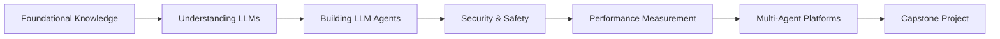

# LLM and Multi-Agent Collaboration Platforms - Learning Path

Welcome to the comprehensive learning module for understanding, building, securing, and measuring **Large Language Model (LLM) agents** and **Multi-Agent Collaboration Platforms (MCP)**. 

This learning path is designed to take you from foundational concepts to advanced implementation and deployment of intelligent agent systems.

## 🎯 Learning Objectives

By the end of this learning path, you will be able to:

- **Understand** the fundamental concepts of LLMs and their applications
- **Build** sophisticated LLM agents with planning and reasoning capabilities
- **Secure** your AI systems against common vulnerabilities and safety concerns
- **Measure** performance and optimize your models and agents
- **Design** multi-agent collaboration platforms for complex problem-solving
- **Deploy** production-ready AI systems with proper monitoring and evaluation

## 🗺️ Learning Path Overview

This learning path is structured into six main phases:

### Phase 1: Foundational Knowledge
Build the mathematical, programming, and AI fundamentals needed for advanced LLM work.

### Phase 2: Understanding LLMs
Deep dive into LLM architecture, training, fine-tuning, and prompt engineering.

### Phase 3: Building LLM Agents
Learn to create autonomous agents with planning, reasoning, and tool integration capabilities.

### Phase 4: Security & Safety
Understand vulnerabilities, safety alignment, and monitoring for responsible AI deployment.

### Phase 5: Performance Measurement
Master evaluation metrics, benchmarking, and optimization techniques.

### Phase 6: Multi-Agent Platforms
Design and implement collaborative multi-agent systems for complex problem-solving.

## ⏱️ Time Commitment

- **Total Duration**: 12-16 weeks
- **Time Investment**: 10-15 hours per week
- **Prerequisites**: Basic programming knowledge (Python preferred)
- **Difficulty Level**: Intermediate to Advanced

## 🎓 Learning Approach

This module combines:

- **Theoretical Foundation**: Research papers, courses, and conceptual understanding
- **Hands-on Practice**: Coding exercises, projects, and experiments
- **Real-world Application**: Industry case studies and practical implementations
- **Community Learning**: Forums, discussions, and peer collaboration

## 🚀 Getting Started

1. **Assess Prerequisites**: Review the [prerequisites](introduction/prerequisites.md) to ensure you're ready
2. **Set Up Environment**: Follow our setup guides for development tools and libraries
3. **Join Communities**: Connect with other learners and practitioners
4. **Plan Your Schedule**: Allocate regular time for both study and hands-on practice

## 📋 Progress Tracking

Use the navigation menu to explore each section. Each page includes:

- ✅ Learning objectives
- 📚 Required reading and resources
- 🛠️ Practical exercises
- 🎯 Assessment criteria
- 📝 Notes and takeaways

## 🤝 Contributing

This learning path is designed to evolve. If you find resources, have suggestions, or want to contribute content, please see our contribution guidelines.

---

**Ready to begin?** Start with the [Introduction](introduction/overview.md) to get oriented, then move through the foundational knowledge before diving into LLM specifics.
