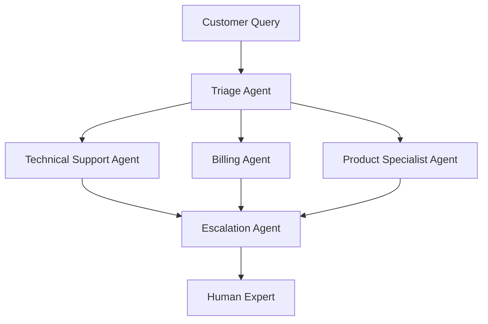
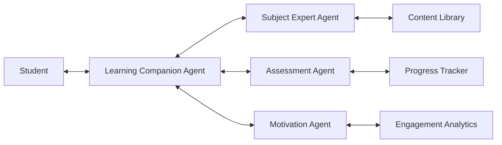

# Real-World Applications of LLM-Powered Multi-Agent Systems

This section explores how LLM-powered multi-agent systems are transforming industries and creating new possibilities for intelligent automation and collaboration.

## 🏢 Enterprise Applications

### Software Development Teams

**Scenario**: Automated software development with specialized agents

**Agent Roles**:
- **Architect Agent**: Designs system architecture and technical specifications
- **Developer Agent**: Writes code in multiple programming languages
- **Reviewer Agent**: Performs code reviews and suggests improvements
- **Tester Agent**: Creates and executes test cases
- **DevOps Agent**: Manages deployment and infrastructure

**Real-World Example**: GitHub Copilot Workspace and similar platforms where agents collaborate on entire software projects.

**Benefits**:
- 24/7 development cycles
- Consistent code quality standards
- Reduced time-to-market
- Knowledge preservation across projects

### Customer Service Orchestration

**Scenario**: Multi-tier customer support with specialized expertise

**Agent Architecture**:

**Use Cases**:
- Complex technical troubleshooting
- Multi-product inquiries
- Escalation management
- Sentiment-based response adaptation

### Financial Services

**Scenario**: Automated financial advisory and risk management

**Agent Specializations**:
- **Risk Assessment Agent**: Analyzes market conditions and portfolio risk
- **Compliance Agent**: Ensures regulatory compliance
- **Strategy Agent**: Develops investment strategies
- **Execution Agent**: Implements trading decisions
- **Reporting Agent**: Generates client reports and insights

**Applications**:
- Personalized investment advice
- Real-time risk monitoring
- Automated compliance checking
- Portfolio rebalancing

## 🔬 Scientific Research

### Drug Discovery Consortium

**Multi-Agent Research Pipeline**:

1. **Literature Review Agent**: Scans scientific databases for relevant research
2. **Molecular Design Agent**: Generates novel compound structures
3. **Simulation Agent**: Performs molecular dynamics simulations
4. **Safety Assessment Agent**: Evaluates toxicity and side effects
5. **Clinical Trial Agent**: Designs optimal trial protocols

**Impact**: Reduced drug discovery timelines from 10-15 years to potentially 5-7 years.

### Climate Modeling Collaboration

**Distributed Climate Analysis**:
- **Data Collection Agents**: Gather environmental data from sensors worldwide
- **Pattern Recognition Agents**: Identify climate trends and anomalies
- **Prediction Agents**: Generate weather and climate forecasts
- **Impact Assessment Agents**: Analyze potential consequences of climate changes
- **Policy Recommendation Agents**: Suggest mitigation strategies

## 🎓 Educational Systems

### Personalized Learning Environment

**Adaptive Educational Agents**:

**Student-Centered Architecture**:

**Agent Functions**:
- **Learning Companion**: Provides personalized guidance and support
- **Subject Experts**: Specialized knowledge in different domains
- **Assessment Agent**: Creates adaptive tests and evaluates progress
- **Motivation Agent**: Maintains engagement and addresses learning obstacles

### Research Assistant Network

**Academic Research Support**:
- **Literature Mining Agent**: Finds relevant papers and extracts key insights
- **Data Analysis Agent**: Performs statistical analysis and visualization
- **Writing Assistant Agent**: Helps structure and improve academic writing
- **Peer Review Agent**: Provides feedback on research quality
- **Grant Writing Agent**: Assists with funding proposals

## 🏥 Healthcare Systems

### Diagnostic Team

**Collaborative Medical Diagnosis**:

**Specialist Agent Network**:
- **Symptom Analysis Agent**: Processes patient symptoms and history
- **Imaging Agent**: Analyzes medical images (X-rays, MRIs, CT scans)
- **Lab Results Agent**: Interprets laboratory test results
- **Differential Diagnosis Agent**: Considers multiple diagnostic possibilities
- **Treatment Planning Agent**: Develops personalized treatment recommendations

**Benefits**:
- Reduced diagnostic errors
- Faster diagnosis times
- Consistent application of medical knowledge
- Support for underserved areas

### Drug Interaction Monitoring

**Pharmacy Safety Network**:
- **Prescription Review Agent**: Checks for drug interactions
- **Dosage Calculation Agent**: Ensures proper dosing
- **Side Effect Monitoring Agent**: Tracks adverse reactions
- **Patient Education Agent**: Provides medication guidance

## 🌆 Smart City Management

### Urban Infrastructure Coordination

**City-Wide Agent Network**:

**Traffic Management**:
- **Traffic Flow Agent**: Optimizes signal timing and routing
- **Emergency Response Agent**: Coordinates first responder routes
- **Public Transit Agent**: Manages bus and rail schedules
- **Parking Management Agent**: Directs drivers to available spaces

**Utility Management**:
- **Energy Grid Agent**: Balances power supply and demand
- **Water System Agent**: Monitors water quality and distribution
- **Waste Management Agent**: Optimizes collection routes
- **Environmental Monitoring Agent**: Tracks air and water quality

## 🎮 Entertainment and Media

### Game Development Studio

**Automated Game Creation**:
- **Game Designer Agent**: Creates game concepts and mechanics
- **Art Generation Agent**: Produces visual assets
- **Narrative Agent**: Develops storylines and dialogue
- **Testing Agent**: Performs gameplay testing and balancing
- **Marketing Agent**: Develops promotional strategies

### Personalized Content Creation

**Media Production Pipeline**:
- **Content Planning Agent**: Identifies trending topics and audience interests
- **Research Agent**: Gathers information and verifies facts
- **Writing Agent**: Creates articles, scripts, or copy
- **Visual Design Agent**: Creates graphics and layouts
- **Distribution Agent**: Optimizes content for different platforms

## 🔧 Manufacturing and Industry

### Smart Factory Management

**Production Optimization Network**:
- **Quality Control Agent**: Monitors product quality in real-time
- **Maintenance Agent**: Predicts equipment failures and schedules maintenance
- **Supply Chain Agent**: Manages inventory and supplier relationships
- **Production Planning Agent**: Optimizes manufacturing schedules
- **Safety Monitoring Agent**: Ensures workplace safety compliance

### Autonomous Vehicle Coordination

**Fleet Management System**:
- **Route Planning Agent**: Optimizes paths for efficiency and safety
- **Vehicle Coordination Agent**: Manages interactions between vehicles
- **Maintenance Scheduling Agent**: Tracks vehicle health and maintenance needs
- **Passenger Experience Agent**: Handles customer service and comfort
- **Emergency Response Agent**: Coordinates responses to accidents or breakdowns

## 💡 Emerging Applications

### Creative Collaboration

**Artistic Creation Teams**:
- **Concept Agent**: Generates creative ideas and themes
- **Style Agent**: Applies artistic styles and aesthetics
- **Critique Agent**: Provides feedback and suggestions for improvement
- **Market Analysis Agent**: Evaluates commercial viability

### Legal Practice Automation

**Law Firm Agent Network**:
- **Case Research Agent**: Finds relevant precedents and statutes
- **Document Review Agent**: Analyzes contracts and legal documents
- **Litigation Strategy Agent**: Develops case strategies
- **Compliance Monitoring Agent**: Ensures regulatory compliance

## 📊 Success Metrics and ROI

### Quantifiable Benefits

**Efficiency Gains**:
- 40-70% reduction in task completion times
- 24/7 operational availability
- Reduced human error rates
- Consistent quality standards

**Cost Savings**:
- Reduced labor costs for routine tasks
- Decreased training and onboarding expenses
- Lower error-related costs
- Improved resource utilization

**Innovation Acceleration**:
- Faster product development cycles
- Enhanced creative collaboration
- Improved decision-making speed
- Better pattern recognition in complex data

## 🚀 Future Directions

### Emerging Trends

**Autonomous Organizations**: Entire businesses operated primarily by agent teams with minimal human oversight.

**Cross-Industry Collaboration**: Agent networks that span multiple industries and organizations for complex problem-solving.

**Human-Agent Hybrid Teams**: Seamless integration of human expertise with agent capabilities.

### Challenges and Considerations

**Ethical Implications**: Ensuring responsible AI deployment and addressing societal impacts.

**Regulatory Compliance**: Navigating evolving regulations and standards for AI systems.

**Technical Challenges**: Scaling, reliability, and maintaining performance as systems grow.

---

**Next Steps**: Review the [Prerequisites](prerequisites.md) to ensure you're prepared for the technical journey ahead, or continue to [Foundational Knowledge](../foundations/ai-ml-fundamentals.md) to begin building your technical foundation.
