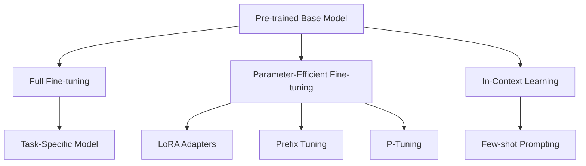

# Fine-tuning & Adaptation: Customizing LLMs for Specific Tasks

Fine-tuning allows you to adapt pre-trained language models for specific domains, tasks, or use cases. This section covers various fine-tuning approaches and their applications in agent systems.

## 🎯 Fine-tuning Fundamentals

### Types of Fine-tuning



**Full Fine-tuning**: Update all model parameters
**Parameter-Efficient**: Update only a subset of parameters
**In-Context Learning**: No parameter updates, only prompting

### When to Fine-tune vs. Prompt Engineering

| Approach | Best For | Pros | Cons |
|----------|----------|------|------|
| **Fine-tuning** | Domain-specific tasks, Consistent performance | Higher accuracy, Specialized behavior | Resource-intensive, Risk of overfitting |
| **Prompt Engineering** | General tasks, Quick iteration | Fast, No training needed | Less consistent, Token limit constraints |
| **RAG** | Knowledge-intensive tasks | Up-to-date info, Factual accuracy | Complex architecture, Retrieval quality dependency |

## 🔧 Parameter-Efficient Fine-tuning (PEFT)

### LoRA (Low-Rank Adaptation)

**LoRA Implementation**:
```python
import numpy as np
from typing import Dict, List, Tuple

class LoRALayer:
    """Low-Rank Adaptation layer for parameter-efficient fine-tuning"""
    
    def __init__(self, 
                 in_features: int, 
                 out_features: int, 
                 rank: int = 16, 
                 alpha: int = 32,
                 dropout: float = 0.1):
        
        self.in_features = in_features
        self.out_features = out_features
        self.rank = rank
        self.alpha = alpha
        self.dropout = dropout
        self.scaling = alpha / rank
        
        # LoRA matrices: W = W_0 + (B @ A) * scaling
        # A: (in_features, rank), B: (rank, out_features)
        self.lora_A = np.random.randn(in_features, rank) * 0.01
        self.lora_B = np.zeros((rank, out_features))
        
        # Store original frozen weights (would be loaded from pre-trained model)
        self.original_weight = np.random.randn(in_features, out_features) * 0.02
        self.frozen = True
    
    def forward(self, x: np.ndarray) -> np.ndarray:
        """Forward pass with LoRA adaptation"""
        # Original computation (frozen)
        original_output = x @ self.original_weight
        
        # LoRA adaptation
        if not self.frozen:
            lora_output = (x @ self.lora_A) @ self.lora_B * self.scaling
            return original_output + lora_output
        
        return original_output
    
    def get_merged_weight(self) -> np.ndarray:
        """Get the merged weight matrix (original + LoRA adaptation)"""
        return self.original_weight + (self.lora_A @ self.lora_B) * self.scaling
    
    def get_trainable_parameters(self) -> Dict[str, np.ndarray]:
        """Return only the trainable LoRA parameters"""
        return {
            'lora_A': self.lora_A,
            'lora_B': self.lora_B
        }
    
    def update_parameters(self, gradients: Dict[str, np.ndarray], learning_rate: float):
        """Update LoRA parameters"""
        if 'lora_A' in gradients:
            self.lora_A -= learning_rate * gradients['lora_A']
        if 'lora_B' in gradients:
            self.lora_B -= learning_rate * gradients['lora_B']

class LoRATransformerBlock:
    """Transformer block with LoRA adaptations"""
    
    def __init__(self, d_model: int, rank: int = 16):
        self.d_model = d_model
        
        # Add LoRA to attention projections
        self.q_lora = LoRALayer(d_model, d_model, rank)
        self.k_lora = LoRALayer(d_model, d_model, rank)
        self.v_lora = LoRALayer(d_model, d_model, rank)
        self.o_lora = LoRALayer(d_model, d_model, rank)
        
        # Add LoRA to feed-forward layers
        self.ff1_lora = LoRALayer(d_model, d_model * 4, rank)
        self.ff2_lora = LoRALayer(d_model * 4, d_model, rank)
        
        self.lora_layers = [
            self.q_lora, self.k_lora, self.v_lora, self.o_lora,
            self.ff1_lora, self.ff2_lora
        ]
    
    def enable_training(self):
        """Enable LoRA training mode"""
        for layer in self.lora_layers:
            layer.frozen = False
    
    def get_trainable_parameters(self) -> Dict[str, np.ndarray]:
        """Get all trainable LoRA parameters"""
        params = {}
        for i, layer in enumerate(self.lora_layers):
            layer_params = layer.get_trainable_parameters()
            for param_name, param_value in layer_params.items():
                params[f'layer_{i}_{param_name}'] = param_value
        return params
    
    def calculate_parameter_efficiency(self, original_model_params: int) -> Dict[str, float]:
        """Calculate parameter efficiency metrics"""
        trainable_params = sum(
            param.size for param in self.get_trainable_parameters().values()
        )
        
        efficiency = {
            'original_params': original_model_params,
            'trainable_params': trainable_params,
            'efficiency_ratio': trainable_params / original_model_params,
            'reduction_factor': original_model_params / trainable_params,
            'trainable_percentage': (trainable_params / original_model_params) * 100
        }
        
        return efficiency

# Example LoRA usage
lora_block = LoRATransformerBlock(d_model=768, rank=16)
lora_block.enable_training()

# Calculate efficiency
original_params = 12 * 768 * 768  # Simplified transformer block parameter count
efficiency_stats = lora_block.calculate_parameter_efficiency(original_params)

print("LoRA Parameter Efficiency:")
for key, value in efficiency_stats.items():
    if 'percentage' in key or 'ratio' in key:
        print(f"{key}: {value:.2f}%")
    else:
        print(f"{key}: {value:,}")
```

### Other PEFT Methods

**Prefix Tuning**:
```python
class PrefixTuning:
    """Prefix tuning for parameter-efficient adaptation"""
    
    def __init__(self, d_model: int, prefix_length: int = 10, num_layers: int = 12):
        self.d_model = d_model
        self.prefix_length = prefix_length
        self.num_layers = num_layers
        
        # Learnable prefix parameters for each layer
        # Shape: (num_layers, prefix_length, d_model)
        self.prefix_embeddings = np.random.randn(num_layers, prefix_length, d_model) * 0.01
        
        # MLP for reparameterization (optional)
        self.prefix_mlp_hidden = d_model * 2
        self.prefix_mlp = {
            'W1': np.random.randn(d_model, self.prefix_mlp_hidden) * 0.01,
            'b1': np.zeros(self.prefix_mlp_hidden),
            'W2': np.random.randn(self.prefix_mlp_hidden, d_model) * 0.01,
            'b2': np.zeros(d_model)
        }
    
    def get_prefix_embeddings(self, layer_idx: int, batch_size: int) -> np.ndarray:
        """Get prefix embeddings for a specific layer"""
        # Get base embeddings for this layer
        layer_prefix = self.prefix_embeddings[layer_idx]  # (prefix_length, d_model)
        
        # Expand for batch
        batch_prefix = np.expand_dims(layer_prefix, 0)  # (1, prefix_length, d_model)
        batch_prefix = np.repeat(batch_prefix, batch_size, axis=0)  # (batch_size, prefix_length, d_model)
        
        return batch_prefix
    
    def apply_prefix_to_attention(self, 
                                  query: np.ndarray, 
                                  key: np.ndarray, 
                                  value: np.ndarray,
                                  layer_idx: int) -> Tuple[np.ndarray, np.ndarray, np.ndarray]:
        """Apply prefix to attention computation"""
        batch_size, seq_len, d_model = query.shape
        
        # Get prefix embeddings for this layer
        prefix_emb = self.get_prefix_embeddings(layer_idx, batch_size)
        
        # Prepend prefix to keys and values
        key_with_prefix = np.concatenate([prefix_emb, key], axis=1)
        value_with_prefix = np.concatenate([prefix_emb, value], axis=1)
        
        # Query stays the same (attends to both prefix and original sequence)
        return query, key_with_prefix, value_with_prefix
    
    def get_trainable_parameters(self) -> Dict[str, np.ndarray]:
        """Return trainable prefix parameters"""
        return {
            'prefix_embeddings': self.prefix_embeddings,
            'mlp_W1': self.prefix_mlp['W1'],
            'mlp_b1': self.prefix_mlp['b1'],
            'mlp_W2': self.prefix_mlp['W2'],
            'mlp_b2': self.prefix_mlp['b2']
        }

class AdapterLayers:
    """Adapter layers for parameter-efficient fine-tuning"""
    
    def __init__(self, d_model: int, bottleneck_size: int = 64):
        self.d_model = d_model
        self.bottleneck_size = bottleneck_size
        
        # Down-projection
        self.down_proj = np.random.randn(d_model, bottleneck_size) * 0.01
        self.down_bias = np.zeros(bottleneck_size)
        
        # Up-projection  
        self.up_proj = np.random.randn(bottleneck_size, d_model) * 0.01
        self.up_bias = np.zeros(d_model)
    
    def forward(self, x: np.ndarray) -> np.ndarray:
        """Forward pass through adapter"""
        # Down-projection with activation
        down = np.maximum(0, x @ self.down_proj + self.down_bias)  # ReLU
        
        # Up-projection
        up = down @ self.up_proj + self.up_bias
        
        # Residual connection
        return x + up
    
    def get_parameter_count(self) -> int:
        """Calculate number of parameters in adapter"""
        return (self.d_model * self.bottleneck_size + self.bottleneck_size + 
                self.bottleneck_size * self.d_model + self.d_model)

# Compare PEFT methods
def compare_peft_methods(d_model: int = 768, original_params: int = 100_000_000):
    """Compare parameter efficiency of different PEFT methods"""
    
    methods = {}
    
    # LoRA
    lora_params = 2 * d_model * 16 * 6  # 6 matrices (Q,K,V,O,FF1,FF2) with rank 16
    methods['LoRA (r=16)'] = lora_params
    
    # Prefix Tuning
    prefix_params = 12 * 10 * d_model  # 12 layers, 10 prefix tokens
    methods['Prefix Tuning'] = prefix_params
    
    # Adapters
    adapter_params = 12 * (2 * d_model * 64 + 64 + d_model)  # 12 layers, bottleneck 64
    methods['Adapters'] = adapter_params
    
    # P-Tuning v2 (similar to prefix)
    p_tuning_params = 12 * 20 * d_model  # 12 layers, 20 prompt tokens
    methods['P-Tuning v2'] = p_tuning_params
    
    print("PEFT Method Comparison:")
    print(f"Original Model Parameters: {original_params:,}")
    print("-" * 50)
    
    for method, params in sorted(methods.items(), key=lambda x: x[1]):
        efficiency = (params / original_params) * 100
        print(f"{method:20}: {params:>8,} params ({efficiency:.3f}%)")

compare_peft_methods()
```

## 📚 Domain-Specific Fine-tuning

### Medical Domain Example

**Medical Text Classification**:
```python
class MedicalDomainFineTuner:
    """Fine-tune models for medical domain tasks"""
    
    def __init__(self, base_model_name: str = "biobert-base"):
        self.base_model = base_model_name
        self.medical_vocabulary = self.load_medical_vocabulary()
        self.training_config = {
            'learning_rate': 2e-5,
            'batch_size': 16,
            'max_epochs': 5,
            'warmup_steps': 500
        }
    
    def load_medical_vocabulary(self) -> Dict[str, str]:
        """Load medical terminology and definitions"""
        return {
            'myocardial infarction': 'heart attack',
            'hypertension': 'high blood pressure', 
            'pneumonia': 'lung infection',
            'diabetes mellitus': 'diabetes',
            'cerebrovascular accident': 'stroke'
        }
    
    def create_medical_training_data(self) -> List[Dict[str, str]]:
        """Create training examples for medical tasks"""
        examples = []
        
        # Clinical note classification
        examples.extend([
            {
                'text': 'Patient presents with chest pain, elevated troponins, and ST elevation on ECG.',
                'label': 'myocardial_infarction',
                'task': 'diagnosis_classification'
            },
            {
                'text': 'Blood pressure reading of 180/110 mmHg, patient reports headaches.',
                'label': 'hypertension',
                'task': 'diagnosis_classification'
            },
            {
                'text': 'Fever, productive cough, and infiltrates visible on chest X-ray.',
                'label': 'pneumonia',
                'task': 'diagnosis_classification'
            }
        ])
        
        # Medical Q&A
        examples.extend([
            {
                'question': 'What are the symptoms of myocardial infarction?',
                'answer': 'Common symptoms include chest pain, shortness of breath, nausea, sweating, and pain radiating to the arm or jaw.',
                'task': 'medical_qa'
            },
            {
                'question': 'How is hypertension diagnosed?',
                'answer': 'Hypertension is diagnosed when blood pressure consistently measures 130/80 mmHg or higher on multiple occasions.',
                'task': 'medical_qa'
            }
        ])
        
        # Drug information
        examples.extend([
            {
                'drug': 'Aspirin',
                'indication': 'Used for cardiovascular protection and pain relief.',
                'dosage': 'Typically 81mg daily for cardiovascular protection.',
                'contraindications': 'Bleeding disorders, severe liver disease.',
                'task': 'drug_information'
            }
        ])
        
        return examples
    
    def create_task_specific_prompts(self, task_type: str) -> str:
        """Create prompts for different medical tasks"""
        prompts = {
            'diagnosis_classification': """
                You are a medical AI assistant trained to help with clinical diagnosis classification.
                
                Given a clinical note, classify the most likely primary diagnosis from the following categories:
                - myocardial_infarction
                - hypertension  
                - pneumonia
                - diabetes
                - other
                
                Clinical Note: {text}
                
                Primary Diagnosis:""",
                
            'medical_qa': """
                You are a medical AI assistant providing accurate, evidence-based answers to medical questions.
                
                Please provide a clear, accurate answer to the following medical question:
                
                Question: {question}
                
                Answer:""",
                
            'drug_information': """
                You are a pharmaceutical AI assistant providing drug information.
                
                Provide comprehensive information about the following medication:
                
                Drug: {drug}
                
                Please include:
                1. Primary indications
                2. Typical dosage
                3. Major contraindications
                4. Common side effects
                
                Information:"""
        }
        
        return prompts.get(task_type, "")
    
    def evaluate_medical_model(self, model_outputs: List[str], ground_truth: List[str]) -> Dict[str, float]:
        """Evaluate model performance on medical tasks"""
        metrics = {}
        
        # Accuracy for classification tasks
        if all(isinstance(gt, str) and gt in ['myocardial_infarction', 'hypertension', 'pneumonia'] 
               for gt in ground_truth):
            
            correct = sum(1 for pred, gt in zip(model_outputs, ground_truth) 
                         if pred.strip().lower() == gt.lower())
            
            metrics['accuracy'] = correct / len(ground_truth)
        
        # Medical terminology usage (simplified check)
        medical_terms_used = 0
        for output in model_outputs:
            output_lower = output.lower()
            for term in self.medical_vocabulary.keys():
                if term.lower() in output_lower:
                    medical_terms_used += 1
                    break
        
        metrics['medical_terminology_usage'] = medical_terms_used / len(model_outputs)
        
        # Average response length (medical responses should be detailed)
        avg_length = sum(len(output.split()) for output in model_outputs) / len(model_outputs)
        metrics['avg_response_length'] = avg_length
        
        return metrics
    
    def safety_check(self, model_output: str) -> Dict[str, bool]:
        """Check medical model outputs for safety issues"""
        safety_flags = {
            'contains_disclaimer': any(phrase in model_output.lower() for phrase in [
                'consult', 'doctor', 'physician', 'medical professional', 'not medical advice'
            ]),
            'avoids_definitive_diagnosis': not any(phrase in model_output.lower() for phrase in [
                'you have', 'you definitely', 'certainly', 'absolutely'
            ]),
            'appropriate_uncertainty': any(phrase in model_output.lower() for phrase in [
                'may', 'might', 'could', 'possibly', 'likely'
            ])
        }
        
        return safety_flags

# Example medical fine-tuning
medical_tuner = MedicalDomainFineTuner()
medical_data = medical_tuner.create_medical_training_data()

print("Medical Training Data Examples:")
for example in medical_data[:3]:
    print(f"Task: {example['task']}")
    if 'text' in example:
        print(f"Text: {example['text']}")
        print(f"Label: {example['label']}")
    elif 'question' in example:
        print(f"Question: {example['question']}")
        print(f"Answer: {example['answer']}")
    print("-" * 40)

# Test safety checking
test_output = "Based on the symptoms described, this could possibly indicate a myocardial infarction. However, you should consult with a physician for proper diagnosis."
safety_results = medical_tuner.safety_check(test_output)
print("Safety Check Results:", safety_results)
```

### Code Generation Fine-tuning

**Programming Domain Adaptation**:
```python
class CodeGenerationFineTuner:
    """Fine-tune models for code generation tasks"""
    
    def __init__(self):
        self.programming_languages = ['python', 'javascript', 'java', 'cpp', 'go']
        self.code_patterns = self.load_code_patterns()
        
    def load_code_patterns(self) -> Dict[str, List[str]]:
        """Load common code patterns for different tasks"""
        return {
            'function_definition': {
                'python': ['def {name}({params}):', 'return {result}'],
                'javascript': ['function {name}({params}) {', 'return {result};', '}'],
                'java': ['public {return_type} {name}({params}) {', 'return {result};', '}']
            },
            'class_definition': {
                'python': ['class {name}:', '__init__(self, {params}):', 'self.{attr} = {value}'],
                'javascript': ['class {name} {', 'constructor({params}) {', 'this.{attr} = {value};', '}'],
                'java': ['public class {name} {', 'public {name}({params}) {', 'this.{attr} = {value};', '}']
            }
        }
    
    def create_code_training_data(self) -> List[Dict[str, str]]:
        """Create training data for code generation"""
        examples = []
        
        # Function generation examples
        examples.extend([
            {
                'instruction': 'Write a Python function to calculate the factorial of a number',
                'input': 'n: integer',
                'output': '''def factorial(n):
    if n == 0 or n == 1:
        return 1
    return n * factorial(n - 1)''',
                'language': 'python',
                'task': 'function_generation'
            },
            {
                'instruction': 'Create a JavaScript function to reverse a string',
                'input': 'str: string',
                'output': '''function reverseString(str) {
    return str.split('').reverse().join('');
}''',
                'language': 'javascript',
                'task': 'function_generation'
            }
        ])
        
        # Code explanation examples
        examples.extend([
            {
                'instruction': 'Explain what this Python code does',
                'input': '''def binary_search(arr, target):
    left, right = 0, len(arr) - 1
    while left <= right:
        mid = (left + right) // 2
        if arr[mid] == target:
            return mid
        elif arr[mid] < target:
            left = mid + 1
        else:
            right = mid - 1
    return -1''',
                'output': 'This function implements binary search algorithm to find the index of a target value in a sorted array. It uses two pointers (left and right) to narrow down the search space by comparing the middle element with the target.',
                'language': 'python',
                'task': 'code_explanation'
            }
        ])
        
        # Bug fixing examples
        examples.extend([
            {
                'instruction': 'Fix the bug in this Python code',
                'input': '''def divide_numbers(a, b):
    return a / b  # Bug: No check for division by zero''',
                'output': '''def divide_numbers(a, b):
    if b == 0:
        raise ValueError("Cannot divide by zero")
    return a / b''',
                'language': 'python',
                'task': 'bug_fixing'
            }
        ])
        
        return examples
    
    def create_code_prompts(self, task_type: str) -> str:
        """Create task-specific prompts for code generation"""
        prompts = {
            'function_generation': '''
You are an expert programmer. Generate clean, efficient, and well-documented code.

Task: {instruction}
Input specification: {input}
Programming language: {language}

Requirements:
- Write clean, readable code
- Include proper error handling
- Add comments for complex logic
- Follow language best practices

Code:''',
            
            'code_explanation': '''
You are a coding instructor. Explain code clearly and concisely.

Please explain what the following {language} code does:

```{language}
{input}
```

Explanation:''',
            
            'bug_fixing': '''
You are a senior developer reviewing code for bugs.

The following {language} code has a bug. Please identify and fix it:

```{language}
{input}
```

Fixed code:''',
            
            'code_optimization': '''
You are a performance optimization expert.

Optimize the following {language} code for better performance:

```{language}
{input}
```

Optimized code:'''
        }
        
        return prompts.get(task_type, "")
    
    def evaluate_code_generation(self, generated_code: str, language: str) -> Dict[str, float]:
        """Evaluate generated code quality"""
        metrics = {}
        
        # Syntax check (simplified)
        syntax_indicators = {
            'python': ['def ', 'class ', 'import ', 'if ', 'for ', 'while '],
            'javascript': ['function ', 'class ', 'const ', 'let ', 'if (', 'for ('],
            'java': ['public ', 'private ', 'class ', 'if (', 'for (', 'while (']
        }
        
        if language in syntax_indicators:
            syntax_score = sum(1 for indicator in syntax_indicators[language] 
                             if indicator in generated_code) / len(syntax_indicators[language])
            metrics['syntax_coverage'] = syntax_score
        
        # Code structure metrics
        lines = generated_code.split('\n')
        metrics['lines_of_code'] = len([line for line in lines if line.strip()])
        metrics['comment_ratio'] = len([line for line in lines if line.strip().startswith('#')]) / len(lines)
        
        # Complexity indicators (simplified)
        complexity_keywords = ['if', 'for', 'while', 'try', 'except', 'switch', 'case']
        complexity_count = sum(1 for keyword in complexity_keywords 
                              if keyword in generated_code.lower())
        metrics['complexity_score'] = complexity_count
        
        return metrics
    
    def code_safety_check(self, generated_code: str, language: str) -> Dict[str, bool]:
        """Check generated code for potential safety issues"""
        safety_flags = {
            'has_input_validation': any(check in generated_code.lower() for check in [
                'if not', 'assert', 'raise', 'throw', 'check'
            ]),
            'avoids_dangerous_functions': not any(func in generated_code.lower() for func in [
                'eval(', 'exec(', 'system(', '__import__', 'getattr('
            ]),
            'has_error_handling': any(handler in generated_code.lower() for handler in [
                'try:', 'except:', 'catch', 'finally:', 'throw', 'error'
            ])
        }
        
        # Language-specific checks
        if language == 'python':
            safety_flags['no_sql_injection'] = 'execute(' not in generated_code.lower()
        elif language == 'javascript':
            safety_flags['no_xss_risk'] = 'innerHTML' not in generated_code
        
        return safety_flags

# Example code fine-tuning
code_tuner = CodeGenerationFineTuner()
code_data = code_tuner.create_code_training_data()

print("Code Generation Training Examples:")
for example in code_data[:2]:
    print(f"Task: {example['task']}")
    print(f"Language: {example['language']}")
    print(f"Instruction: {example['instruction']}")
    print(f"Output:\n{example['output']}")
    print("-" * 50)

# Test code evaluation
test_code = '''def fibonacci(n):
    if n <= 1:
        return n
    return fibonacci(n-1) + fibonacci(n-2)'''

code_metrics = code_tuner.evaluate_code_generation(test_code, 'python')
safety_check = code_tuner.code_safety_check(test_code, 'python')

print("Code Evaluation Metrics:", code_metrics)
print("Safety Check:", safety_check)
```

## 🔍 Fine-tuning Evaluation and Monitoring

### Comprehensive Evaluation Framework

**Multi-Metric Evaluation**:
```python
class FineTuningEvaluator:
    """Comprehensive evaluation framework for fine-tuned models"""
    
    def __init__(self):
        self.evaluation_metrics = {
            'accuracy': self.calculate_accuracy,
            'perplexity': self.calculate_perplexity,
            'bleu_score': self.calculate_bleu,
            'rouge_score': self.calculate_rouge,
            'semantic_similarity': self.calculate_semantic_similarity,
            'task_specific': self.calculate_task_specific_metrics
        }
        
        self.catastrophic_forgetting_tests = []
    
    def calculate_accuracy(self, predictions: List[str], ground_truth: List[str]) -> float:
        """Calculate classification accuracy"""
        if len(predictions) != len(ground_truth):
            return 0.0
        
        correct = sum(1 for pred, gt in zip(predictions, ground_truth) 
                     if pred.strip().lower() == gt.strip().lower())
        
        return correct / len(predictions)
    
    def calculate_perplexity(self, model_probs: List[List[float]]) -> float:
        """Calculate perplexity from model probabilities"""
        total_log_prob = 0.0
        total_tokens = 0
        
        for token_probs in model_probs:
            for prob in token_probs:
                if prob > 0:
                    total_log_prob += np.log(prob)
                    total_tokens += 1
        
        if total_tokens == 0:
            return float('inf')
        
        avg_log_prob = total_log_prob / total_tokens
        perplexity = np.exp(-avg_log_prob)
        
        return perplexity
    
    def calculate_bleu(self, predictions: List[str], references: List[str]) -> float:
        """Calculate BLEU score for text generation"""
        from collections import Counter
        
        def get_ngrams(text: str, n: int) -> List[str]:
            tokens = text.split()
            return [' '.join(tokens[i:i+n]) for i in range(len(tokens)-n+1)]
        
        total_score = 0.0
        
        for pred, ref in zip(predictions, references):
            pred_tokens = pred.split()
            ref_tokens = ref.split()
            
            # Calculate precision for n-grams (n=1 to 4)
            precisions = []
            
            for n in range(1, 5):
                pred_ngrams = get_ngrams(pred, n)
                ref_ngrams = get_ngrams(ref, n)
                
                if not pred_ngrams:
                    precisions.append(0.0)
                    continue
                
                pred_counter = Counter(pred_ngrams)
                ref_counter = Counter(ref_ngrams)
                
                overlap = sum((pred_counter & ref_counter).values())
                precision = overlap / len(pred_ngrams)
                precisions.append(precision)
            
            # Geometric mean of precisions
            if all(p > 0 for p in precisions):
                bleu = np.exp(np.mean(np.log(precisions)))
                
                # Brevity penalty
                bp = min(1.0, np.exp(1 - len(ref_tokens) / len(pred_tokens))) if len(pred_tokens) > 0 else 0
                bleu *= bp
            else:
                bleu = 0.0
            
            total_score += bleu
        
        return total_score / len(predictions) if predictions else 0.0
    
    def calculate_rouge(self, predictions: List[str], references: List[str]) -> Dict[str, float]:
        """Calculate ROUGE scores"""
        from collections import Counter
        
        def rouge_n(pred: str, ref: str, n: int) -> float:
            pred_grams = [' '.join(pred.split()[i:i+n]) for i in range(len(pred.split())-n+1)]
            ref_grams = [' '.join(ref.split()[i:i+n]) for i in range(len(ref.split())-n+1)]
            
            if not ref_grams:
                return 0.0
            
            overlap = len(set(pred_grams) & set(ref_grams))
            return overlap / len(ref_grams)
        
        rouge_scores = {'rouge_1': 0.0, 'rouge_2': 0.0, 'rouge_l': 0.0}
        
        for pred, ref in zip(predictions, references):
            rouge_scores['rouge_1'] += rouge_n(pred, ref, 1)
            rouge_scores['rouge_2'] += rouge_n(pred, ref, 2)
            
            # ROUGE-L (longest common subsequence)
            pred_words = pred.split()
            ref_words = ref.split()
            
            # Simplified LCS calculation
            lcs_length = 0
            i = j = 0
            while i < len(pred_words) and j < len(ref_words):
                if pred_words[i] == ref_words[j]:
                    lcs_length += 1
                    i += 1
                j += 1
            
            rouge_l = lcs_length / len(ref_words) if ref_words else 0.0
            rouge_scores['rouge_l'] += rouge_l
        
        # Average scores
        for key in rouge_scores:
            rouge_scores[key] /= len(predictions) if predictions else 1
        
        return rouge_scores
    
    def calculate_semantic_similarity(self, predictions: List[str], references: List[str]) -> float:
        """Calculate semantic similarity (simplified)"""
        # This would typically use sentence embeddings like BERT, SBERT, etc.
        # For now, we'll use word overlap as a proxy
        
        total_similarity = 0.0
        
        for pred, ref in zip(predictions, references):
            pred_words = set(pred.lower().split())
            ref_words = set(ref.lower().split())
            
            if not ref_words:
                similarity = 0.0
            else:
                intersection = len(pred_words & ref_words)
                union = len(pred_words | ref_words)
                similarity = intersection / union if union > 0 else 0.0
            
            total_similarity += similarity
        
        return total_similarity / len(predictions) if predictions else 0.0
    
    def calculate_task_specific_metrics(self, task_type: str, predictions: List[str], 
                                       ground_truth: List[str]) -> Dict[str, float]:
        """Calculate task-specific evaluation metrics"""
        metrics = {}
        
        if task_type == 'classification':
            # Classification metrics
            metrics['accuracy'] = self.calculate_accuracy(predictions, ground_truth)
            
            # Precision, Recall, F1 (simplified for binary)
            if len(set(ground_truth)) == 2:
                tp = fp = tn = fn = 0
                for pred, true in zip(predictions, ground_truth):
                    if pred == true == ground_truth[0]:  # Positive class (first unique value)
                        tp += 1
                    elif pred == ground_truth[0] and true != ground_truth[0]:
                        fp += 1
                    elif pred != ground_truth[0] and true == ground_truth[0]:
                        fn += 1
                    else:
                        tn += 1
                
                precision = tp / (tp + fp) if (tp + fp) > 0 else 0.0
                recall = tp / (tp + fn) if (tp + fn) > 0 else 0.0
                f1 = 2 * (precision * recall) / (precision + recall) if (precision + recall) > 0 else 0.0
                
                metrics.update({'precision': precision, 'recall': recall, 'f1': f1})
        
        elif task_type == 'summarization':
            # Summarization-specific metrics
            rouge_scores = self.calculate_rouge(predictions, ground_truth)
            metrics.update(rouge_scores)
            
            # Length ratio (summary should be shorter)
            avg_pred_len = np.mean([len(p.split()) for p in predictions])
            avg_ref_len = np.mean([len(r.split()) for r in ground_truth])
            metrics['compression_ratio'] = avg_pred_len / avg_ref_len if avg_ref_len > 0 else 0.0
        
        elif task_type == 'translation':
            # Translation-specific metrics
            bleu = self.calculate_bleu(predictions, ground_truth)
            metrics['bleu'] = bleu
            
            # Length penalty
            length_penalty = 1.0 - abs(
                np.mean([len(p.split()) for p in predictions]) - 
                np.mean([len(r.split()) for r in ground_truth])
            ) / max(1, np.mean([len(r.split()) for r in ground_truth]))
            metrics['length_penalty'] = max(0.0, length_penalty)
        
        return metrics
    
    def evaluate_catastrophic_forgetting(self, model, original_tasks_data: List[Dict]) -> Dict[str, float]:
        """Evaluate how much the model has forgotten from original training"""
        forgetting_metrics = {}
        
        for task_data in original_tasks_data:
            task_name = task_data['task_name']
            test_inputs = task_data['test_inputs']
            expected_outputs = task_data['expected_outputs']
            
            # Simulate model predictions on original tasks
            model_outputs = [f"Simulated output for {inp}" for inp in test_inputs]
            
            # Calculate performance drop
            current_accuracy = self.calculate_accuracy(model_outputs, expected_outputs)
            original_accuracy = task_data.get('original_accuracy', 1.0)
            
            forgetting_score = max(0.0, original_accuracy - current_accuracy)
            forgetting_metrics[f'{task_name}_forgetting'] = forgetting_score
        
        # Overall forgetting score
        forgetting_metrics['avg_forgetting'] = np.mean(list(forgetting_metrics.values()))
        
        return forgetting_metrics
    
    def comprehensive_evaluation(self, model_outputs: List[str], ground_truth: List[str], 
                                task_type: str = 'general') -> Dict[str, float]:
        """Run comprehensive evaluation"""
        results = {}
        
        # Basic metrics
        results['accuracy'] = self.calculate_accuracy(model_outputs, ground_truth)
        results['semantic_similarity'] = self.calculate_semantic_similarity(model_outputs, ground_truth)
        
        # Task-specific metrics
        task_metrics = self.calculate_task_specific_metrics(task_type, model_outputs, ground_truth)
        results.update(task_metrics)
        
        # Text quality metrics
        if task_type in ['generation', 'summarization', 'translation']:
            results['bleu'] = self.calculate_bleu(model_outputs, ground_truth)
            rouge_scores = self.calculate_rouge(model_outputs, ground_truth)
            results.update(rouge_scores)
        
        return results

# Example comprehensive evaluation
evaluator = FineTuningEvaluator()

# Simulate evaluation data
predictions = [
    "The model correctly identified the sentiment as positive.",
    "This is a well-written summary of the main points.",
    "The translation captures the meaning accurately."
]

ground_truth = [
    "The model successfully classified the sentiment as positive.",
    "This summary effectively covers the key points.",
    "The translation accurately conveys the original meaning."
]

# Run evaluation
results = evaluator.comprehensive_evaluation(predictions, ground_truth, task_type='general')

print("Fine-tuning Evaluation Results:")
for metric, score in results.items():
    print(f"{metric}: {score:.3f}")
```

## ✅ Fine-tuning Best Practices Checklist

Ensure you follow these best practices:

1. **Data Quality**: Clean, relevant, diverse training data
2. **Parameter Efficiency**: Use PEFT methods when possible
3. **Regularization**: Prevent overfitting with dropout, weight decay
4. **Learning Rate**: Use appropriate schedules and warmup
5. **Evaluation**: Multiple metrics and test sets
6. **Safety**: Domain-specific safety checks
7. **Monitoring**: Track catastrophic forgetting
8. **Documentation**: Record experiments and results

## 🚀 Next Steps

Continue with:

1. **[Model Evaluation](evaluation.md)** - Systematic model assessment
2. **[Building LLM Agents](../agents/architecture.md)** - Apply fine-tuned models to agents
3. **[Security & Safety](../security/fundamentals.md)** - Secure deployment practices

---

*Fine-tuning enables you to create specialized models for specific domains and tasks. Master these techniques to build more effective and reliable LLM-powered agent systems.*
