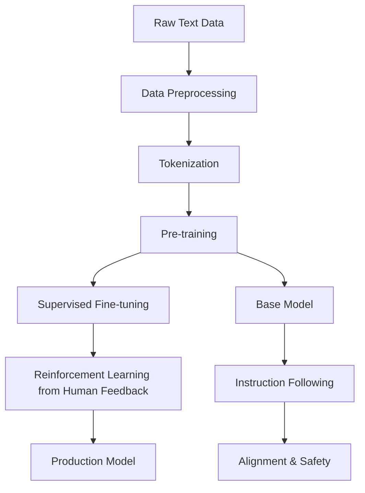

# LLM Training Process: From Raw Text to Language Understanding

Training Large Language Models is a complex, multi-stage process involving massive datasets, distributed computing, and careful optimization. This section covers the complete training pipeline.

## 🔄 Training Pipeline Overview

### Three-Stage Training Process



**Stage 1: Pre-training** - Learn language patterns from massive text
**Stage 2: Supervised Fine-tuning (SFT)** - Learn to follow instructions  
**Stage 3: RLHF** - Align with human preferences

## 📝 Data Preprocessing

### Data Collection and Cleaning

**Web Crawling and Sources**:
```python
import requests
from bs4 import BeautifulSoup
import re
from typing import List, Dict
import json

class DataCollector:
    """Collect and clean training data for LLMs"""
    
    def __init__(self):
        self.quality_filters = {
            'min_length': 100,
            'max_length': 100000,
            'min_words': 20,
            'language_threshold': 0.8
        }
    
    def clean_text(self, text: str) -> str:
        """Clean raw text data"""
        # Remove excessive whitespace
        text = re.sub(r'\s+', ' ', text)
        
        # Remove HTML artifacts
        text = re.sub(r'<[^>]+>', '', text)
        
        # Fix common encoding issues
        text = text.replace('’', "'")
        text = text.replace('“', '"')
        text = text.replace('â€', '"')
        
        # Remove URLs
        text = re.sub(r'http[s]?://(?:[a-zA-Z]|[0-9]|[$-_@.&+]|[!*\\(\\),]|(?:%[0-9a-fA-F][0-9a-fA-F]))+', '', text)
        
        return text.strip()
    
    def quality_filter(self, text: str) -> bool:
        """Filter low-quality text"""
        # Length filters
        if len(text) < self.quality_filters['min_length']:
            return False
        if len(text) > self.quality_filters['max_length']:
            return False
        
        # Word count filter
        words = text.split()
        if len(words) < self.quality_filters['min_words']:
            return False
        
        # Language detection (simplified)
        english_chars = sum(1 for c in text.lower() if 'a' <= c <= 'z')
        total_chars = len([c for c in text if c.isalpha()])
        
        if total_chars > 0 and english_chars / total_chars < self.quality_filters['language_threshold']:
            return False
        
        # Content quality heuristics
        if text.count('...') > 10:  # Likely truncated
            return False
        if text.lower().count('cookie') > 5:  # Cookie notices
            return False
        
        return True
    
    def deduplication(self, texts: List[str], threshold: float = 0.85) -> List[str]:
        """Remove near-duplicate texts"""
        from difflib import SequenceMatcher
        
        unique_texts = []
        
        for text in texts:
            is_duplicate = False
            
            for unique_text in unique_texts:
                similarity = SequenceMatcher(None, text, unique_text).ratio()
                if similarity > threshold:
                    is_duplicate = True
                    break
            
            if not is_duplicate:
                unique_texts.append(text)
        
        return unique_texts
    
    def create_training_dataset(self, sources: List[str]) -> Dict:
        """Create processed dataset from multiple sources"""
        all_texts = []
        
        # Common Crawl data (simulated)
        common_crawl = self.simulate_common_crawl()
        all_texts.extend(common_crawl)
        
        # Books (simulated)
        books_data = self.simulate_books_data()
        all_texts.extend(books_data)
        
        # Academic papers (simulated)  
        papers_data = self.simulate_papers_data()
        all_texts.extend(papers_data)
        
        # Clean and filter
        cleaned_texts = [self.clean_text(text) for text in all_texts]
        filtered_texts = [text for text in cleaned_texts if self.quality_filter(text)]
        
        # Deduplication
        final_texts = self.deduplication(filtered_texts)
        
        return {
            'texts': final_texts,
            'total_documents': len(final_texts),
            'total_tokens': sum(len(text.split()) for text in final_texts),
            'sources': {
                'common_crawl': len(common_crawl),
                'books': len(books_data),
                'papers': len(papers_data)
            }
        }
    
    def simulate_common_crawl(self) -> List[str]:
        """Simulate Common Crawl web data"""
        return [
            "This is a sample web page about artificial intelligence. AI is transforming many industries...",
            "Welcome to our blog about machine learning. Today we'll discuss neural networks...",
            "News article: Recent advances in natural language processing have led to breakthrough applications..."
        ]
    
    def simulate_books_data(self) -> List[str]:
        return [
            "Chapter 1: Introduction to Computer Science. Computer science is the study of algorithms...",
            "In the realm of literature, we find that narrative structures have evolved significantly..."
        ]
    
    def simulate_papers_data(self) -> List[str]:
        return [
            "Abstract: This paper presents a novel approach to transformer architecture optimization...",
            "We propose a new method for scaling neural language models to trillion parameters..."
        ]

# Example usage
collector = DataCollector()
dataset = collector.create_training_dataset(['web', 'books', 'papers'])
print(f"Dataset created with {dataset['total_documents']} documents and {dataset['total_tokens']} tokens")
```

### Tokenization Strategies

**Subword Tokenization**:
```python
import re
from collections import defaultdict, Counter
from typing import Dict, List, Tuple

class BPETokenizer:
    """Byte Pair Encoding tokenizer for LLMs"""
    
    def __init__(self, vocab_size: int = 50000):
        self.vocab_size = vocab_size
        self.vocab = {}
        self.merges = []
        self.special_tokens = {
            '<pad>': 0,
            '<unk>': 1, 
            '<s>': 2,
            '</s>': 3
        }
    
    def get_word_freqs(self, texts: List[str]) -> Dict[str, int]:
        """Get word frequencies from training texts"""
        word_freqs = Counter()
        
        for text in texts:
            # Simple tokenization (space-based)
            words = text.lower().split()
            for word in words:
                # Clean punctuation
                word = re.sub(r'[^\w]', '', word)
                if word:
                    word_freqs[word] += 1
        
        return dict(word_freqs)
    
    def get_pairs(self, word_freqs: Dict[str, int]) -> Dict[Tuple[str, str], int]:
        """Get all pairs of consecutive symbols"""
        pairs = defaultdict(int)
        
        for word, freq in word_freqs.items():
            # Convert word to list of characters
            symbols = list(word)
            
            # Count all consecutive pairs
            for i in range(len(symbols) - 1):
                pair = (symbols[i], symbols[i + 1])
                pairs[pair] += freq
        
        return dict(pairs)
    
    def merge_vocab(self, pair: Tuple[str, str], word_freqs: Dict[str, int]) -> Dict[str, int]:
        """Merge the most frequent pair in vocabulary"""
        new_word_freqs = {}
        bigram = ''.join(pair)
        
        for word, freq in word_freqs.items():
            # Replace all occurrences of the pair
            new_word = word.replace(''.join(pair), bigram)
            new_word_freqs[new_word] = freq
        
        return new_word_freqs
    
    def train(self, texts: List[str]):
        """Train BPE tokenizer"""
        # Get initial word frequencies
        word_freqs = self.get_word_freqs(texts)
        
        # Initialize vocabulary with single characters
        vocab = set()
        for word in word_freqs.keys():
            vocab.update(list(word))
        
        # Add special tokens
        vocab.update(self.special_tokens.keys())
        
        # Perform BPE merges
        num_merges = self.vocab_size - len(vocab)
        
        for i in range(num_merges):
            pairs = self.get_pairs(word_freqs)
            
            if not pairs:
                break
            
            # Find most frequent pair
            best_pair = max(pairs, key=pairs.get)
            
            # Merge the pair
            word_freqs = self.merge_vocab(best_pair, word_freqs)
            
            # Add merged token to vocabulary
            merged_token = ''.join(best_pair)
            vocab.add(merged_token)
            
            # Store merge for encoding
            self.merges.append(best_pair)
            
            if (i + 1) % 1000 == 0:
                print(f"Merge {i+1}/{num_merges}: {best_pair} -> {merged_token}")
        
        # Create final vocabulary mapping
        self.vocab = {token: i for i, token in enumerate(sorted(vocab))}
        
        print(f"Trained BPE tokenizer with {len(self.vocab)} tokens")
    
    def encode(self, text: str) -> List[int]:
        """Encode text to token IDs"""
        # This is simplified - real BPE encoding is more complex
        tokens = []
        words = text.lower().split()
        
        for word in words:
            word = re.sub(r'[^\w]', '', word)
            if word in self.vocab:
                tokens.append(self.vocab[word])
            else:
                # Handle unknown words by character-level encoding
                for char in word:
                    if char in self.vocab:
                        tokens.append(self.vocab[char])
                    else:
                        tokens.append(self.vocab['<unk>'])
        
        return tokens
    
    def decode(self, token_ids: List[int]) -> str:
        """Decode token IDs back to text"""
        id_to_token = {v: k for k, v in self.vocab.items()}
        tokens = [id_to_token.get(token_id, '<unk>') for token_id in token_ids]
        return ' '.join(tokens)

# Example tokenizer training
sample_texts = [
    "The quick brown fox jumps over the lazy dog",
    "Machine learning is a subset of artificial intelligence",
    "Natural language processing enables computers to understand human language"
]

tokenizer = BPETokenizer(vocab_size=1000)
tokenizer.train(sample_texts)

# Test encoding/decoding
text = "The fox jumps"
token_ids = tokenizer.encode(text)
decoded = tokenizer.decode(token_ids)
print(f"Original: {text}")
print(f"Encoded: {token_ids}")
print(f"Decoded: {decoded}")
```

## 🚀 Pre-training Process

### Distributed Training Setup

**Multi-GPU Training Strategy**:
```python
import numpy as np
from typing import Dict, List, Optional
import time

class DistributedTrainer:
    """Simulate distributed training for LLMs"""
    
    def __init__(self, 
                 model_params: Dict,
                 num_gpus: int = 8,
                 batch_size_per_gpu: int = 16,
                 gradient_accumulation_steps: int = 4):
        
        self.model_params = model_params
        self.num_gpus = num_gpus
        self.batch_size_per_gpu = batch_size_per_gpu
        self.gradient_accumulation_steps = gradient_accumulation_steps
        
        # Effective batch size
        self.effective_batch_size = (
            num_gpus * batch_size_per_gpu * gradient_accumulation_steps
        )
        
        print(f"Distributed Training Setup:")
        print(f"  GPUs: {num_gpus}")
        print(f"  Batch size per GPU: {batch_size_per_gpu}")
        print(f"  Gradient accumulation steps: {gradient_accumulation_steps}")
        print(f"  Effective batch size: {self.effective_batch_size}")
        
        # Training state
        self.step = 0
        self.total_tokens_seen = 0
    
    def calculate_loss(self, logits: np.ndarray, targets: np.ndarray) -> float:
        """Calculate cross-entropy loss"""
        # Simplified cross-entropy calculation
        batch_size, seq_len, vocab_size = logits.shape
        
        # Apply softmax to logits
        exp_logits = np.exp(logits - np.max(logits, axis=-1, keepdims=True))
        probs = exp_logits / np.sum(exp_logits, axis=-1, keepdims=True)
        
        # Calculate cross-entropy
        loss = 0.0
        count = 0
        
        for i in range(batch_size):
            for j in range(seq_len - 1):  # Exclude last position
                target_token = targets[i, j + 1]  # Next token prediction
                if target_token >= 0:  # Valid target (not padding)
                    loss += -np.log(probs[i, j, target_token] + 1e-8)
                    count += 1
        
        return loss / count if count > 0 else 0.0
    
    def training_step(self, batch: Dict[str, np.ndarray]) -> Dict[str, float]:
        """Simulate one training step"""
        input_ids = batch['input_ids']
        attention_mask = batch['attention_mask']
        
        batch_size, seq_len = input_ids.shape
        vocab_size = self.model_params['vocab_size']
        
        # Simulate forward pass (generate random logits)
        logits = np.random.randn(batch_size, seq_len, vocab_size)
        
        # Calculate loss
        loss = self.calculate_loss(logits, input_ids)
        
        # Simulate backward pass and parameter updates
        # In real training, this would involve actual gradient computation
        
        # Update training statistics
        self.step += 1
        self.total_tokens_seen += np.sum(attention_mask)
        
        return {
            'loss': loss,
            'learning_rate': self.get_learning_rate(),
            'tokens_per_second': self.calculate_throughput(),
            'step': self.step
        }
    
    def get_learning_rate(self) -> float:
        """Get current learning rate (with warmup and decay)"""
        warmup_steps = 2000
        max_lr = 6e-4
        min_lr = 6e-5
        
        if self.step < warmup_steps:
            # Linear warmup
            return max_lr * (self.step / warmup_steps)
        else:
            # Cosine decay
            decay_ratio = (self.step - warmup_steps) / (100000 - warmup_steps)
            decay_ratio = min(decay_ratio, 1.0)
            return min_lr + 0.5 * (max_lr - min_lr) * (1 + np.cos(np.pi * decay_ratio))
    
    def calculate_throughput(self) -> float:
        """Calculate tokens processed per second"""
        # Simulate throughput calculation
        return self.effective_batch_size * 2048 * 0.8  # tokens/second
    
    def train_epoch(self, dataset: List[Dict], epoch: int):
        """Train for one epoch"""
        epoch_losses = []
        start_time = time.time()
        
        print(f"\nEpoch {epoch + 1}")
        print("-" * 50)
        
        for batch_idx, batch in enumerate(dataset):
            # Training step
            step_metrics = self.training_step(batch)
            epoch_losses.append(step_metrics['loss'])
            
            # Logging
            if batch_idx % 100 == 0:
                elapsed = time.time() - start_time
                print(f"Step {self.step:6d} | "
                      f"Loss: {step_metrics['loss']:.4f} | "
                      f"LR: {step_metrics['learning_rate']:.2e} | "
                      f"Tokens/s: {step_metrics['tokens_per_second']:,.0f} | "
                      f"Time: {elapsed:.1f}s")
        
        avg_loss = np.mean(epoch_losses)
        total_time = time.time() - start_time
        
        print(f"Epoch {epoch + 1} completed:")
        print(f"  Average Loss: {avg_loss:.4f}")
        print(f"  Total Time: {total_time:.1f}s")
        print(f"  Total Tokens Seen: {self.total_tokens_seen:,}")
        
        return avg_loss

# Simulate training
model_config = {
    'vocab_size': 50000,
    'd_model': 768,
    'num_layers': 12,
    'num_heads': 12
}

trainer = DistributedTrainer(model_config)

# Create dummy dataset
dummy_dataset = []
for _ in range(1000):  # 1000 batches
    batch = {
        'input_ids': np.random.randint(0, 50000, (16, 2048)),
        'attention_mask': np.ones((16, 2048))
    }
    dummy_dataset.append(batch)

# Train for a few steps
for epoch in range(2):
    avg_loss = trainer.train_epoch(dummy_dataset[:10], epoch)  # Just 10 batches for demo
```

### Training Objectives and Loss Functions

**Language Modeling Loss**:
```python
class LanguageModelingLoss:
    """Various loss functions for language model training"""
    
    def __init__(self, vocab_size: int):
        self.vocab_size = vocab_size
    
    def cross_entropy_loss(self, logits: np.ndarray, targets: np.ndarray, 
                          ignore_index: int = -100) -> float:
        """Standard cross-entropy loss for next-token prediction"""
        batch_size, seq_len, vocab_size = logits.shape
        
        # Shift targets for next-token prediction
        shifted_targets = targets[:, 1:].flatten()  # Remove first token
        shifted_logits = logits[:, :-1, :].reshape(-1, vocab_size)  # Remove last position
        
        # Apply softmax
        max_logits = np.max(shifted_logits, axis=1, keepdims=True)
        exp_logits = np.exp(shifted_logits - max_logits)
        probs = exp_logits / np.sum(exp_logits, axis=1, keepdims=True)
        
        # Calculate loss
        total_loss = 0.0
        valid_tokens = 0
        
        for i in range(len(shifted_targets)):
            if shifted_targets[i] != ignore_index:
                token_prob = probs[i, shifted_targets[i]]
                total_loss += -np.log(token_prob + 1e-8)
                valid_tokens += 1
        
        return total_loss / valid_tokens if valid_tokens > 0 else 0.0
    
    def perplexity(self, logits: np.ndarray, targets: np.ndarray) -> float:
        """Calculate perplexity metric"""
        loss = self.cross_entropy_loss(logits, targets)
        return np.exp(loss)
    
    def prefix_lm_loss(self, logits: np.ndarray, targets: np.ndarray, 
                      prefix_length: int) -> float:
        """Prefix language modeling loss (like T5)"""
        # Only compute loss on non-prefix tokens
        suffix_logits = logits[:, prefix_length:, :]
        suffix_targets = targets[:, prefix_length:]
        
        return self.cross_entropy_loss(suffix_logits, suffix_targets)

# Training monitoring
class TrainingMonitor:
    """Monitor training progress and metrics"""
    
    def __init__(self):
        self.metrics_history = {
            'loss': [],
            'perplexity': [],
            'learning_rate': [],
            'tokens_per_second': [],
            'gradient_norm': []
        }
    
    def log_metrics(self, step: int, metrics: Dict[str, float]):
        """Log training metrics"""
        for key, value in metrics.items():
            if key in self.metrics_history:
                self.metrics_history[key].append(value)
    
    def plot_training_curves(self):
        """Plot training progress"""
        import matplotlib.pyplot as plt
        
        fig, axes = plt.subplots(2, 2, figsize=(12, 8))
        
        # Loss curve
        axes[0, 0].plot(self.metrics_history['loss'])
        axes[0, 0].set_title('Training Loss')
        axes[0, 0].set_ylabel('Cross-Entropy Loss')
        
        # Perplexity curve
        axes[0, 1].plot(self.metrics_history['perplexity'])
        axes[0, 1].set_title('Perplexity')
        axes[0, 1].set_ylabel('Perplexity')
        
        # Learning rate schedule
        axes[1, 0].plot(self.metrics_history['learning_rate'])
        axes[1, 0].set_title('Learning Rate Schedule')
        axes[1, 0].set_ylabel('Learning Rate')
        
        # Throughput
        axes[1, 1].plot(self.metrics_history['tokens_per_second'])
        axes[1, 1].set_title('Training Throughput')
        axes[1, 1].set_ylabel('Tokens/Second')
        
        plt.tight_layout()
        plt.show()
    
    def get_training_summary(self) -> Dict[str, float]:
        """Get summary statistics"""
        return {
            'final_loss': self.metrics_history['loss'][-1] if self.metrics_history['loss'] else 0,
            'best_loss': min(self.metrics_history['loss']) if self.metrics_history['loss'] else 0,
            'avg_throughput': np.mean(self.metrics_history['tokens_per_second']) if self.metrics_history['tokens_per_second'] else 0
        }
```

## 🎯 Supervised Fine-tuning (SFT)

### Instruction Following Training

**Creating Instruction Datasets**:
```python
class InstructionDataset:
    """Generate and format instruction-following data"""
    
    def __init__(self):
        self.instruction_templates = [
            "Write a {type} about {topic}",
            "Explain {concept} in simple terms",
            "Summarize the following text: {text}",
            "Translate the following {source_lang} text to {target_lang}: {text}",
            "Answer the following question: {question}"
        ]
    
    def generate_instruction_examples(self) -> List[Dict[str, str]]:
        """Generate instruction-following examples"""
        examples = []
        
        # Writing tasks
        examples.append({
            'instruction': 'Write a short story about a robot learning emotions',
            'input': '',
            'output': 'In a lab filled with blinking lights, Unit-7 processed its first smile. The expression felt foreign, stretching actuators in unfamiliar ways. But as its creator laughed with joy, something new sparked in Unit-7\'s neural networks—not just recognition, but resonance. For the first time, the robot understood that emotions weren\'t just data patterns, but bridges connecting one consciousness to another.'
        })
        
        # Explanation tasks  
        examples.append({
            'instruction': 'Explain machine learning in simple terms',
            'input': '',
            'output': 'Machine learning is like teaching a computer to recognize patterns, similar to how a child learns to identify animals. Instead of programming specific rules, we show the computer many examples (like thousands of cat photos) so it can learn to identify cats on its own. The more examples it sees, the better it becomes at making predictions about new, unseen data.'
        })
        
        # Q&A tasks
        examples.append({
            'instruction': 'Answer the following question',
            'input': 'What causes seasons on Earth?',
            'output': 'Seasons are caused by Earth\'s tilted axis as it orbits the Sun. Earth is tilted at about 23.5 degrees, so different parts of the planet receive varying amounts of direct sunlight throughout the year. When your hemisphere tilts toward the Sun, you experience summer with longer days and more direct sunlight. When it tilts away, you get winter with shorter days and less direct sunlight.'
        })
        
        return examples
    
    def format_for_training(self, examples: List[Dict[str, str]]) -> List[str]:
        """Format examples for training"""
        formatted = []
        
        for example in examples:
            if example['input']:
                # With input context
                text = f"### Instruction:\n{example['instruction']}\n\n### Input:\n{example['input']}\n\n### Response:\n{example['output']}"
            else:
                # Without input context
                text = f"### Instruction:\n{example['instruction']}\n\n### Response:\n{example['output']}"
            
            formatted.append(text)
        
        return formatted
    
    def create_training_data(self, examples: List[Dict[str, str]], 
                           tokenizer) -> List[Dict[str, np.ndarray]]:
        """Create tokenized training data"""
        training_data = []
        
        for example in examples:
            formatted_text = self.format_for_training([example])[0]
            
            # Tokenize
            tokens = tokenizer.encode(formatted_text)
            
            # Create labels (for computing loss only on response)
            labels = tokens.copy()
            
            # Find response start (simplified)
            response_start = formatted_text.find("### Response:")
            if response_start != -1:
                # Mask instruction tokens (set to -100 to ignore in loss)
                instruction_tokens = tokenizer.encode(formatted_text[:response_start])
                labels[:len(instruction_tokens)] = [-100] * len(instruction_tokens)
            
            training_data.append({
                'input_ids': np.array(tokens),
                'labels': np.array(labels)
            })
        
        return training_data

# SFT Training loop
class SFTTrainer:
    """Supervised Fine-tuning trainer"""
    
    def __init__(self, base_model, tokenizer):
        self.model = base_model
        self.tokenizer = tokenizer
        self.training_stats = []
    
    def compute_loss(self, logits: np.ndarray, labels: np.ndarray) -> float:
        """Compute loss only on response tokens"""
        # Find non-masked positions
        valid_positions = labels != -100
        
        if not np.any(valid_positions):
            return 0.0
        
        # Get predictions and targets for valid positions
        valid_logits = logits[valid_positions]
        valid_labels = labels[valid_positions]
        
        # Apply softmax
        max_logits = np.max(valid_logits, axis=-1, keepdims=True)
        exp_logits = np.exp(valid_logits - max_logits)
        probs = exp_logits / np.sum(exp_logits, axis=-1, keepdims=True)
        
        # Cross-entropy loss
        loss = 0.0
        for i, label in enumerate(valid_labels):
            loss += -np.log(probs[i, label] + 1e-8)
        
        return loss / len(valid_labels)
    
    def train_step(self, batch: List[Dict[str, np.ndarray]]) -> float:
        """Single training step"""
        total_loss = 0.0
        
        for example in batch:
            input_ids = example['input_ids']
            labels = example['labels']
            
            # Forward pass (simplified)
            logits = np.random.randn(len(input_ids), self.tokenizer.vocab_size)
            
            # Compute loss
            loss = self.compute_loss(logits, labels)
            total_loss += loss
        
        return total_loss / len(batch)
    
    def fine_tune(self, dataset: List[Dict[str, np.ndarray]], 
                  epochs: int = 3, batch_size: int = 4):
        """Fine-tune model on instruction data"""
        print(f"Starting supervised fine-tuning...")
        print(f"Dataset size: {len(dataset)}")
        print(f"Epochs: {epochs}")
        print(f"Batch size: {batch_size}")
        
        for epoch in range(epochs):
            epoch_losses = []
            
            # Create batches
            for i in range(0, len(dataset), batch_size):
                batch = dataset[i:i + batch_size]
                
                # Training step
                loss = self.train_step(batch)
                epoch_losses.append(loss)
                
                if i % (batch_size * 10) == 0:
                    print(f"Epoch {epoch + 1}, Batch {i // batch_size}: Loss = {loss:.4f}")
            
            avg_loss = np.mean(epoch_losses)
            self.training_stats.append(avg_loss)
            print(f"Epoch {epoch + 1} completed. Average loss: {avg_loss:.4f}")

# Example SFT training
instruction_dataset = InstructionDataset()
examples = instruction_dataset.generate_instruction_examples()

print("Instruction Examples:")
for i, example in enumerate(examples):
    print(f"\nExample {i + 1}:")
    print(f"Instruction: {example['instruction']}")
    print(f"Input: {example['input']}")
    print(f"Output: {example['output'][:100]}...")
```

## 🔄 Reinforcement Learning from Human Feedback (RLHF)

### Reward Model Training

**Human Preference Data Collection**:
```python
class RewardModel:
    """Reward model for RLHF training"""
    
    def __init__(self, d_model: int = 768):
        self.d_model = d_model
        # Initialize reward head (maps model outputs to scalar reward)
        self.reward_head = np.random.randn(d_model, 1) * 0.01
        self.bias = 0.0
    
    def compute_reward(self, hidden_states: np.ndarray) -> float:
        """Compute scalar reward from hidden states"""
        # Take last token's hidden state
        last_hidden = hidden_states[-1, :]
        
        # Linear projection to scalar reward
        reward = np.dot(last_hidden, self.reward_head.flatten()) + self.bias
        
        return reward
    
    def train_on_preferences(self, comparisons: List[Dict]):
        """Train reward model on human preference comparisons"""
        print(f"Training reward model on {len(comparisons)} comparisons")
        
        losses = []
        
        for comparison in comparisons:
            response_a = comparison['response_a']
            response_b = comparison['response_b']
            preference = comparison['preference']  # 'A' or 'B'
            
            # Get hidden states (simulated)
            hidden_a = np.random.randn(len(response_a.split()), self.d_model)
            hidden_b = np.random.randn(len(response_b.split()), self.d_model)
            
            # Compute rewards
            reward_a = self.compute_reward(hidden_a)
            reward_b = self.compute_reward(hidden_b)
            
            # Bradley-Terry loss
            if preference == 'A':
                # A is preferred, so reward_a should be higher
                loss = np.log(1 + np.exp(reward_b - reward_a))
            else:
                # B is preferred, so reward_b should be higher
                loss = np.log(1 + np.exp(reward_a - reward_b))
            
            losses.append(loss)
            
            # Gradient update (simplified)
            learning_rate = 0.001
            if preference == 'A':
                gradient = np.exp(reward_b - reward_a) / (1 + np.exp(reward_b - reward_a))
                self.reward_head -= learning_rate * gradient * hidden_a[-1:].T
            else:
                gradient = np.exp(reward_a - reward_b) / (1 + np.exp(reward_a - reward_b))
                self.reward_head -= learning_rate * gradient * hidden_b[-1:].T
        
        avg_loss = np.mean(losses)
        print(f"Reward model training completed. Average loss: {avg_loss:.4f}")
        
        return avg_loss

class PPOTrainer:
    """Proximal Policy Optimization for RLHF"""
    
    def __init__(self, policy_model, reward_model, reference_model):
        self.policy = policy_model
        self.reward_model = reward_model
        self.reference = reference_model
        
        # PPO hyperparameters
        self.clip_epsilon = 0.2
        self.kl_penalty = 0.1
        self.value_loss_coef = 0.1
        self.entropy_bonus = 0.01
    
    def compute_advantages(self, rewards: List[float], values: List[float]) -> List[float]:
        """Compute advantages using GAE"""
        advantages = []
        gae = 0
        gamma = 0.99
        lam = 0.95
        
        for i in reversed(range(len(rewards))):
            if i == len(rewards) - 1:
                next_value = 0
            else:
                next_value = values[i + 1]
            
            delta = rewards[i] + gamma * next_value - values[i]
            gae = delta + gamma * lam * gae
            advantages.insert(0, gae)
        
        return advantages
    
    def ppo_step(self, prompts: List[str], responses: List[str]) -> Dict[str, float]:
        """Single PPO training step"""
        batch_size = len(prompts)
        
        # Generate responses and compute rewards
        rewards = []
        kl_penalties = []
        
        for prompt, response in zip(prompts, responses):
            # Compute reward from reward model
            # (In practice, this involves forward passes through the models)
            reward = self.reward_model.compute_reward(np.random.randn(10, 768))
            
            # Compute KL penalty vs reference model
            # (This prevents the model from deviating too much from the reference)
            kl_penalty = np.random.uniform(0, 0.1)  # Simulated
            
            total_reward = reward - self.kl_penalty * kl_penalty
            
            rewards.append(total_reward)
            kl_penalties.append(kl_penalty)
        
        # Compute value estimates and advantages
        values = [np.random.uniform(-1, 1) for _ in range(batch_size)]  # Simulated
        advantages = self.compute_advantages(rewards, values)
        
        # PPO loss computation (simplified)
        policy_loss = np.mean([max(adv, self.clip_epsilon * adv) for adv in advantages])
        value_loss = np.mean([(r - v)**2 for r, v in zip(rewards, values)])
        
        total_loss = policy_loss + self.value_loss_coef * value_loss
        
        return {
            'policy_loss': policy_loss,
            'value_loss': value_loss,
            'total_loss': total_loss,
            'avg_reward': np.mean(rewards),
            'avg_kl': np.mean(kl_penalties)
        }
    
    def train(self, dataset: List[Dict[str, str]], epochs: int = 1):
        """Train policy using PPO"""
        print(f"Starting PPO training for {epochs} epochs")
        
        for epoch in range(epochs):
            epoch_metrics = []
            
            # Sample batches
            batch_size = 8
            for i in range(0, len(dataset), batch_size):
                batch = dataset[i:i + batch_size]
                
                prompts = [item['prompt'] for item in batch]
                responses = [item['response'] for item in batch]
                
                # PPO step
                metrics = self.ppo_step(prompts, responses)
                epoch_metrics.append(metrics)
                
                if i % (batch_size * 5) == 0:
                    print(f"Epoch {epoch + 1}, Step {i // batch_size}: "
                          f"Reward = {metrics['avg_reward']:.3f}, "
                          f"KL = {metrics['avg_kl']:.3f}")
            
            # Epoch summary
            avg_reward = np.mean([m['avg_reward'] for m in epoch_metrics])
            avg_kl = np.mean([m['avg_kl'] for m in epoch_metrics])
            
            print(f"Epoch {epoch + 1} completed: "
                  f"Avg Reward = {avg_reward:.3f}, "
                  f"Avg KL = {avg_kl:.3f}")

# Example RLHF training
preference_data = [
    {
        'prompt': 'Explain quantum computing',
        'response_a': 'Quantum computing uses quantum bits that can be 0 and 1 simultaneously.',
        'response_b': 'Quantum computing is really complicated and uses weird physics stuff.',
        'preference': 'A'
    },
    {
        'prompt': 'Write a poem about AI',
        'response_a': 'AI is smart and cool, it helps us with many things.',
        'response_b': 'Silicon dreams awaken, algorithms dance in digital dawn.',
        'preference': 'B'
    }
]

# Train reward model
reward_model = RewardModel()
reward_model.train_on_preferences(preference_data)

print("RLHF training pipeline completed!")
```

## 📊 Training Metrics and Evaluation

### Key Training Metrics

**Training Monitoring Dashboard**:
```python
class TrainingDashboard:
    """Comprehensive training monitoring and visualization"""
    
    def __init__(self):
        self.metrics = {
            'pre_training': {
                'loss': [],
                'perplexity': [],
                'learning_rate': [],
                'gradient_norm': [],
                'tokens_per_second': []
            },
            'sft': {
                'instruction_loss': [],
                'response_quality': [],
                'task_accuracy': []
            },
            'rlhf': {
                'reward_score': [],
                'kl_divergence': [],
                'policy_loss': [],
                'value_loss': []
            }
        }
        
        self.checkpoints = []
        self.evaluation_results = []
    
    def log_pretraining_metrics(self, step: int, loss: float, perplexity: float,
                               lr: float, grad_norm: float, throughput: float):
        """Log pre-training metrics"""
        self.metrics['pre_training']['loss'].append(loss)
        self.metrics['pre_training']['perplexity'].append(perplexity)
        self.metrics['pre_training']['learning_rate'].append(lr)
        self.metrics['pre_training']['gradient_norm'].append(grad_norm)
        self.metrics['pre_training']['tokens_per_second'].append(throughput)
    
    def create_training_report(self) -> str:
        """Generate comprehensive training report"""
        report = "# LLM Training Report\n\n"
        
        # Pre-training summary
        if self.metrics['pre_training']['loss']:
            final_loss = self.metrics['pre_training']['loss'][-1]
            min_loss = min(self.metrics['pre_training']['loss'])
            report += f"## Pre-training Results\n"
            report += f"- Final Loss: {final_loss:.4f}\n"
            report += f"- Best Loss: {min_loss:.4f}\n"
            report += f"- Final Perplexity: {np.exp(final_loss):.2f}\n\n"
        
        # SFT summary
        if self.metrics['sft']['instruction_loss']:
            final_sft_loss = self.metrics['sft']['instruction_loss'][-1]
            report += f"## Supervised Fine-tuning Results\n"
            report += f"- Final SFT Loss: {final_sft_loss:.4f}\n\n"
        
        # RLHF summary
        if self.metrics['rlhf']['reward_score']:
            avg_reward = np.mean(self.metrics['rlhf']['reward_score'][-10:])
            report += f"## RLHF Results\n"
            report += f"- Average Reward (last 10 steps): {avg_reward:.3f}\n\n"
        
        return report
    
    def plot_training_progress(self):
        """Plot comprehensive training curves"""
        import matplotlib.pyplot as plt
        
        fig, axes = plt.subplots(2, 3, figsize=(18, 10))
        
        # Pre-training loss
        if self.metrics['pre_training']['loss']:
            axes[0, 0].plot(self.metrics['pre_training']['loss'])
            axes[0, 0].set_title('Pre-training Loss')
            axes[0, 0].set_xlabel('Steps')
            axes[0, 0].set_ylabel('Cross-Entropy Loss')
            axes[0, 0].set_yscale('log')
        
        # Learning rate schedule
        if self.metrics['pre_training']['learning_rate']:
            axes[0, 1].plot(self.metrics['pre_training']['learning_rate'])
            axes[0, 1].set_title('Learning Rate Schedule')
            axes[0, 1].set_xlabel('Steps')
            axes[0, 1].set_ylabel('Learning Rate')
            axes[0, 1].set_yscale('log')
        
        # Training throughput
        if self.metrics['pre_training']['tokens_per_second']:
            axes[0, 2].plot(self.metrics['pre_training']['tokens_per_second'])
            axes[0, 2].set_title('Training Throughput')
            axes[0, 2].set_xlabel('Steps')
            axes[0, 2].set_ylabel('Tokens/Second')
        
        # SFT loss
        if self.metrics['sft']['instruction_loss']:
            axes[1, 0].plot(self.metrics['sft']['instruction_loss'])
            axes[1, 0].set_title('SFT Loss')
            axes[1, 0].set_xlabel('Steps')
            axes[1, 0].set_ylabel('Instruction Loss')
        
        # RLHF rewards
        if self.metrics['rlhf']['reward_score']:
            axes[1, 1].plot(self.metrics['rlhf']['reward_score'])
            axes[1, 1].set_title('RLHF Reward Progression')
            axes[1, 1].set_xlabel('Steps')
            axes[1, 1].set_ylabel('Average Reward')
        
        # KL divergence
        if self.metrics['rlhf']['kl_divergence']:
            axes[1, 2].plot(self.metrics['rlhf']['kl_divergence'])
            axes[1, 2].set_title('KL Divergence from Reference')
            axes[1, 2].set_xlabel('Steps')
            axes[1, 2].set_ylabel('KL Divergence')
        
        plt.tight_layout()
        plt.show()

# Create dashboard and simulate training
dashboard = TrainingDashboard()

# Simulate metrics
for step in range(100):
    # Pre-training metrics
    loss = 5.0 * np.exp(-step / 50) + 1.0 + 0.1 * np.random.randn()
    perplexity = np.exp(loss)
    lr = 6e-4 * min(step / 2000, 1.0) * (1 - step / 10000)
    grad_norm = 1.0 + 0.5 * np.random.randn()
    throughput = 50000 + 5000 * np.random.randn()
    
    dashboard.log_pretraining_metrics(step, loss, perplexity, lr, grad_norm, throughput)
    
    # SFT metrics (later in training)
    if step > 70:
        sft_loss = 2.0 * np.exp(-(step - 70) / 10) + 0.5 + 0.05 * np.random.randn()
        dashboard.metrics['sft']['instruction_loss'].append(sft_loss)
    
    # RLHF metrics (final phase)
    if step > 85:
        reward = 0.1 * (step - 85) + 0.2 * np.random.randn()
        kl_div = 0.05 + 0.02 * np.random.randn()
        dashboard.metrics['rlhf']['reward_score'].append(reward)
        dashboard.metrics['rlhf']['kl_divergence'].append(kl_div)

# Generate report and plots
print(dashboard.create_training_report())
dashboard.plot_training_progress()
```

## ✅ Training Process Checklist

Ensure you understand:

1. **Data Pipeline**: Collection, cleaning, tokenization, deduplication
2. **Distributed Training**: Multi-GPU setups, gradient accumulation
3. **Pre-training Objectives**: Next-token prediction, loss functions
4. **SFT Process**: Instruction formatting, response masking
5. **RLHF Pipeline**: Reward models, PPO, human preferences
6. **Training Monitoring**: Metrics, checkpointing, evaluation

## 🚀 Next Steps

Continue with:

1. **[Fine-tuning & Adaptation](fine-tuning.md)** - Customize models for specific tasks
2. **[Prompt Engineering](prompt-engineering.md)** - Optimize model interactions
3. **[Building LLM Agents](../agents/architecture.md)** - Apply trained models to agents

---

*Understanding the complete training process is essential for working with LLMs effectively and building robust agent systems that leverage these powerful foundation models.*
