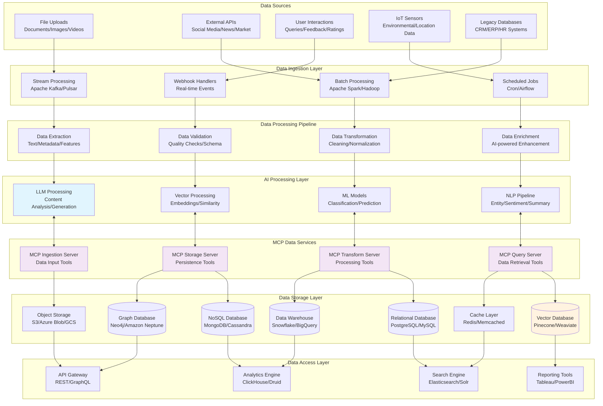
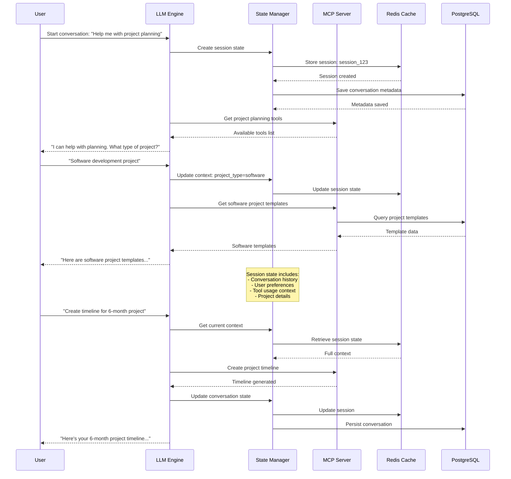
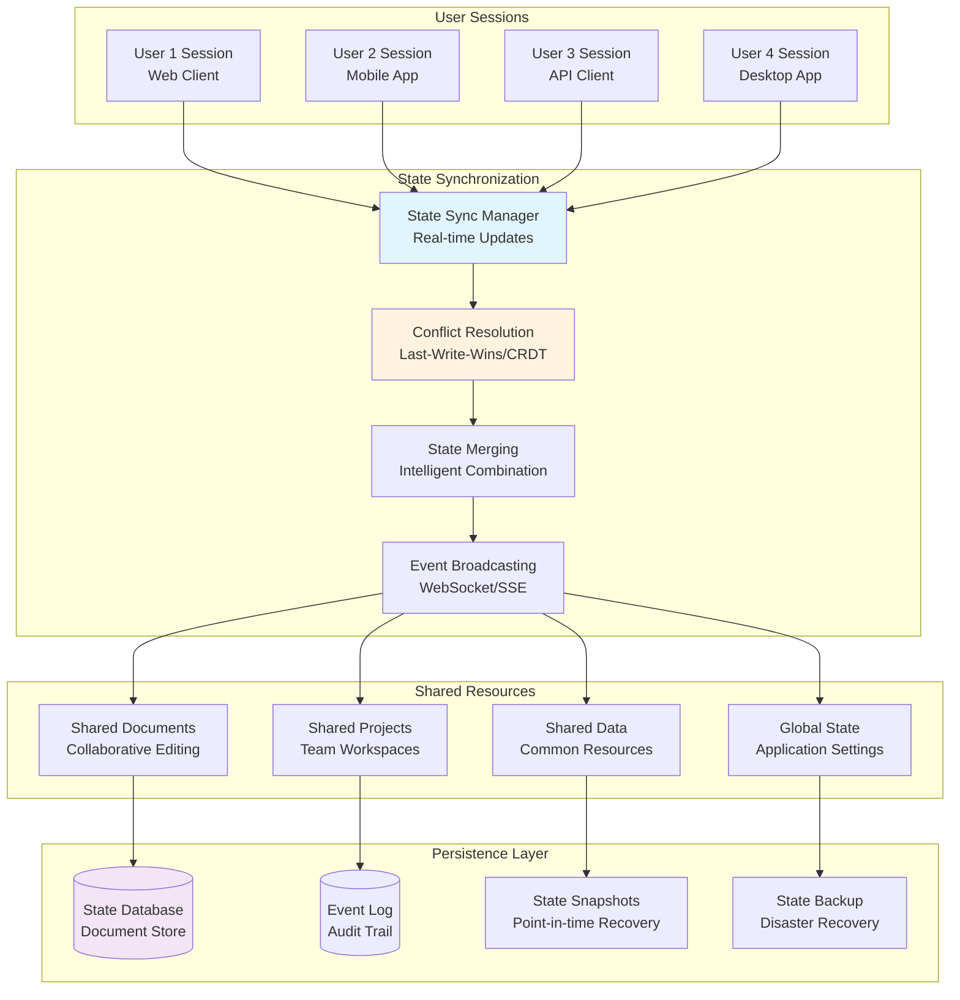
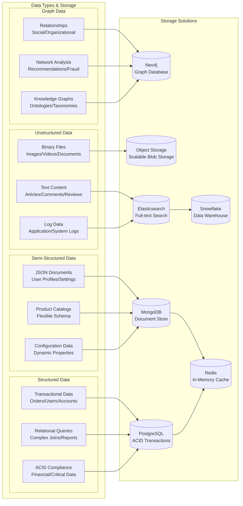
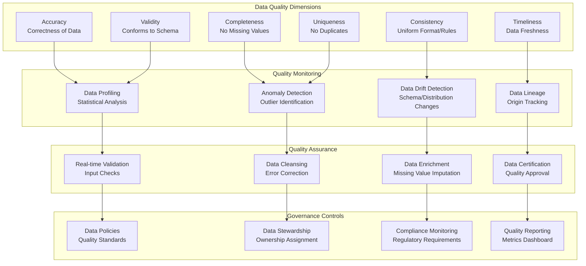
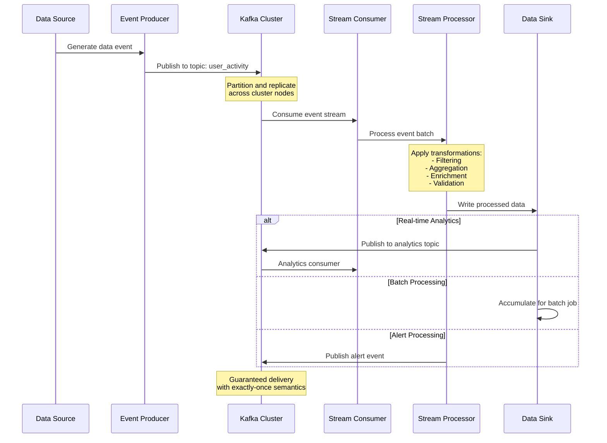

# Data Flow and Persistence Patterns

This diagram illustrates how data flows through MCP-enabled AI systems, including persistence strategies, data transformation pipelines, and state management patterns.

## Use Case: Intelligent Content Management and Analytics Platform

A comprehensive content management system that uses AI to process, analyze, and generate insights from various data sources including documents, images, videos, and user interactions.

## End-to-End Data Flow Architecture

## Data Transformation Pipeline

### Multi-Stage Data Processing

```mermaid
flowchart TD
    subgraph "Raw Data Stage"
        RAW[Raw Data<br/>Unstructured Content]
        VALIDATE_RAW[Data Validation<br/>Format/Size Checks]
        QUARANTINE[Quarantine<br/>Invalid Data]
    end
    
    subgraph "Preprocessing Stage"
        CLEAN[Data Cleaning<br/>Remove Noise/Duplicates]
        NORMALIZE[Normalization<br/>Standard Formats]
        TOKENIZE[Tokenization<br/>Text Segmentation]
    end
    
    subgraph "Feature Extraction"
        TEXT_EXTRACT[Text Extraction<br/>OCR/PDF Processing]
        METADATA[Metadata Extraction<br/>File Properties/EXIF]
        CONTENT_ANALYSIS[Content Analysis<br/>Language/Type Detection]
    end
    
    subgraph "AI Enhancement"
        EMBEDDINGS[Generate Embeddings<br/>Vector Representations]
        CLASSIFICATION[Classification<br/>Category/Topic Assignment]
        SENTIMENT[Sentiment Analysis<br/>Emotional Tone]
        ENTITIES[Entity Recognition<br/>People/Places/Organizations]
    end
    
    subgraph "Enrichment Stage"
        LOOKUP[External Lookups<br/>Knowledge Base/APIs]
        LINKING[Entity Linking<br/>Knowledge Graph]
        TAGGING[Auto Tagging<br/>Metadata Generation]
        SUMMARY[Summarization<br/>Key Points Extraction]
    end
    
    subgraph "Quality Assurance"
        QA_CHECK[Quality Checks<br/>Accuracy Validation]
        CONFIDENCE[Confidence Scoring<br/>Reliability Metrics]
        REVIEW[Human Review<br/>Manual Validation]
        APPROVAL[Final Approval<br/>Ready for Storage]
    end
    
    RAW --> VALIDATE_RAW
    VALIDATE_RAW --> CLEAN
    VALIDATE_RAW --> QUARANTINE
    
    CLEAN --> NORMALIZE
    NORMALIZE --> TOKENIZE
    
    TOKENIZE --> TEXT_EXTRACT
    TEXT_EXTRACT --> METADATA
    METADATA --> CONTENT_ANALYSIS
    
    CONTENT_ANALYSIS --> EMBEDDINGS
    EMBEDDINGS --> CLASSIFICATION
    CLASSIFICATION --> SENTIMENT
    SENTIMENT --> ENTITIES
    
    ENTITIES --> LOOKUP
    LOOKUP --> LINKING
    LINKING --> TAGGING
    TAGGING --> SUMMARY
    
    SUMMARY --> QA_CHECK
    QA_CHECK --> CONFIDENCE
    CONFIDENCE --> REVIEW
    REVIEW --> APPROVAL
    
    QUARANTINE -.->|Fix & Retry| CLEAN
    REVIEW -.->|Feedback| EMBEDDINGS
```

## State Management Patterns

### Conversation State Management

### Multi-User State Synchronization

## Data Persistence Strategies

### Polyglot Persistence Architecture

### Data Lifecycle Management

```mermaid
flowchart TD
    subgraph "Data Creation"
        INGEST[Data Ingestion<br/>Initial Capture]
        VALIDATE_LC[Validation<br/>Quality Checks]
        CATALOG_LC[Cataloging<br/>Metadata Assignment]
        CLASSIFY[Classification<br/>Sensitivity/Type]
    end
    
    subgraph "Active Phase"
        HOT[Hot Storage<br/>Frequent Access/Fast]
        INDEX[Indexing<br/>Search Optimization]
        REPLICATE[Replication<br/>High Availability]
        BACKUP_ACTIVE[Active Backup<br/>Real-time Protection]
    end
    
    subgraph "Warm Phase"
        WARM[Warm Storage<br/>Occasional Access]
        COMPRESS[Compression<br/>Space Optimization]
        DEDUPE[Deduplication<br/>Eliminate Redundancy]
        BACKUP_WARM[Scheduled Backup<br/>Periodic Protection]
    end
    
    subgraph "Cold Phase"
        COLD[Cold Storage<br/>Rare Access/Archive]
        GLACIER[Glacier Storage<br/>Deep Archive]
        TAPE[Tape Backup<br/>Long-term Storage]
        COMPLIANCE[Compliance Hold<br/>Legal Requirements]
    end
    
    subgraph "End of Life"
        RETENTION[Retention Policy<br/>Automated Expiry]
        SECURE_DELETE[Secure Deletion<br/>Cryptographic Erasure]
        AUDIT_EOL[Audit Trail<br/>Deletion Logging]
        CERTIFICATE[Destruction Certificate<br/>Compliance Proof]
    end
    
    INGEST --> VALIDATE_LC
    VALIDATE_LC --> CATALOG_LC
    CATALOG_LC --> CLASSIFY
    
    CLASSIFY --> HOT
    HOT --> INDEX
    INDEX --> REPLICATE
    REPLICATE --> BACKUP_ACTIVE
    
    BACKUP_ACTIVE -->|30 days| WARM
    WARM --> COMPRESS
    COMPRESS --> DEDUPE
    DEDUPE --> BACKUP_WARM
    
    BACKUP_WARM -->|1 year| COLD
    COLD --> GLACIER
    GLACIER --> TAPE
    TAPE --> COMPLIANCE
    
    COMPLIANCE -->|7 years| RETENTION
    RETENTION --> SECURE_DELETE
    SECURE_DELETE --> AUDIT_EOL
    AUDIT_EOL --> CERTIFICATE
```

## Data Quality and Governance

### Data Quality Framework

## Real-Time Data Streaming

### Event-Driven Data Flow

## Benefits of Comprehensive Data Flow

### Data Accessibility
- **Unified Access**: Single interface to all data sources
- **Real-time Insights**: Live data processing and analytics
- **Historical Analysis**: Complete data lineage and history
- **Self-Service**: Business users can access data independently

### Scalability and Performance
- **Horizontal Scaling**: Add storage and processing capacity
- **Optimized Storage**: Right data in right storage system
- **Intelligent Caching**: Reduce latency for frequent queries
- **Stream Processing**: Handle high-velocity data flows

### Data Governance
- **Quality Assurance**: Automated data quality monitoring
- **Security Controls**: Fine-grained access control
- **Compliance**: Automated regulatory compliance
- **Audit Trail**: Complete data usage tracking
