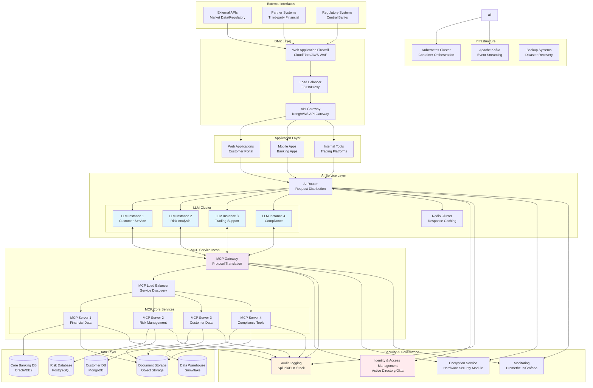
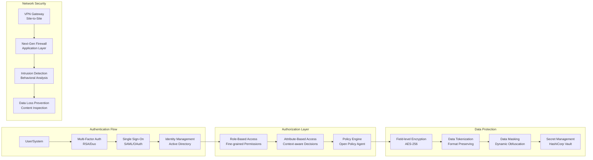
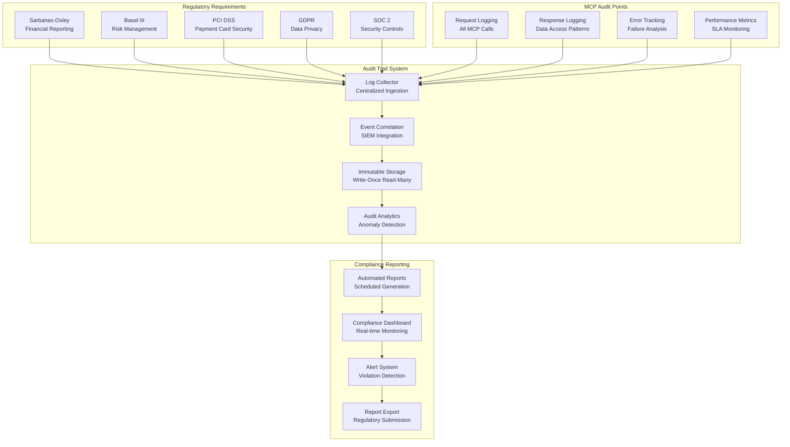
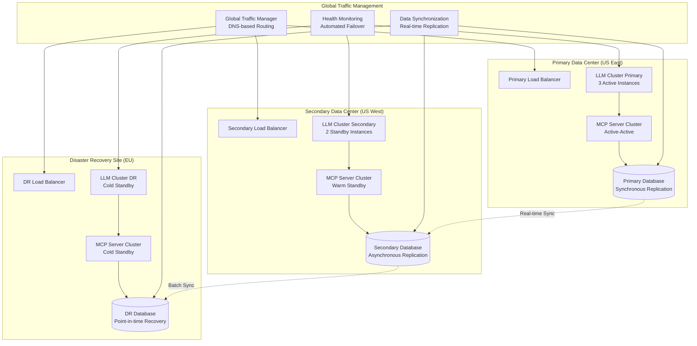
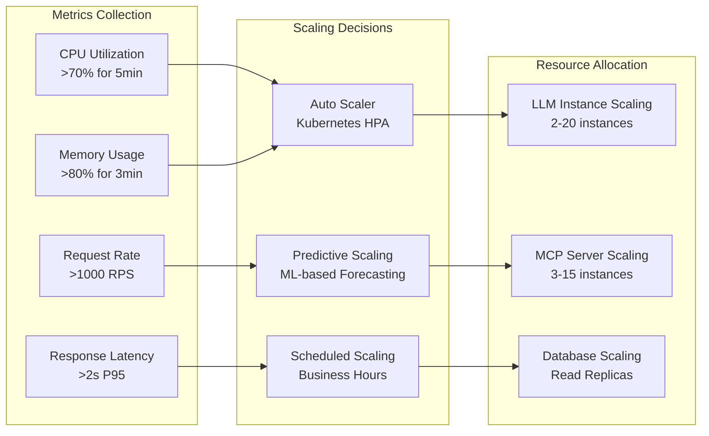

# Enterprise MCP Architecture

This diagram illustrates a large-scale enterprise implementation of MCP-enabled AI systems with comprehensive security, monitoring, and governance capabilities.

## Use Case: Global Financial Services AI Platform

A multinational bank's AI platform that provides intelligent services across trading, risk management, customer service, and regulatory compliance while maintaining strict security and audit requirements.

## High-Level Enterprise Architecture

## Security Architecture Deep Dive

## Compliance and Audit Framework

## High Availability and Disaster Recovery

## Performance and Scaling Strategy

### Auto-Scaling Configuration

## Enterprise Benefits

### Operational Excellence
- **99.99% Uptime**: Multi-region deployment with automated failover
- **Sub-second Response**: Optimized caching and load balancing
- **Elastic Scaling**: Automatic resource scaling based on demand
- **Global Reach**: Distributed architecture for worldwide access

### Security and Compliance
- **Zero Trust Architecture**: Every request authenticated and authorized
- **End-to-End Encryption**: Data protected in transit and at rest
- **Immutable Audit Logs**: Complete traceability for regulatory compliance
- **Real-time Monitoring**: Continuous security and performance monitoring

### Cost Optimization
- **Resource Efficiency**: Dynamic scaling reduces unused capacity
- **Caching Strategy**: Intelligent caching minimizes expensive API calls
- **Data Tiering**: Automated data lifecycle management
- **Cloud Economics**: Hybrid deployment for cost optimization

### Risk Management
- **Disaster Recovery**: RTO < 15 minutes, RPO < 5 minutes
- **Circuit Breakers**: Prevent cascade failures across services
- **Rate Limiting**: Protect against abuse and ensure fair usage
- **Graceful Degradation**: Maintain core functionality during outages
