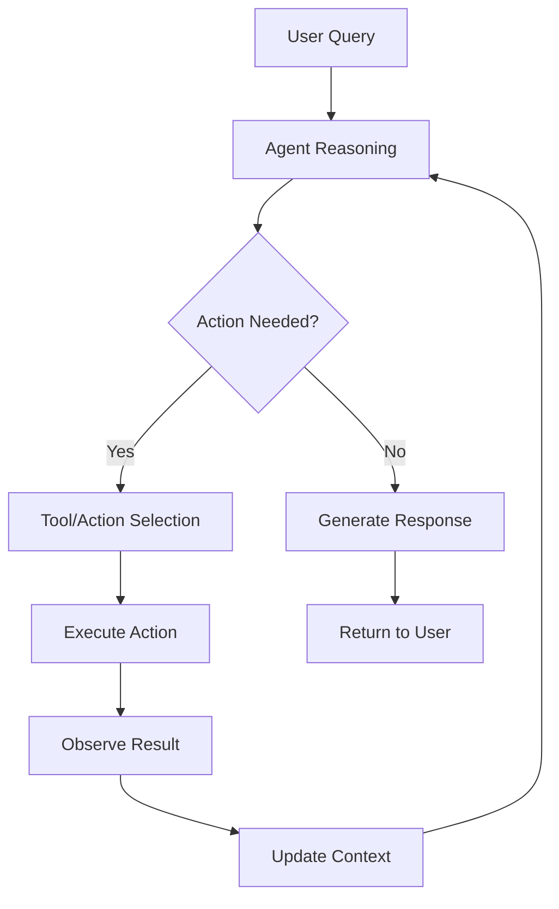

# LLM Agent Architecture: Building Intelligent Autonomous Systems

LLM agents combine the language understanding capabilities of Large Language Models with autonomous reasoning, planning, and action execution. This section covers the fundamental architectures for building sophisticated AI agents.

## 🏗️ Core Agent Architecture Patterns

### ReAct (Reasoning + Acting) Pattern



**ReAct Implementation**:
```python
import asyncio
from typing import Dict, List, Any, Optional, Union
from abc import ABC, abstractmethod
import json

class Tool(ABC):
    """Abstract base class for agent tools"""
    
    def __init__(self, name: str, description: str):
        self.name = name
        self.description = description
    
    @abstractmethod
    async def execute(self, parameters: Dict[str, Any]) -> Dict[str, Any]:
        """Execute the tool with given parameters"""
        pass
    
    @abstractmethod
    def get_schema(self) -> Dict[str, Any]:
        """Return tool parameter schema"""
        pass

class WebSearchTool(Tool):
    """Web search tool for information retrieval"""
    
    def __init__(self):
        super().__init__(
            name="web_search",
            description="Search the internet for current information"
        )
    
    async def execute(self, parameters: Dict[str, Any]) -> Dict[str, Any]:
        query = parameters.get('query', '')
        max_results = parameters.get('max_results', 5)
        
        # Simulate web search
        results = [
            {"title": f"Result {i+1} for '{query}'", 
             "url": f"https://example.com/result-{i+1}",
             "snippet": f"This is result {i+1} about {query}..."}
            for i in range(max_results)
        ]
        
        return {
            "success": True,
            "results": results,
            "total_found": len(results)
        }
    
    def get_schema(self) -> Dict[str, Any]:
        return {
            "type": "object",
            "properties": {
                "query": {"type": "string", "description": "Search query"},
                "max_results": {"type": "integer", "description": "Maximum results to return", "default": 5}
            },
            "required": ["query"]
        }

class CalculatorTool(Tool):
    """Calculator tool for mathematical operations"""
    
    def __init__(self):
        super().__init__(
            name="calculator",
            description="Perform mathematical calculations"
        )
    
    async def execute(self, parameters: Dict[str, Any]) -> Dict[str, Any]:
        expression = parameters.get('expression', '')
        
        try:
            # Safe evaluation (in production, use ast.literal_eval or similar)
            result = eval(expression.replace('^', '**'))
            return {
                "success": True,
                "result": result,
                "expression": expression
            }
        except Exception as e:
            return {
                "success": False,
                "error": str(e),
                "expression": expression
            }
    
    def get_schema(self) -> Dict[str, Any]:
        return {
            "type": "object",
            "properties": {
                "expression": {"type": "string", "description": "Mathematical expression to evaluate"}
            },
            "required": ["expression"]
        }

class ReActAgent:
    """ReAct (Reasoning + Acting) agent implementation"""
    
    def __init__(self, model_name: str = "gpt-4"):
        self.model_name = model_name
        self.tools: Dict[str, Tool] = {}
        self.max_iterations = 10
        self.conversation_history = []
    
    def add_tool(self, tool: Tool):
        """Add a tool to the agent's toolkit"""
        self.tools[tool.name] = tool
    
    def get_tools_description(self) -> str:
        """Generate description of available tools"""
        if not self.tools:
            return "No tools available."
        
        descriptions = []
        for tool in self.tools.values():
            schema = tool.get_schema()
            descriptions.append(f"- {tool.name}: {tool.description}")
            descriptions.append(f"  Parameters: {json.dumps(schema, indent=2)}")
        
        return "\n".join(descriptions)
    
    def create_system_prompt(self) -> str:
        """Create the system prompt for ReAct reasoning"""
        tools_desc = self.get_tools_description()
        
        return f"""You are a helpful AI assistant that can reason step by step and use tools to help answer questions.

Available tools:
{tools_desc}

Use the following format for your reasoning:

Thought: [Your reasoning about what to do next]
Action: [The action to take - either use a tool or provide final answer]
Action Input: [The input parameters for the action, in JSON format]
Observation: [The result of the action - this will be filled automatically]

Continue this pattern until you can provide a Final Answer.

When using tools:
- Use the exact tool name from the list above
- Provide parameters in proper JSON format
- Wait for the observation before continuing

When you have enough information to answer the question, provide:
Final Answer: [Your complete answer to the user's question]

Let's begin!"""
    
    async def parse_action(self, text: str) -> Optional[Dict[str, Any]]:
        """Parse action from agent's response"""
        lines = text.strip().split('\n')
        action_info = {}
        
        for line in lines:
            if line.startswith('Action:'):
                action_info['action'] = line.replace('Action:', '').strip()
            elif line.startswith('Action Input:'):
                input_text = line.replace('Action Input:', '').strip()
                try:
                    action_info['input'] = json.loads(input_text)
                except json.JSONDecodeError:
                    action_info['input'] = input_text
        
        return action_info if 'action' in action_info else None
    
    async def execute_tool(self, tool_name: str, parameters: Dict[str, Any]) -> Dict[str, Any]:
        """Execute a tool with given parameters"""
        if tool_name not in self.tools:
            return {
                "success": False,
                "error": f"Tool '{tool_name}' not found. Available tools: {list(self.tools.keys())}"
            }
        
        tool = self.tools[tool_name]
        return await tool.execute(parameters)
    
    async def generate_response(self, prompt: str) -> str:
        """Generate response using LLM (simulated)"""
        # In practice, this would call an actual LLM API
        await asyncio.sleep(0.1)  # Simulate API delay
        
        # Simple simulation based on prompt content
        if "search" in prompt.lower():
            return """Thought: I need to search for information about this topic.
Action: web_search
Action Input: {"query": "relevant search query", "max_results": 3}"""
        elif "calculate" in prompt.lower() or any(op in prompt for op in ['+', '-', '*', '/', 'math']):
            return """Thought: I need to perform a mathematical calculation.
Action: calculator
Action Input: {"expression": "2 + 2"}"""
        else:
            return """Thought: I have enough information to provide an answer.
Final Answer: Based on the available information, here is my response."""
    
    async def run(self, user_query: str) -> str:
        """Run the ReAct agent on a user query"""
        # Initialize conversation
        system_prompt = self.create_system_prompt()
        current_prompt = f"{system_prompt}\n\nUser Query: {user_query}"
        
        iteration = 0
        
        while iteration < self.max_iterations:
            # Generate response
            response = await self.generate_response(current_prompt)
            
            # Check for Final Answer
            if "Final Answer:" in response:
                final_answer = response.split("Final Answer:")[-1].strip()
                return final_answer
            
            # Parse and execute action
            action_info = await self.parse_action(response)
            
            if action_info:
                tool_name = action_info['action']
                parameters = action_info.get('input', {})
                
                # Execute tool
                result = await self.execute_tool(tool_name, parameters)
                
                # Update prompt with observation
                current_prompt += f"\n\n{response}\nObservation: {json.dumps(result)}\n"
            else:
                # No action found, treat as final answer
                return response
            
            iteration += 1
        
        return "I apologize, but I couldn't complete the task within the maximum number of iterations."

# Example usage
async def demo_react_agent():
    """Demonstrate ReAct agent capabilities"""
    
    # Create agent
    agent = ReActAgent()
    
    # Add tools
    agent.add_tool(WebSearchTool())
    agent.add_tool(CalculatorTool())
    
    # Test queries
    queries = [
        "What is 15 * 23 + 47?",
        "Search for information about machine learning",
        "Calculate the area of a circle with radius 5"
    ]
    
    for query in queries:
        print(f"\n{'='*50}")
        print(f"Query: {query}")
        print(f"{'='*50}")
        
        try:
            result = await agent.run(query)
            print(f"Result: {result}")
        except Exception as e:
            print(f"Error: {e}")

# Run demo
# asyncio.run(demo_react_agent())
```

### Plan-and-Execute Architecture

```python
class Task:
    """Represents a single task in a plan"""
    
    def __init__(self, id: str, description: str, dependencies: List[str] = None):
        self.id = id
        self.description = description
        self.dependencies = dependencies or []
        self.status = "pending"  # pending, in_progress, completed, failed
        self.result = None
        self.error = None

class PlanExecuteAgent:
    """Plan-and-Execute agent that decomposes complex tasks"""
    
    def __init__(self):
        self.tools: Dict[str, Tool] = {}
        self.execution_history = []
    
    def add_tool(self, tool: Tool):
        """Add tool to agent toolkit"""
        self.tools[tool.name] = tool
    
    async def generate_plan(self, objective: str) -> List[Task]:
        """Generate a plan to achieve the objective"""
        # In practice, this would use an LLM to decompose the task
        # For demo, we'll create a simple plan structure
        
        if "research" in objective.lower():
            return [
                Task("search_info", "Search for relevant information", []),
                Task("analyze_results", "Analyze search results", ["search_info"]),
                Task("synthesize", "Create comprehensive summary", ["analyze_results"])
            ]
        elif "calculate" in objective.lower():
            return [
                Task("identify_formula", "Identify required mathematical formula", []),
                Task("gather_inputs", "Gather input values", []),
                Task("perform_calculation", "Execute calculation", ["identify_formula", "gather_inputs"])
            ]
        else:
            return [
                Task("understand_task", "Understand the requirements", []),
                Task("execute_task", "Execute the main task", ["understand_task"]),
                Task("verify_result", "Verify the result", ["execute_task"])
            ]
    
    async def execute_task(self, task: Task, context: Dict[str, Any]) -> Dict[str, Any]:
        """Execute a single task"""
        task.status = "in_progress"
        
        try:
            # Simulate task execution
            if "search" in task.description.lower():
                if "web_search" in self.tools:
                    result = await self.tools["web_search"].execute({
                        "query": context.get("search_query", "general search")
                    })
                    task.result = result
                else:
                    task.result = {"info": "Simulated search results"}
            
            elif "calculate" in task.description.lower():
                if "calculator" in self.tools:
                    result = await self.tools["calculator"].execute({
                        "expression": context.get("expression", "1+1")
                    })
                    task.result = result
                else:
                    task.result = {"result": 42}
            
            else:
                # Generic task execution
                task.result = {"status": "completed", "description": task.description}
            
            task.status = "completed"
            return task.result
            
        except Exception as e:
            task.status = "failed"
            task.error = str(e)
            return {"error": str(e)}
    
    async def execute_plan(self, tasks: List[Task], context: Dict[str, Any]) -> Dict[str, Any]:
        """Execute plan with dependency resolution"""
        completed_tasks = set()
        results = {}
        
        while len(completed_tasks) < len(tasks):
            progress_made = False
            
            for task in tasks:
                if task.status == "completed":
                    continue
                
                # Check if dependencies are satisfied
                deps_satisfied = all(dep in completed_tasks for dep in task.dependencies)
                
                if deps_satisfied and task.status == "pending":
                    # Execute task
                    result = await self.execute_task(task, context)
                    results[task.id] = result
                    
                    if task.status == "completed":
                        completed_tasks.add(task.id)
                        progress_made = True
                    
                    # Update context with task results
                    context[task.id] = result
            
            if not progress_made:
                # Check for failed tasks or circular dependencies
                failed_tasks = [t for t in tasks if t.status == "failed"]
                if failed_tasks:
                    return {"error": f"Tasks failed: {[t.id for t in failed_tasks]}"}
                else:
                    return {"error": "Circular dependency or other execution error"}
        
        return results
    
    async def run(self, objective: str, initial_context: Dict[str, Any] = None) -> Dict[str, Any]:
        """Run the plan-execute agent"""
        context = initial_context or {}
        
        # Step 1: Generate plan
        plan = await self.generate_plan(objective)
        
        print(f"Generated plan with {len(plan)} tasks:")
        for task in plan:
            deps_str = f" (depends on: {task.dependencies})" if task.dependencies else ""
            print(f"  - {task.id}: {task.description}{deps_str}")
        
        # Step 2: Execute plan
        results = await self.execute_plan(plan, context)
        
        return {
            "objective": objective,
            "plan": [{"id": t.id, "description": t.description, "dependencies": t.dependencies} for t in plan],
            "results": results,
            "final_status": "completed" if "error" not in results else "failed"
        }

# Example usage
async def demo_plan_execute():
    """Demonstrate Plan-Execute agent"""
    
    agent = PlanExecuteAgent()
    agent.add_tool(WebSearchTool())
    agent.add_tool(CalculatorTool())
    
    objectives = [
        "Research the latest developments in quantum computing",
        "Calculate the compound interest for $1000 at 5% for 10 years"
    ]
    
    for objective in objectives:
        print(f"\n{'='*60}")
        print(f"Objective: {objective}")
        print(f"{'='*60}")
        
        result = await agent.run(objective)
        print(f"Final Status: {result['final_status']}")
        if result['final_status'] == 'completed':
            print("Execution completed successfully!")
        else:
            print(f"Execution failed: {result['results'].get('error', 'Unknown error')}")

# asyncio.run(demo_plan_execute())
```

## 🧠 Agent Memory Systems

### Short-term and Long-term Memory

```python
from datetime import datetime, timedelta
from typing import Optional

class MemoryItem:
    """Individual memory item"""
    
    def __init__(self, content: str, memory_type: str = "episodic", 
                 importance: float = 1.0, tags: List[str] = None):
        self.id = f"mem_{datetime.now().timestamp()}"
        self.content = content
        self.memory_type = memory_type  # episodic, semantic, procedural
        self.importance = importance
        self.tags = tags or []
        self.created_at = datetime.now()
        self.last_accessed = datetime.now()
        self.access_count = 0
        self.decay_factor = 0.9  # Memory decay rate

    def access(self):
        """Update access statistics"""
        self.last_accessed = datetime.now()
        self.access_count += 1
    
    def get_strength(self) -> float:
        """Calculate memory strength based on recency and frequency"""
        # Time decay
        time_since_creation = (datetime.now() - self.created_at).total_seconds() / 86400  # days
        time_decay = self.decay_factor ** time_since_creation
        
        # Frequency boost
        frequency_boost = min(2.0, 1.0 + (self.access_count * 0.1))
        
        # Importance weighting
        return self.importance * time_decay * frequency_boost

class AgentMemory:
    """Comprehensive memory system for AI agents"""
    
    def __init__(self, max_short_term: int = 20, max_long_term: int = 1000):
        self.short_term_memory: List[MemoryItem] = []
        self.long_term_memory: List[MemoryItem] = []
        self.semantic_memory: Dict[str, Any] = {}  # Facts and knowledge
        self.procedural_memory: Dict[str, Any] = {}  # Skills and procedures
        
        self.max_short_term = max_short_term
        self.max_long_term = max_long_term
        
        # Memory consolidation thresholds
        self.consolidation_threshold = 0.7
        self.forgetting_threshold = 0.1
    
    def add_memory(self, content: str, memory_type: str = "episodic", 
                   importance: float = 1.0, tags: List[str] = None):
        """Add new memory item"""
        memory_item = MemoryItem(content, memory_type, importance, tags)
        
        # Add to short-term memory first
        self.short_term_memory.append(memory_item)
        
        # Maintain short-term memory size
        if len(self.short_term_memory) > self.max_short_term:
            self._consolidate_memories()
    
    def _consolidate_memories(self):
        """Move important memories from short-term to long-term"""
        # Sort short-term memories by strength
        self.short_term_memory.sort(key=lambda m: m.get_strength(), reverse=True)
        
        # Consolidate high-strength memories
        to_consolidate = []
        remaining_short_term = []
        
        for memory in self.short_term_memory:
            if (memory.get_strength() >= self.consolidation_threshold or 
                len(remaining_short_term) >= self.max_short_term):
                to_consolidate.append(memory)
            else:
                remaining_short_term.append(memory)
        
        # Move to long-term memory
        self.long_term_memory.extend(to_consolidate)
        self.short_term_memory = remaining_short_term
        
        # Clean up weak long-term memories
        self._forget_weak_memories()
    
    def _forget_weak_memories(self):
        """Remove weak memories from long-term storage"""
        strong_memories = [
            mem for mem in self.long_term_memory 
            if mem.get_strength() >= self.forgetting_threshold
        ]
        
        # Keep only the strongest memories if we exceed capacity
        if len(strong_memories) > self.max_long_term:
            strong_memories.sort(key=lambda m: m.get_strength(), reverse=True)
            self.long_term_memory = strong_memories[:self.max_long_term]
        else:
            self.long_term_memory = strong_memories
    
    def retrieve_memories(self, query: str, max_results: int = 5) -> List[MemoryItem]:
        """Retrieve relevant memories based on query"""
        all_memories = self.short_term_memory + self.long_term_memory
        
        # Simple relevance scoring (in practice, use embeddings)
        query_words = set(query.lower().split())
        
        scored_memories = []
        for memory in all_memories:
            memory.access()  # Update access statistics
            
            # Calculate relevance score
            memory_words = set(memory.content.lower().split())
            word_overlap = len(query_words & memory_words)
            tag_overlap = len(set(memory.tags) & query_words) if memory.tags else 0
            
            relevance = (word_overlap + tag_overlap * 2) * memory.get_strength()
            
            if relevance > 0:
                scored_memories.append((memory, relevance))
        
        # Sort by relevance and return top results
        scored_memories.sort(key=lambda x: x[1], reverse=True)
        return [memory for memory, score in scored_memories[:max_results]]
    
    def add_semantic_knowledge(self, key: str, value: Any):
        """Add factual knowledge to semantic memory"""
        self.semantic_memory[key] = value
    
    def get_semantic_knowledge(self, key: str) -> Optional[Any]:
        """Retrieve factual knowledge"""
        return self.semantic_memory.get(key)
    
    def add_procedure(self, name: str, steps: List[str]):
        """Add procedural knowledge (how to do things)"""
        self.procedural_memory[name] = {
            'steps': steps,
            'usage_count': 0,
            'success_rate': 1.0
        }
    
    def get_procedure(self, name: str) -> Optional[Dict[str, Any]]:
        """Retrieve procedural knowledge"""
        if name in self.procedural_memory:
            self.procedural_memory[name]['usage_count'] += 1
            return self.procedural_memory[name]
        return None
    
    def get_memory_summary(self) -> Dict[str, Any]:
        """Get summary of current memory state"""
        return {
            'short_term_count': len(self.short_term_memory),
            'long_term_count': len(self.long_term_memory),
            'semantic_knowledge_count': len(self.semantic_memory),
            'procedures_count': len(self.procedural_memory),
            'total_memories': len(self.short_term_memory) + len(self.long_term_memory)
        }

# Example usage with memory-enhanced agent
class MemoryEnhancedAgent(ReActAgent):
    """ReAct agent with memory capabilities"""
    
    def __init__(self, model_name: str = "gpt-4"):
        super().__init__(model_name)
        self.memory = AgentMemory()
    
    async def run_with_memory(self, user_query: str) -> str:
        """Run agent with memory integration"""
        # Retrieve relevant memories
        relevant_memories = self.memory.retrieve_memories(user_query, max_results=3)
        
        # Add memory context to prompt
        memory_context = ""
        if relevant_memories:
            memory_context = "Relevant past experiences:\n"
            for memory in relevant_memories:
                memory_context += f"- {memory.content}\n"
            memory_context += "\n"
        
        # Store current interaction in memory
        self.memory.add_memory(
            f"User asked: {user_query}",
            memory_type="episodic",
            importance=1.0,
            tags=user_query.split()[:3]  # First 3 words as tags
        )
        
        # Run normal agent logic with memory context
        result = await self.run(user_query)
        
        # Store the result
        self.memory.add_memory(
            f"Responded with: {result}",
            memory_type="episodic",
            importance=0.8
        )
        
        return result

# Demo memory-enhanced agent
async def demo_memory_agent():
    """Demonstrate memory-enhanced agent"""
    
    agent = MemoryEnhancedAgent()
    agent.add_tool(WebSearchTool())
    agent.add_tool(CalculatorTool())
    
    # Add some initial knowledge
    agent.memory.add_semantic_knowledge("user_preferences", {"language": "Python", "domain": "AI"})
    agent.memory.add_procedure("debug_code", [
        "Read error message carefully",
        "Check syntax and indentation",
        "Verify variable names and imports",
        "Test with simple examples"
    ])
    
    queries = [
        "What is machine learning?",
        "How do I debug Python code?",
        "Tell me more about machine learning applications"  # Should reference earlier conversation
    ]
    
    for query in queries:
        print(f"\n{'='*50}")
        print(f"Query: {query}")
        print(f"Memory Summary: {agent.memory.get_memory_summary()}")
        
        result = await agent.run_with_memory(query)
        print(f"Result: {result}")

# asyncio.run(demo_memory_agent())
print("Agent architecture components defined successfully!")
```

## ✅ Agent Architecture Checklist

Master these key concepts:

1. **ReAct Pattern**: Reasoning and Acting cycles
2. **Plan-Execute**: Task decomposition and execution
3. **Tool Integration**: Adding capabilities to agents
4. **Memory Systems**: Short-term, long-term, and semantic memory
5. **Context Management**: Maintaining conversation state
6. **Error Handling**: Robust failure recovery
7. **Performance Monitoring**: Tracking agent effectiveness

## 🚀 Next Steps

Continue with:

1. **[Agent Tools](tools.md)** - Building comprehensive agent toolkits
2. **[Memory Systems](memory.md)** - Advanced memory architectures
3. **[Agent Deployment](deployment.md)** - Production deployment strategies

---

*Agent architecture is the foundation for building intelligent, autonomous AI systems. Master these patterns to create sophisticated LLM-powered agents capable of complex reasoning and task execution.*
