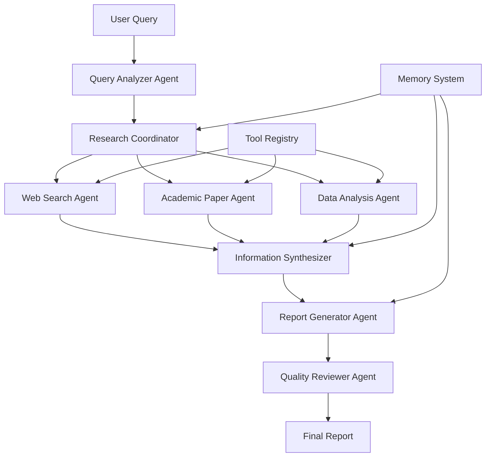

# Capstone Project: Intelligent Multi-Agent Research Assistant

This capstone project integrates all concepts learned throughout the course by building a sophisticated multi-agent system that can conduct comprehensive research, analyze information, and generate detailed reports on complex topics.

## 🎯 Project Overview

### System Architecture



### Core Components

1. **Query Analyzer Agent**: Understands and decomposes research queries
2. **Research Coordinator**: Plans and orchestrates the research process
3. **Information Gathering Agents**: Web search, academic papers, data collection
4. **Synthesis Agent**: Combines information from multiple sources
5. **Report Generator**: Creates comprehensive research reports
6. **Quality Reviewer**: Ensures accuracy and completeness

## 📋 Project Requirements

### Functional Requirements

**Primary Features**:
- Natural language query processing
- Multi-source information gathering
- Intelligent agent coordination
- Comprehensive report generation
- Citation and source tracking
- Quality assurance and fact-checking

**Agent Capabilities**:
- Web search and content extraction
- Academic paper analysis
- Data visualization creation
- Multi-language support
- Real-time collaboration

**System Features**:
- Persistent memory across sessions
- Configurable research depth
- Export in multiple formats (PDF, HTML, Markdown)
- Interactive query refinement
- Progress tracking and status updates

### Technical Requirements

**Architecture**:
- Microservices-based agent system
- RESTful API interfaces
- Message queue for agent communication
- Vector database for knowledge storage
- LLM integration for reasoning

**Performance**:
- Handle queries within 2-5 minutes
- Support concurrent research sessions
- Scale to 10+ simultaneous users
- 99.9% uptime availability

**Security**:
- API key management
- Rate limiting and quotas
- Data privacy and compliance
- Secure communication between agents

## 🏗️ Implementation Guide

### Phase 1: Foundation Setup (Week 1-2)

**Environment Preparation**:
```python
# Project structure
research-assistant/
├── agents/
│   ├── __init__.py
│   ├── base_agent.py
│   ├── query_analyzer.py
│   ├── research_coordinator.py
│   ├── web_search_agent.py
│   ├── academic_agent.py
│   ├── synthesis_agent.py
│   └── report_generator.py
├── tools/
│   ├── __init__.py
│   ├── web_scraper.py
│   ├── paper_finder.py
│   ├── citation_tracker.py
│   └── data_visualizer.py
├── memory/
│   ├── __init__.py
│   ├── vector_store.py
│   ├── graph_memory.py
│   └── session_manager.py
├── api/
│   ├── __init__.py
│   ├── main.py
│   ├── routes.py
│   └── models.py
├── frontend/
│   ├── index.html
│   ├── app.js
│   └── style.css
├── tests/
├── requirements.txt
├── docker-compose.yml
└── README.md
```

**Core Dependencies**:
```python
# requirements.txt
fastapi==0.104.1
uvicorn==0.24.0
langchain==0.1.0
chromadb==0.4.15
numpy==1.24.3
pandas==2.0.3
aiohttp==3.9.0
beautifulsoup4==4.12.2
python-multipart==0.0.6
python-dotenv==1.0.0
openai==1.3.0
anthropic==0.3.0
tiktoken==0.5.0
sqlalchemy==2.0.23
alembic==1.13.0
redis==5.0.1
celery==5.3.4
pytest==7.4.3
pytest-asyncio==0.21.1
streamlit==1.28.0  # For web interface
plotly==5.17.0     # For visualizations
reportlab==4.0.7   # For PDF generation
```

### Phase 2: Base Agent Framework (Week 2-3)

**Base Agent Class**:
```python
from abc import ABC, abstractmethod
from typing import Dict, List, Any, Optional
import asyncio
import logging
from datetime import datetime
import uuid

class BaseAgent(ABC):
    """Abstract base class for all research assistant agents"""
    
    def __init__(self, name: str, capabilities: List[str], llm_client=None):
        self.id = str(uuid.uuid4())
        self.name = name
        self.capabilities = capabilities
        self.llm_client = llm_client
        self.status = "initialized"
        self.memory = {}
        self.tools = {}
        self.created_at = datetime.now()
        self.logger = logging.getLogger(f"agent.{name}")
    
    @abstractmethod
    async def process_message(self, message: Dict[str, Any]) -> Dict[str, Any]:
        """Process incoming message and return response"""
        pass
    
    @abstractmethod
    def get_capabilities(self) -> List[str]:
        """Return list of agent capabilities"""
        pass
    
    async def initialize(self):
        """Initialize agent resources"""
        self.status = "ready"
        self.logger.info(f"Agent {self.name} initialized")
    
    async def cleanup(self):
        """Cleanup agent resources"""
        self.status = "stopped"
        self.logger.info(f"Agent {self.name} cleaned up")
    
    def add_tool(self, name: str, tool: Any):
        """Add tool to agent toolkit"""
        self.tools[name] = tool
        self.logger.info(f"Added tool '{name}' to agent {self.name}")
    
    def get_status(self) -> Dict[str, Any]:
        """Get current agent status"""
        return {
            "id": self.id,
            "name": self.name,
            "status": self.status,
            "capabilities": self.capabilities,
            "tools": list(self.tools.keys()),
            "created_at": self.created_at.isoformat(),
            "memory_items": len(self.memory)
        }

class ResearchCoordinator(BaseAgent):
    """Coordinates multi-agent research process"""
    
    def __init__(self, llm_client):
        super().__init__(
            name="research_coordinator",
            capabilities=["planning", "coordination", "task_decomposition"],
            llm_client=llm_client
        )
        self.active_agents = {}
        self.research_sessions = {}
    
    async def process_message(self, message: Dict[str, Any]) -> Dict[str, Any]:
        """Coordinate research based on user query"""
        query = message.get("query", "")
        session_id = message.get("session_id", str(uuid.uuid4()))
        
        # Create research plan
        research_plan = await self.create_research_plan(query)
        
        # Initialize research session
        self.research_sessions[session_id] = {
            "query": query,
            "plan": research_plan,
            "status": "in_progress",
            "results": {},
            "started_at": datetime.now()
        }
        
        # Execute research plan
        results = await self.execute_research_plan(session_id, research_plan)
        
        return {
            "session_id": session_id,
            "status": "completed",
            "results": results,
            "plan": research_plan
        }
    
    async def create_research_plan(self, query: str) -> Dict[str, Any]:
        """Create detailed research plan using LLM"""
        planning_prompt = f"""
        Create a comprehensive research plan for the following query: "{query}"
        
        Structure your plan with:
        1. Key research objectives
        2. Information sources to explore
        3. Analysis tasks needed
        4. Expected deliverables
        
        Format as structured JSON with tasks, dependencies, and agent assignments.
        """
        
        # Simulate LLM planning (replace with actual API call)
        plan = {
            "objectives": [
                "Gather comprehensive information on the topic",
                "Analyze different perspectives and viewpoints",
                "Synthesize findings into coherent insights",
                "Generate actionable recommendations"
            ],
            "tasks": [
                {
                    "id": "web_search",
                    "agent": "web_search_agent",
                    "description": "Search web for recent information",
                    "priority": 1,
                    "dependencies": []
                },
                {
                    "id": "academic_search",
                    "agent": "academic_agent", 
                    "description": "Find relevant academic papers",
                    "priority": 1,
                    "dependencies": []
                },
                {
                    "id": "synthesis",
                    "agent": "synthesis_agent",
                    "description": "Combine information from all sources",
                    "priority": 2,
                    "dependencies": ["web_search", "academic_search"]
                },
                {
                    "id": "report_generation",
                    "agent": "report_generator",
                    "description": "Generate comprehensive report",
                    "priority": 3,
                    "dependencies": ["synthesis"]
                }
            ],
            "timeline": "30-45 minutes",
            "resources_needed": ["web_search", "academic_database", "synthesis_engine"]
        }
        
        return plan
    
    async def execute_research_plan(self, session_id: str, plan: Dict[str, Any]) -> Dict[str, Any]:
        """Execute research plan with multiple agents"""
        tasks = plan["tasks"]
        completed_tasks = set()
        task_results = {}
        
        # Execute tasks based on dependencies
        while len(completed_tasks) < len(tasks):
            ready_tasks = [
                task for task in tasks 
                if task["id"] not in completed_tasks and 
                all(dep in completed_tasks for dep in task["dependencies"])
            ]
            
            if not ready_tasks:
                break
            
            # Execute ready tasks in parallel
            task_futures = []
            for task in ready_tasks:
                future = self.execute_task(task, task_results)
                task_futures.append((task, future))
            
            # Wait for task completion
            for task, future in task_futures:
                try:
                    result = await future
                    task_results[task["id"]] = result
                    completed_tasks.add(task["id"])
                    
                    self.logger.info(f"Completed task: {task['id']}")
                except Exception as e:
                    self.logger.error(f"Task {task['id']} failed: {e}")
                    task_results[task["id"]] = {"error": str(e)}
                    completed_tasks.add(task["id"])  # Mark as completed to avoid infinite loop
        
        return task_results
    
    async def execute_task(self, task: Dict[str, Any], context: Dict[str, Any]) -> Dict[str, Any]:
        """Execute individual task"""
        # Simulate task execution (replace with actual agent calls)
        await asyncio.sleep(1)  # Simulate processing time
        
        if task["id"] == "web_search":
            return {
                "sources": ["source1.com", "source2.org"],
                "summary": "Web search completed successfully",
                "key_findings": ["Finding 1", "Finding 2", "Finding 3"]
            }
        elif task["id"] == "academic_search":
            return {
                "papers": ["Paper 1", "Paper 2"],
                "summary": "Academic search completed",
                "citations": 15
            }
        elif task["id"] == "synthesis":
            return {
                "combined_insights": "Synthesized information from multiple sources",
                "contradictions": [],
                "confidence": 0.85
            }
        elif task["id"] == "report_generation":
            return {
                "report": "Comprehensive research report generated",
                "sections": ["Introduction", "Methodology", "Findings", "Conclusions"],
                "word_count": 2500
            }
        
        return {"status": "completed", "task_id": task["id"]}
    
    def get_capabilities(self) -> List[str]:
        return self.capabilities

# Initialize system components
async def initialize_research_system():
    """Initialize the research assistant system"""
    
    # Create coordinator
    coordinator = ResearchCoordinator(llm_client=None)  # Add actual LLM client
    await coordinator.initialize()
    
    # Test basic functionality
    test_message = {
        "query": "What are the latest developments in quantum computing?",
        "session_id": "test_session"
    }
    
    result = await coordinator.process_message(test_message)
    print("System initialized successfully!")
    print(f"Test result: {result}")
    
    return coordinator

# Run initialization
# coordinator = asyncio.run(initialize_research_system())
```

### Phase 3: Specialized Agents (Week 3-4)

**Web Search Agent**:
```python
import aiohttp
from bs4 import BeautifulSoup
import re
from typing import List

class WebSearchAgent(BaseAgent):
    """Agent specialized in web search and content extraction"""
    
    def __init__(self, llm_client, search_api_key=None):
        super().__init__(
            name="web_search_agent",
            capabilities=["web_search", "content_extraction", "url_analysis"],
            llm_client=llm_client
        )
        self.search_api_key = search_api_key
        self.max_results = 10
        self.timeout = 30
    
    async def process_message(self, message: Dict[str, Any]) -> Dict[str, Any]:
        """Process search request"""
        query = message.get("query", "")
        max_results = message.get("max_results", self.max_results)
        
        try:
            # Perform web search
            search_results = await self.web_search(query, max_results)
            
            # Extract content from top results
            content_results = []
            for result in search_results[:5]:  # Extract content from top 5
                content = await self.extract_content(result["url"])
                if content:
                    content_results.append({
                        **result,
                        "content": content["text"][:1000],  # First 1000 chars
                        "content_summary": await self.summarize_content(content["text"])
                    })
            
            return {
                "status": "success",
                "query": query,
                "search_results": search_results,
                "content_results": content_results,
                "total_found": len(search_results)
            }
            
        except Exception as e:
            return {
                "status": "error",
                "error": str(e),
                "query": query
            }
    
    async def web_search(self, query: str, max_results: int) -> List[Dict[str, Any]]:
        """Perform web search (implement with actual search API)"""
        # Simulate web search results
        results = []
        for i in range(max_results):
            results.append({
                "title": f"Search Result {i+1} for '{query}'",
                "url": f"https://example{i+1}.com/article",
                "snippet": f"This is a snippet for result {i+1} about {query}...",
                "date": "2024-01-15",
                "relevance_score": 0.9 - (i * 0.1)
            })
        
        return results
    
    async def extract_content(self, url: str) -> Optional[Dict[str, Any]]:
        """Extract text content from URL"""
        try:
            async with aiohttp.ClientSession(timeout=aiohttp.ClientTimeout(total=self.timeout)) as session:
                async with session.get(url) as response:
                    if response.status == 200:
                        html = await response.text()
                        soup = BeautifulSoup(html, 'html.parser')
                        
                        # Remove script and style elements
                        for script in soup(["script", "style"]):
                            script.decompose()
                        
                        # Extract text
                        text = soup.get_text()
                        
                        # Clean text
                        lines = (line.strip() for line in text.splitlines())
                        chunks = (phrase.strip() for line in lines for phrase in line.split("  "))
                        text = ' '.join(chunk for chunk in chunks if chunk)
                        
                        return {
                            "text": text,
                            "title": soup.title.string if soup.title else "",
                            "word_count": len(text.split()),
                            "url": url
                        }
        except Exception as e:
            self.logger.error(f"Failed to extract content from {url}: {e}")
            return None
    
    async def summarize_content(self, content: str) -> str:
        """Summarize extracted content using LLM"""
        if len(content) < 200:
            return content
        
        # Simulate content summarization
        sentences = content.split('. ')[:3]  # First 3 sentences
        return '. '.join(sentences) + '.'
    
    def get_capabilities(self) -> List[str]:
        return self.capabilities

class AcademicAgent(BaseAgent):
    """Agent specialized in academic paper search and analysis"""
    
    def __init__(self, llm_client):
        super().__init__(
            name="academic_agent",
            capabilities=["paper_search", "citation_analysis", "abstract_analysis"],
            llm_client=llm_client
        )
    
    async def process_message(self, message: Dict[str, Any]) -> Dict[str, Any]:
        """Process academic search request"""
        query = message.get("query", "")
        
        # Search for papers
        papers = await self.search_papers(query)
        
        # Analyze abstracts
        analyzed_papers = []
        for paper in papers[:5]:  # Analyze top 5
            analysis = await self.analyze_abstract(paper["abstract"])
            analyzed_papers.append({
                **paper,
                "analysis": analysis
            })
        
        return {
            "status": "success", 
            "query": query,
            "papers_found": len(papers),
            "analyzed_papers": analyzed_papers,
            "key_authors": self.extract_key_authors(papers),
            "publication_venues": self.extract_venues(papers)
        }
    
    async def search_papers(self, query: str) -> List[Dict[str, Any]]:
        """Search for academic papers (implement with arXiv API, Semantic Scholar, etc.)"""
        # Simulate academic search
        papers = []
        for i in range(10):
            papers.append({
                "title": f"Academic Paper {i+1}: {query} Research",
                "authors": [f"Author {i+1}A", f"Author {i+1}B"],
                "abstract": f"This paper presents research on {query}. We investigate various aspects and provide novel insights. Our methodology involves comprehensive analysis and evaluation. The results demonstrate significant improvements over existing approaches.",
                "year": 2023 - (i % 3),
                "venue": f"Conference {i+1}",
                "citations": 50 - (i * 5),
                "url": f"https://arxiv.org/abs/2301.{i+1:05d}",
                "keywords": [query.lower(), "machine learning", "research"]
            })
        return papers
    
    async def analyze_abstract(self, abstract: str) -> Dict[str, Any]:
        """Analyze paper abstract"""
        # Simple analysis (replace with LLM-based analysis)
        word_count = len(abstract.split())
        
        # Extract methodology keywords
        method_keywords = []
        if "survey" in abstract.lower():
            method_keywords.append("survey")
        if "experiment" in abstract.lower():
            method_keywords.append("experimental")
        if "theoretical" in abstract.lower():
            method_keywords.append("theoretical")
        
        return {
            "word_count": word_count,
            "methodology_type": method_keywords,
            "research_contribution": "novel approach",  # Simplified
            "relevance_score": 0.8
        }
    
    def extract_key_authors(self, papers: List[Dict[str, Any]]) -> List[str]:
        """Extract frequently appearing authors"""
        author_count = {}
        for paper in papers:
            for author in paper["authors"]:
                author_count[author] = author_count.get(author, 0) + 1
        
        return sorted(author_count.keys(), key=author_count.get, reverse=True)[:5]
    
    def extract_venues(self, papers: List[Dict[str, Any]]) -> List[str]:
        """Extract publication venues"""
        venues = set()
        for paper in papers:
            venues.add(paper["venue"])
        return list(venues)
    
    def get_capabilities(self) -> List[str]:
        return self.capabilities
```

### Phase 4: Integration and API (Week 4-5)

**FastAPI Backend**:
```python
from fastapi import FastAPI, HTTPException, BackgroundTasks
from fastapi.middleware.cors import CORSMiddleware
from pydantic import BaseModel
from typing import Optional, Dict, Any
import asyncio
import uuid

app = FastAPI(title="Research Assistant API", version="1.0.0")

# CORS middleware
app.add_middleware(
    CORSMiddleware,
    allow_origins=["*"],
    allow_credentials=True,
    allow_methods=["*"],
    allow_headers=["*"],
)

# Pydantic models
class ResearchRequest(BaseModel):
    query: str
    depth: str = "standard"  # "quick", "standard", "comprehensive"
    focus_areas: Optional[List[str]] = None
    max_sources: int = 20

class ResearchResponse(BaseModel):
    session_id: str
    status: str
    progress: float
    estimated_completion: Optional[str] = None
    results: Optional[Dict[str, Any]] = None

# Global system components
research_system = None
active_sessions = {}

@app.on_event("startup")
async def startup_event():
    """Initialize research system on startup"""
    global research_system
    research_system = await initialize_research_system()

@app.post("/research", response_model=ResearchResponse)
async def start_research(request: ResearchRequest, background_tasks: BackgroundTasks):
    """Start new research session"""
    session_id = str(uuid.uuid4())
    
    # Initialize session
    active_sessions[session_id] = {
        "status": "started",
        "progress": 0.0,
        "request": request,
        "results": None
    }
    
    # Start research in background
    background_tasks.add_task(execute_research, session_id, request)
    
    return ResearchResponse(
        session_id=session_id,
        status="started",
        progress=0.0,
        estimated_completion="2-5 minutes"
    )

@app.get("/research/{session_id}", response_model=ResearchResponse)
async def get_research_status(session_id: str):
    """Get research session status"""
    if session_id not in active_sessions:
        raise HTTPException(status_code=404, detail="Session not found")
    
    session = active_sessions[session_id]
    return ResearchResponse(
        session_id=session_id,
        status=session["status"],
        progress=session["progress"],
        results=session["results"]
    )

@app.get("/research/{session_id}/report")
async def download_report(session_id: str, format: str = "pdf"):
    """Download research report"""
    if session_id not in active_sessions:
        raise HTTPException(status_code=404, detail="Session not found")
    
    session = active_sessions[session_id]
    if session["status"] != "completed":
        raise HTTPException(status_code=400, detail="Research not completed")
    
    # Generate report in requested format
    report_content = generate_report(session["results"], format)
    
    return {"download_url": f"/downloads/{session_id}.{format}"}

async def execute_research(session_id: str, request: ResearchRequest):
    """Execute research in background"""
    try:
        # Update progress
        active_sessions[session_id]["progress"] = 0.1
        active_sessions[session_id]["status"] = "analyzing_query"
        
        # Process with research coordinator
        message = {
            "query": request.query,
            "session_id": session_id,
            "depth": request.depth,
            "focus_areas": request.focus_areas
        }
        
        # Simulate progress updates
        for progress in [0.3, 0.5, 0.7, 0.9]:
            await asyncio.sleep(2)
            active_sessions[session_id]["progress"] = progress
        
        # Get results from coordinator
        results = await research_system.process_message(message)
        
        # Update session with results
        active_sessions[session_id].update({
            "status": "completed",
            "progress": 1.0,
            "results": results
        })
        
    except Exception as e:
        active_sessions[session_id].update({
            "status": "failed",
            "progress": 1.0,
            "error": str(e)
        })

def generate_report(results: Dict[str, Any], format: str) -> str:
    """Generate research report in specified format"""
    # Implement report generation logic
    return f"Generated {format} report"

if __name__ == "__main__":
    import uvicorn
    uvicorn.run(app, host="0.0.0.0", port=8000)
```

## ✅ Success Criteria

### Technical Metrics
- **Response Time**: < 5 minutes for standard queries
- **Accuracy**: > 85% factual accuracy in reports
- **Source Coverage**: Minimum 10 diverse sources per query
- **Uptime**: > 99% system availability
- **Scalability**: Handle 10+ concurrent sessions

### Quality Metrics  
- **Comprehensiveness**: Reports cover all major aspects
- **Citation Quality**: Proper attribution and source links
- **Readability**: Clear, well-structured output
- **Relevance**: Information directly addresses query
- **Objectivity**: Balanced perspective on controversial topics

### User Experience
- **Intuitive Interface**: Easy query input and result navigation
- **Progress Tracking**: Real-time status updates
- **Export Options**: Multiple format support (PDF, HTML, etc.)
- **Session Management**: Save and resume research sessions
- **Customization**: Adjustable depth and focus areas

---

*This capstone project demonstrates mastery of LLM and multi-agent system concepts through a practical, real-world application that showcases advanced AI coordination, reasoning, and report generation capabilities.*
