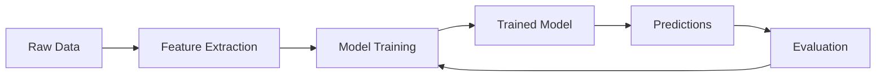
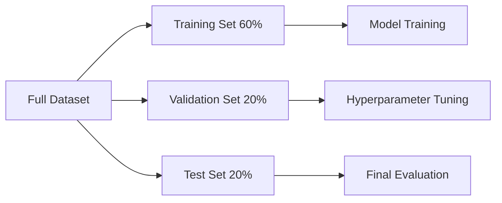
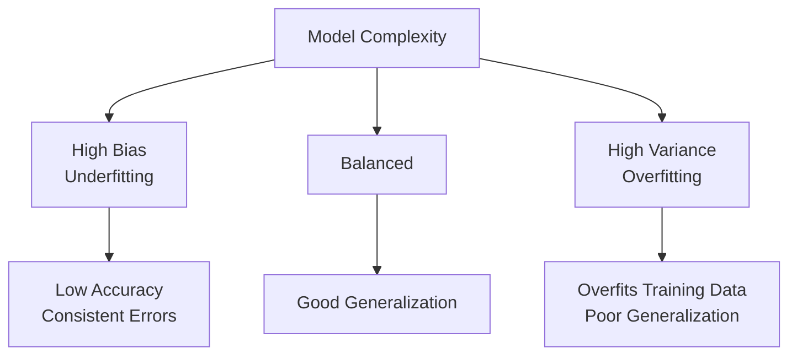

# AI/ML Fundamentals

Understanding the fundamental concepts of Artificial Intelligence and Machine Learning is essential for working with Large Language Models and Multi-Agent systems. This section provides a comprehensive foundation for the advanced topics ahead.

## 🧠 What is Artificial Intelligence?

Artificial Intelligence is the field of computer science focused on creating systems that can perform tasks typically requiring human intelligence. These tasks include:

- **Learning**: Acquiring new knowledge and skills from experience
- **Reasoning**: Making logical deductions and inferences
- **Problem-solving**: Finding solutions to complex challenges
- **Perception**: Interpreting sensory information
- **Language processing**: Understanding and generating human language

### Types of AI

**Narrow AI (Weak AI)**:
- Designed for specific tasks
- Current state of most AI systems
- Examples: Image recognition, chess playing, recommendation systems

**General AI (Strong AI)**:
- Human-level intelligence across all domains
- Theoretical goal of AI research
- Can transfer knowledge between different tasks

**Superintelligence**:
- Intelligence that exceeds human cognitive abilities
- Speculative future possibility
- Subject of ongoing research and debate

## 🤖 Machine Learning Fundamentals

Machine Learning is a subset of AI that enables systems to automatically learn and improve from experience without being explicitly programmed for every scenario.

### Core ML Concepts

**Data-Driven Approach**:


**Key Components**:

- **Data**: The fuel that drives machine learning
- **Features**: Measurable properties of observed phenomena
- **Model**: Mathematical representation of a real-world process
- **Algorithm**: Method used to create the model
- **Training**: Process of teaching the model using historical data
- **Inference**: Using the trained model to make predictions

### Types of Machine Learning

#### 1. Supervised Learning

Learning with labeled examples where the correct answer is provided during training.

**Classification Tasks**:
- Predicting discrete categories
- Examples: Email spam detection, image recognition, sentiment analysis
- Common algorithms: Logistic Regression, Decision Trees, Random Forest, SVM

**Regression Tasks**:
- Predicting continuous values
- Examples: Stock price prediction, temperature forecasting
- Common algorithms: Linear Regression, Polynomial Regression, Neural Networks

**Key Concepts**:
```python
# Example: Simple supervised learning workflow
from sklearn.model_selection import train_test_split
from sklearn.linear_model import LogisticRegression
from sklearn.metrics import accuracy_score

# Split data into training and testing sets
X_train, X_test, y_train, y_test = train_test_split(X, y, test_size=0.2)

# Train the model
model = LogisticRegression()
model.fit(X_train, y_train)

# Make predictions
predictions = model.predict(X_test)

# Evaluate performance
accuracy = accuracy_score(y_test, predictions)
```

#### 2. Unsupervised Learning

Learning patterns in data without labeled examples.

**Clustering**:
- Grouping similar data points
- Examples: Customer segmentation, gene sequencing
- Algorithms: K-Means, DBSCAN, Hierarchical clustering

**Dimensionality Reduction**:
- Reducing the number of features while preserving information
- Examples: Data visualization, feature selection
- Algorithms: PCA, t-SNE, UMAP

**Association Rules**:
- Finding relationships between variables
- Examples: Market basket analysis, recommendation systems
- Algorithms: Apriori, FP-Growth

#### 3. Reinforcement Learning

Learning optimal actions through interaction with an environment.

**Key Elements**:
- **Agent**: The learner/decision maker
- **Environment**: The world the agent interacts with
- **Actions**: What the agent can do
- **States**: Situations the agent can be in
- **Rewards**: Feedback from the environment

**Applications**:
- Game playing (Chess, Go, video games)
- Robotics and autonomous systems
- Recommendation systems
- Trading algorithms

## 🔍 Key ML Algorithms and Techniques

### Linear Models

**Linear Regression**:
- Predicts continuous values using linear relationships
- Mathematical foundation: y = mx + b (extended to multiple dimensions)
- Strengths: Simple, interpretable, fast
- Limitations: Assumes linear relationships

**Logistic Regression**:
- Classification using logistic function
- Outputs probabilities between 0 and 1
- Suitable for binary and multiclass problems

### Tree-Based Methods

**Decision Trees**:
- Make decisions through a series of questions
- Highly interpretable
- Prone to overfitting with complex trees

**Random Forest**:
- Ensemble of decision trees
- Reduces overfitting through voting
- Handles missing values and different data types

**Gradient Boosting**:
- Builds models sequentially, correcting previous errors
- High performance on structured data
- Examples: XGBoost, LightGBM, CatBoost

### Support Vector Machines (SVM)

**Concept**:
- Finds optimal boundary (hyperplane) between classes
- Effective for high-dimensional data
- Uses kernel trick for non-linear relationships

### K-Nearest Neighbors (KNN)

**Concept**:
- Classifies based on k nearest neighbors
- No training phase (lazy learning)
- Sensitive to curse of dimensionality

### Naive Bayes

**Concept**:
- Probabilistic classifier based on Bayes' theorem
- Assumes feature independence
- Effective for text classification

## 🧮 Mathematical Foundations

### Linear Algebra for ML

**Vectors and Matrices**:
```python
import numpy as np

# Vector operations
v1 = np.array([1, 2, 3])
v2 = np.array([4, 5, 6])
dot_product = np.dot(v1, v2)  # 32

# Matrix operations
A = np.array([[1, 2], [3, 4]])
B = np.array([[5, 6], [7, 8]])
matrix_product = np.dot(A, B)
```

**Key Concepts for ML**:
- **Dot Product**: Measures similarity between vectors
- **Matrix Multiplication**: Core operation in neural networks
- **Eigenvalues/Eigenvectors**: Important for PCA and other techniques
- **Norms**: Measure vector magnitude (L1, L2 norms)

### Statistics and Probability

**Descriptive Statistics**:
- Mean, median, mode
- Variance and standard deviation
- Correlation and covariance
- Percentiles and quartiles

**Probability Distributions**:
- Normal (Gaussian) distribution
- Bernoulli and binomial distributions
- Poisson distribution
- Understanding when to use each

**Bayes' Theorem**:
```
P(A|B) = P(B|A) × P(A) / P(B)
```
- Foundation for many ML algorithms
- Critical for understanding uncertainty in models

### Calculus for ML

**Derivatives**:
- Rate of change
- Critical for optimization algorithms
- Chain rule for composite functions

**Gradient and Optimization**:
- Gradient: Direction of steepest increase
- Gradient descent: Optimization algorithm
- Learning rate: Controls step size in optimization

## 📊 Model Evaluation and Validation

### Training, Validation, and Test Sets

**Data Splitting Strategy**:


### Cross-Validation

**K-Fold Cross-Validation**:
```python
from sklearn.model_selection import cross_val_score
from sklearn.ensemble import RandomForestClassifier

model = RandomForestClassifier()
scores = cross_val_score(model, X, y, cv=5)
print(f"Average accuracy: {scores.mean():.3f} (+/- {scores.std() * 2:.3f})")
```

### Evaluation Metrics

**Classification Metrics**:
- **Accuracy**: Correct predictions / Total predictions
- **Precision**: True Positives / (True Positives + False Positives)
- **Recall**: True Positives / (True Positives + False Negatives)
- **F1-Score**: Harmonic mean of precision and recall
- **ROC-AUC**: Area under the ROC curve

**Regression Metrics**:
- **Mean Squared Error (MSE)**: Average of squared differences
- **Root Mean Squared Error (RMSE)**: Square root of MSE
- **Mean Absolute Error (MAE)**: Average of absolute differences
- **R-squared**: Proportion of variance explained

### Overfitting and Underfitting

**Overfitting**:
- Model performs well on training data but poorly on new data
- Too complex for the amount of training data
- Solutions: Regularization, more data, simpler models

**Underfitting**:
- Model performs poorly on both training and new data
- Too simple to capture underlying patterns
- Solutions: More complex models, better features

**Bias-Variance Tradeoff**:


## 🛠️ Practical Implementation

### Feature Engineering

**Feature Selection**:
- Removing irrelevant or redundant features
- Techniques: Correlation analysis, mutual information, recursive feature elimination

**Feature Transformation**:
```python
from sklearn.preprocessing import StandardScaler, LabelEncoder
from sklearn.feature_extraction.text import TfidfVectorizer

# Numerical features
scaler = StandardScaler()
X_scaled = scaler.fit_transform(X_numerical)

# Categorical features
encoder = LabelEncoder()
y_encoded = encoder.fit_transform(y_categorical)

# Text features
vectorizer = TfidfVectorizer(max_features=1000)
X_text = vectorizer.fit_transform(text_data)
```

**Feature Creation**:
- Combining existing features
- Polynomial features
- Domain-specific transformations

### Model Selection and Hyperparameter Tuning

**Grid Search**:
```python
from sklearn.model_selection import GridSearchCV

param_grid = {
    'n_estimators': [50, 100, 200],
    'max_depth': [3, 5, 7],
    'min_samples_split': [2, 5, 10]
}

grid_search = GridSearchCV(
    RandomForestClassifier(),
    param_grid,
    cv=5,
    scoring='accuracy'
)

grid_search.fit(X_train, y_train)
best_model = grid_search.best_estimator_
```

**Random Search**:
- More efficient for large parameter spaces
- Explores parameter space more broadly

### Model Interpretation

**Feature Importance**:
- Understanding which features contribute most to predictions
- Available in tree-based models

**SHAP (SHapley Additive exPlanations)**:
- Unified approach to explaining model predictions
- Works with any ML model

## 📚 Learning Resources

### Essential Books
1. **"Hands-On Machine Learning with Scikit-Learn, Keras, and TensorFlow"** by Aurélien Géron
2. **"Pattern Recognition and Machine Learning"** by Christopher Bishop
3. **"The Elements of Statistical Learning"** by Hastie, Tibshirani, and Friedman
4. **"Machine Learning: A Probabilistic Perspective"** by Kevin Murphy

### Online Courses
1. **Andrew Ng's Machine Learning Course** (Coursera)
2. **CS229 Machine Learning** (Stanford - free online)
3. **Fast.ai Machine Learning Course**
4. **MIT 6.034 Artificial Intelligence**

### Practical Resources
1. **Scikit-learn Documentation** - Comprehensive guides and examples
2. **Kaggle Learn** - Free micro-courses on ML topics
3. **Google AI Education** - Machine learning crash course
4. **Papers With Code** - Latest research with implementations

### Programming Practice
1. **Kaggle Competitions** - Real-world problems and datasets
2. **Google Colab** - Free GPU/TPU access for experimentation
3. **GitHub Projects** - Open-source ML implementations
4. **MLOps Platforms** - Neptune, Weights & Biases, MLflow

## 🎯 Practical Exercises

### Exercise 1: Data Exploration
```python
# Load a dataset and perform exploratory data analysis
import pandas as pd
import matplotlib.pyplot as plt
import seaborn as sns

# Load dataset (use iris, titanic, or housing dataset)
df = pd.read_csv('your_dataset.csv')

# Basic statistics
print(df.describe())
print(df.info())

# Visualizations
plt.figure(figsize=(12, 8))
sns.pairplot(df)
plt.show()

# Correlation matrix
correlation_matrix = df.corr()
sns.heatmap(correlation_matrix, annot=True, cmap='coolwarm')
plt.show()
```

### Exercise 2: Build Your First ML Model
```python
from sklearn.datasets import load_iris
from sklearn.model_selection import train_test_split
from sklearn.ensemble import RandomForestClassifier
from sklearn.metrics import classification_report, confusion_matrix

# Load data
iris = load_iris()
X, y = iris.data, iris.target

# Split data
X_train, X_test, y_train, y_test = train_test_split(
    X, y, test_size=0.2, random_state=42
)

# Train model
model = RandomForestClassifier(n_estimators=100, random_state=42)
model.fit(X_train, y_train)

# Make predictions
predictions = model.predict(X_test)

# Evaluate
print(classification_report(y_test, predictions))
print(confusion_matrix(y_test, predictions))

# Feature importance
feature_importance = pd.DataFrame({
    'feature': iris.feature_names,
    'importance': model.feature_importances_
}).sort_values('importance', ascending=False)

print(feature_importance)
```

### Exercise 3: Cross-Validation and Hyperparameter Tuning
```python
from sklearn.model_selection import cross_val_score, GridSearchCV

# Cross-validation
cv_scores = cross_val_score(model, X, y, cv=5)
print(f"CV Accuracy: {cv_scores.mean():.3f} (+/- {cv_scores.std() * 2:.3f})")

# Hyperparameter tuning
param_grid = {
    'n_estimators': [50, 100, 200],
    'max_depth': [3, 5, 7, None],
    'min_samples_split': [2, 5, 10]
}

grid_search = GridSearchCV(
    RandomForestClassifier(random_state=42),
    param_grid,
    cv=5,
    scoring='accuracy',
    n_jobs=-1
)

grid_search.fit(X_train, y_train)
print(f"Best parameters: {grid_search.best_params_}")
print(f"Best CV score: {grid_search.best_score_:.3f}")
```

## ✅ Knowledge Check

Before proceeding to the next section, ensure you can:

1. **Explain the difference** between supervised, unsupervised, and reinforcement learning
2. **Implement a complete ML pipeline** from data loading to model evaluation
3. **Choose appropriate evaluation metrics** for different types of problems
4. **Identify and address overfitting** in your models
5. **Perform basic feature engineering** and data preprocessing
6. **Use cross-validation** for reliable model evaluation
7. **Tune hyperparameters** using grid search or random search

## 🚀 Next Steps

With a solid foundation in AI/ML fundamentals, you're ready to explore:

1. **[Mathematics for AI](mathematics.md)** - Dive deeper into the mathematical concepts
2. **[Programming Essentials](programming.md)** - Master the programming tools and techniques
3. **[Deep Learning Basics](deep-learning.md)** - Understand neural networks and deep learning

---

*This foundation in AI/ML fundamentals provides the essential knowledge needed to understand and work with Large Language Models and Multi-Agent systems. The concepts covered here will be referenced and built upon throughout the learning path.*
