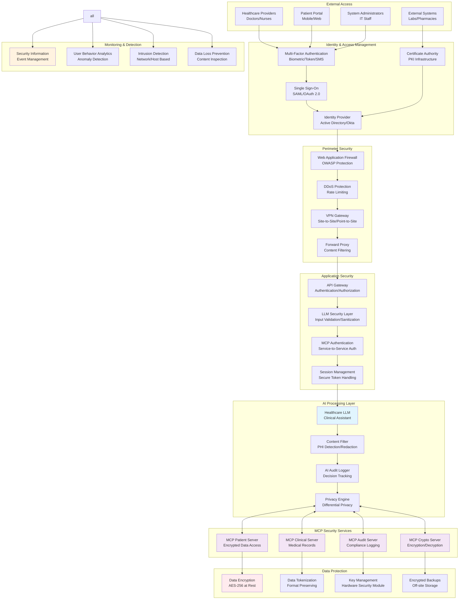
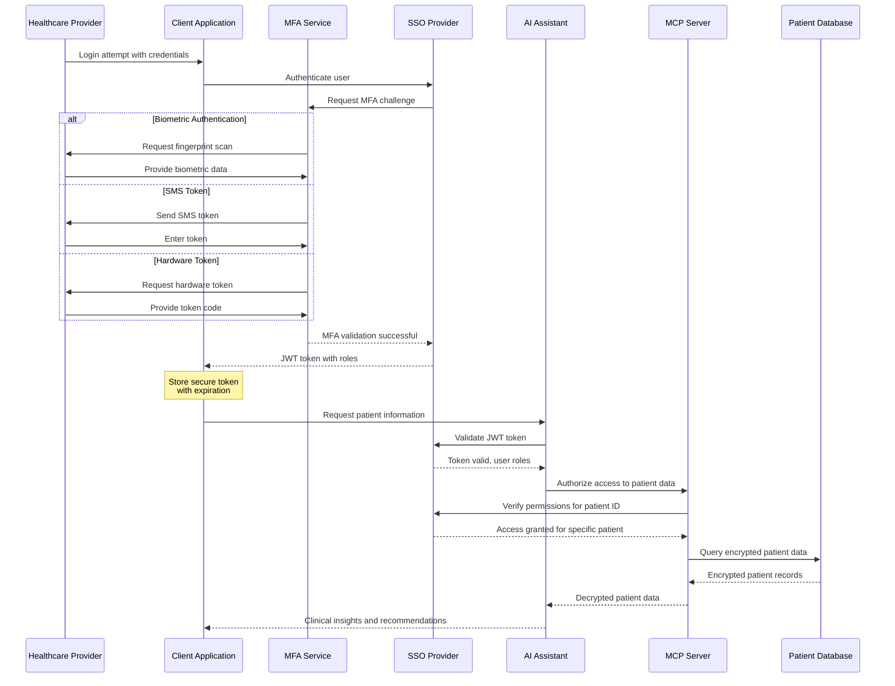
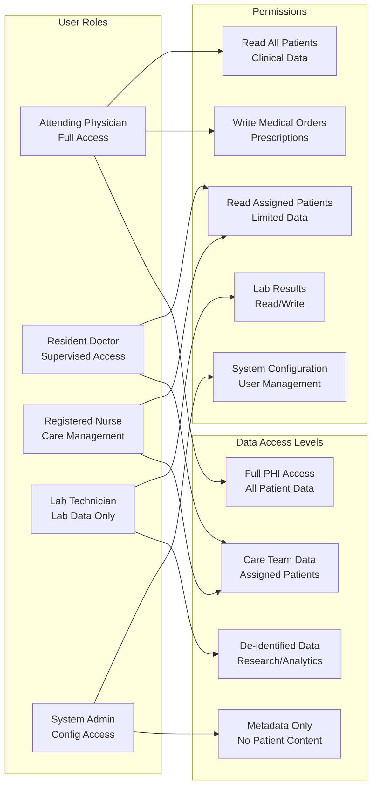
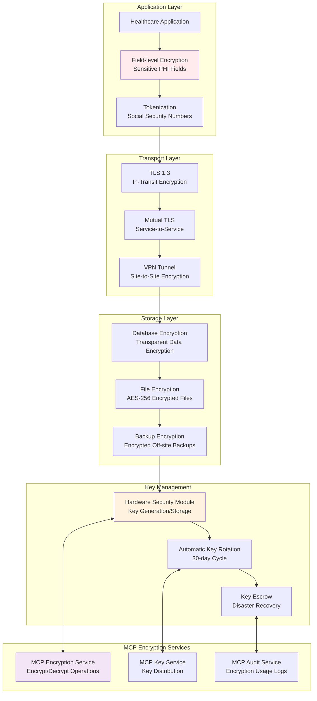
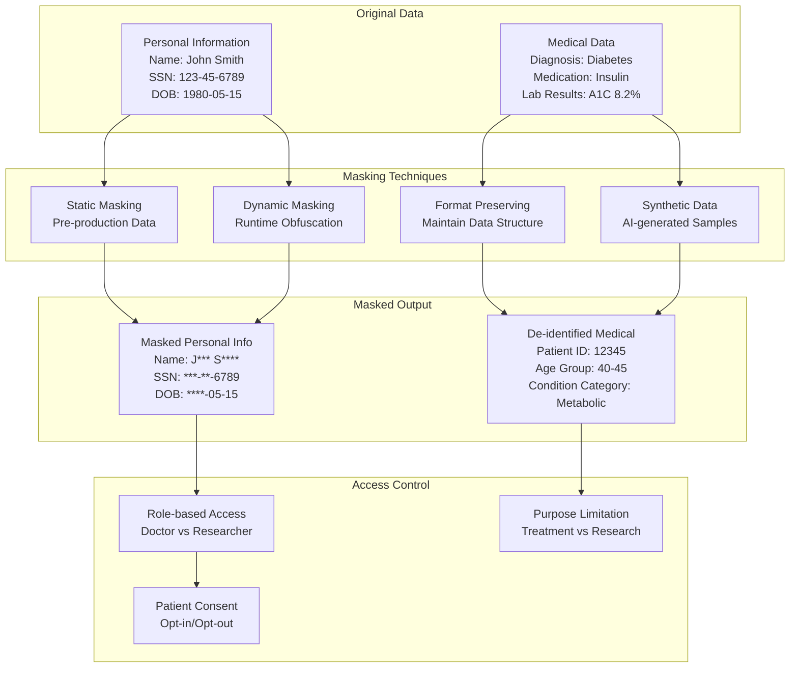
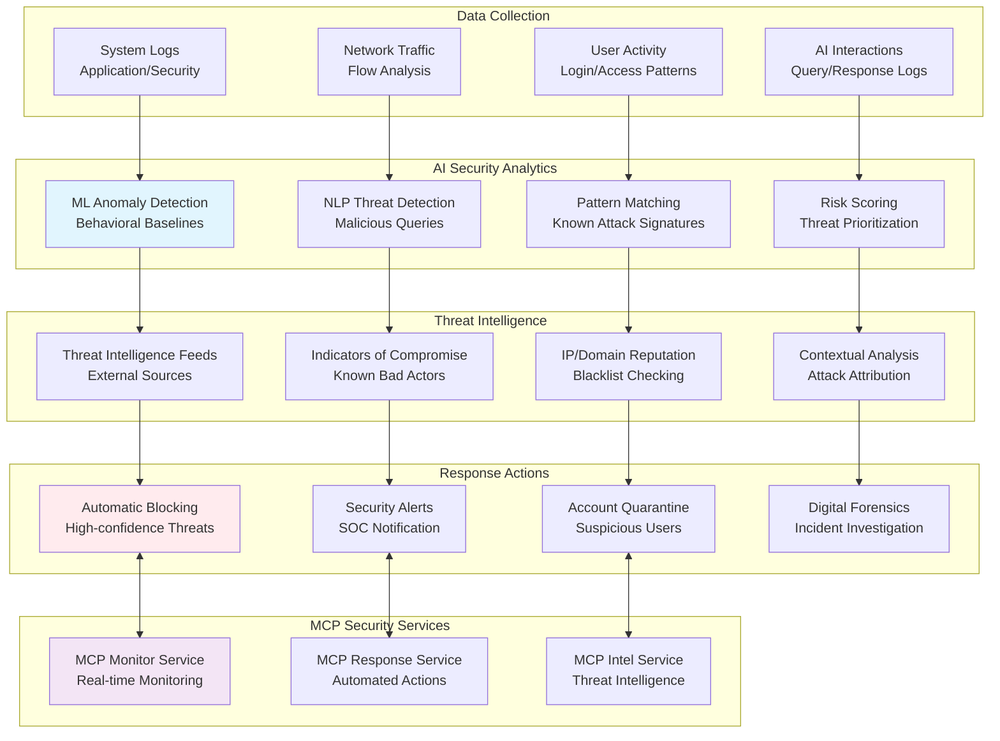
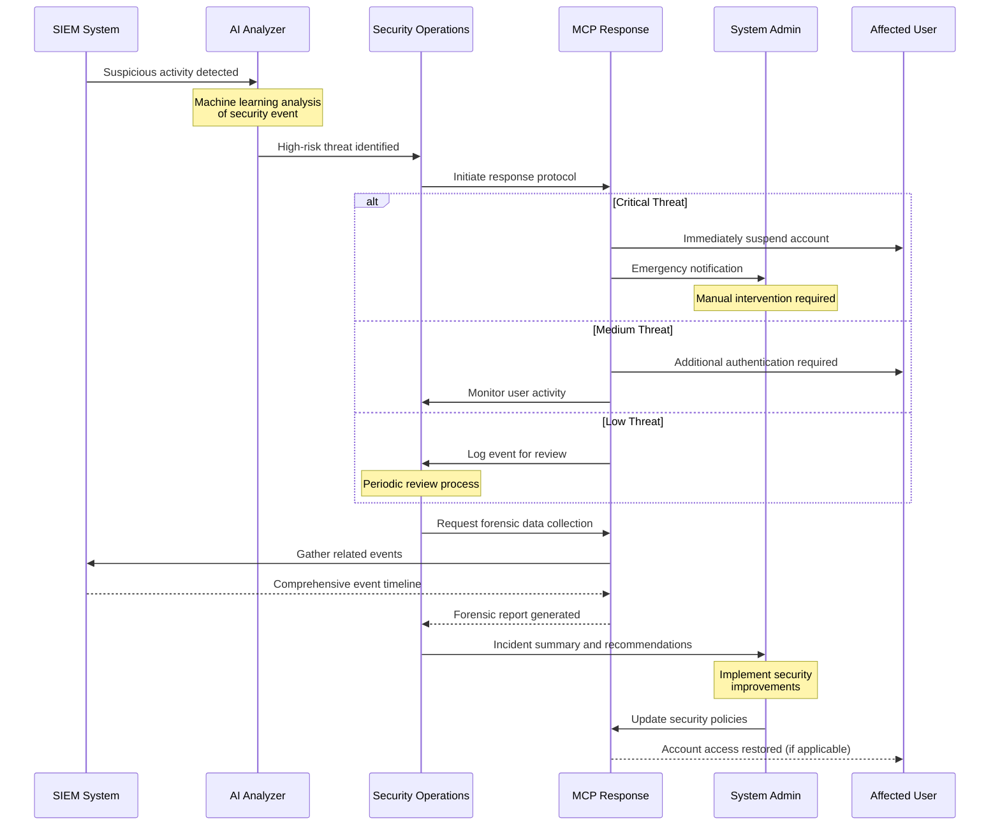

# Security and Authentication Patterns

This diagram illustrates comprehensive security patterns for MCP-enabled AI systems, covering authentication, authorization, data protection, and threat detection.

## Use Case: Healthcare AI Assistant with HIPAA Compliance

An AI-powered healthcare system that provides clinical decision support, patient information management, and treatment recommendations while maintaining strict HIPAA compliance and protecting sensitive patient data.

## Zero Trust Security Architecture

## Authentication and Authorization Flow

### Multi-Factor Authentication Process

### Role-Based Access Control (RBAC)

## Data Protection and Encryption

### Multi-Layer Encryption Strategy

### Data Masking and Anonymization

## Threat Detection and Response

### AI-Powered Security Monitoring

### Incident Response Workflow

## Compliance and Audit Framework

### HIPAA Compliance Architecture

```mermaid
graph TB
    subgraph "Administrative Safeguards"
        POLICY[Security Policies<br/>Written Procedures]
        TRAINING[Security Training<br/>Staff Education]
        ACCESS_MGMT[Access Management<br/>User Provisioning]
        INCIDENT[Incident Response<br/>Breach Procedures]
    end
    
    subgraph "Physical Safeguards"
        FACILITY[Facility Access<br/>Secure Data Centers]
        WORKSTATION[Workstation Security<br/>Endpoint Protection]
        MEDIA[Media Controls<br/>Data Disposal]
        DEVICE[Device Controls<br/>Mobile Device Management]
    end
    
    subgraph "Technical Safeguards"
        AUTH[Access Control<br/>User Authentication]
        AUDIT_LOG[Audit Logs<br/>Activity Tracking]
        INTEGRITY[Data Integrity<br/>Tamper Detection]
        TRANSMISSION[Secure Transmission<br/>End-to-end Encryption]
    end
    
    subgraph "MCP Compliance Services"
        MCP_AUDIT[MCP Audit Service<br/>Compliance Monitoring]
        MCP_REPORT[MCP Report Service<br/>Automated Reporting]
        MCP_ALERT[MCP Alert Service<br/>Compliance Violations]
    end
    
    POLICY --> MCP_AUDIT
    TRAINING --> MCP_AUDIT
    ACCESS_MGMT --> MCP_AUDIT
    INCIDENT --> MCP_ALERT
    
    FACILITY --> MCP_AUDIT
    WORKSTATION --> MCP_AUDIT
    MEDIA --> MCP_AUDIT
    DEVICE --> MCP_AUDIT
    
    AUTH --> MCP_AUDIT
    AUDIT_LOG --> MCP_REPORT
    INTEGRITY --> MCP_ALERT
    TRANSMISSION --> MCP_AUDIT
    
    style MCP_AUDIT fill:#f3e5f5
    style AUTH fill:#e1f5fe
    style AUDIT_LOG fill:#fff3e0
```

## Security Benefits and Outcomes

### Risk Mitigation
- **Zero Trust Architecture**: Never trust, always verify approach
- **Defense in Depth**: Multiple security layers prevent single point of failure
- **Continuous Monitoring**: Real-time threat detection and response
- **Compliance Automation**: Automated HIPAA, SOX, and PCI compliance checking

### Privacy Protection
- **Data Minimization**: Only collect and process necessary data
- **Purpose Limitation**: Use data only for specified purposes
- **Consent Management**: Respect user privacy preferences
- **Right to be Forgotten**: Automated data deletion capabilities

### Operational Security
- **Incident Response**: Automated threat response reduces MTTR
- **Audit Trail**: Complete activity logging for forensic analysis
- **Key Management**: Secure key lifecycle management
- **Secure Development**: Security built into development lifecycle
