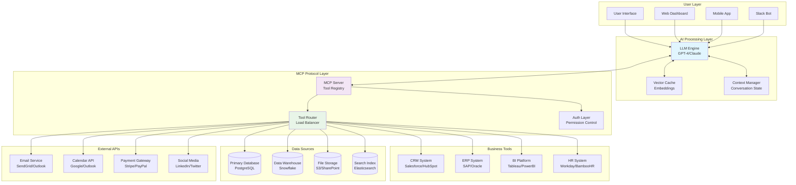
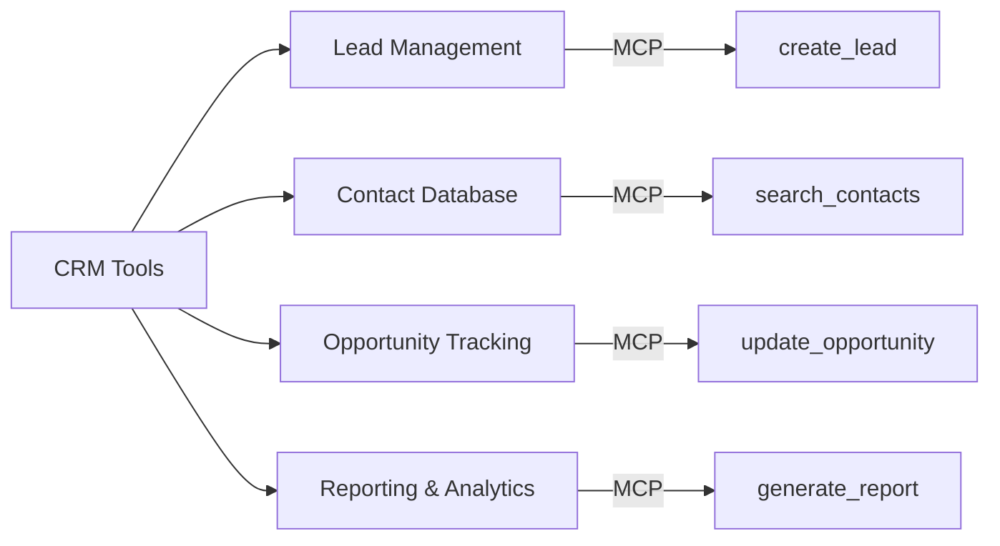
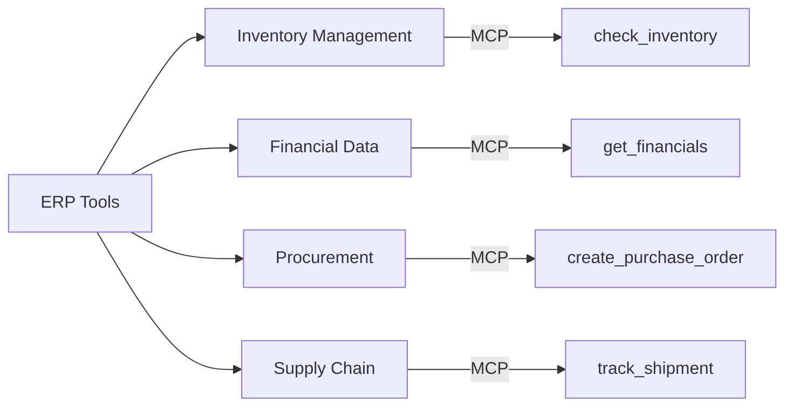
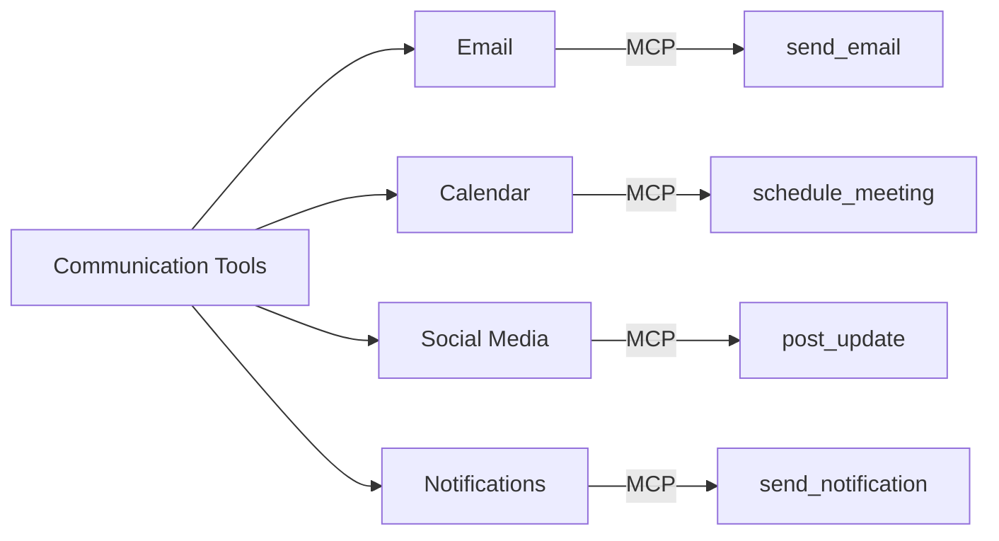
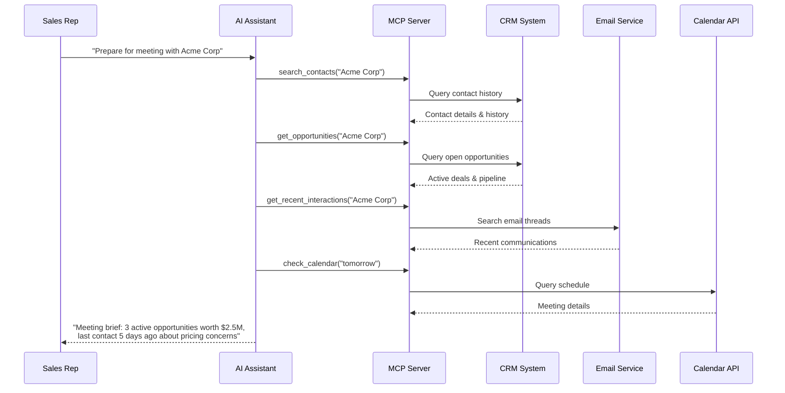
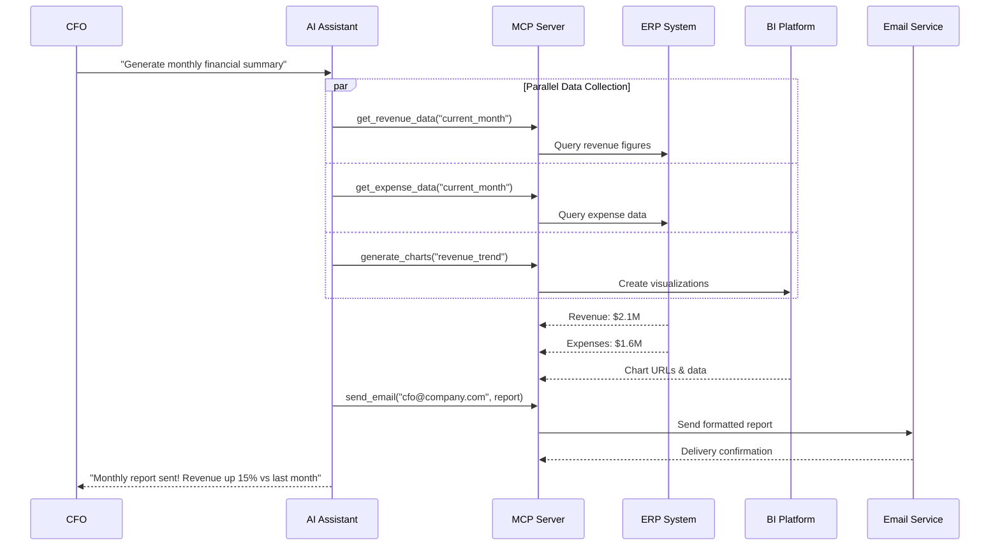

# Tool Integration via MCP

This diagram demonstrates how multiple external tools and services integrate through MCP to create powerful AI capabilities.

## Use Case: Comprehensive Business Intelligence Assistant

An AI assistant that integrates with multiple business tools to provide comprehensive insights, automate workflows, and generate reports.

## Architecture Diagram

## Tool Categories and Capabilities

### 1. **Customer Relationship Management (CRM)**

### 2. **Enterprise Resource Planning (ERP)**

### 3. **Communication & Collaboration**

## Real-World Integration Examples

### Sales Intelligence Workflow

### Financial Reporting Automation

## Implementation Considerations

### Security & Authentication
- **OAuth 2.0/SAML**: Secure authentication with business tools
- **Role-Based Access**: Granular permissions per user and tool
- **Audit Logging**: Complete tool usage tracking
- **Data Encryption**: End-to-end encryption for sensitive data

### Performance Optimization
- **Connection Pooling**: Reuse database connections across requests
- **Caching Strategy**: Cache frequently accessed data and tool responses
- **Async Processing**: Non-blocking execution for long-running operations
- **Rate Limiting**: Prevent API quota exhaustion

### Error Handling
- **Graceful Degradation**: Fallback options when tools are unavailable
- **Retry Logic**: Automatic retry with exponential backoff
- **Circuit Breakers**: Prevent cascade failures
- **User-Friendly Messages**: Clear error communication to end users
