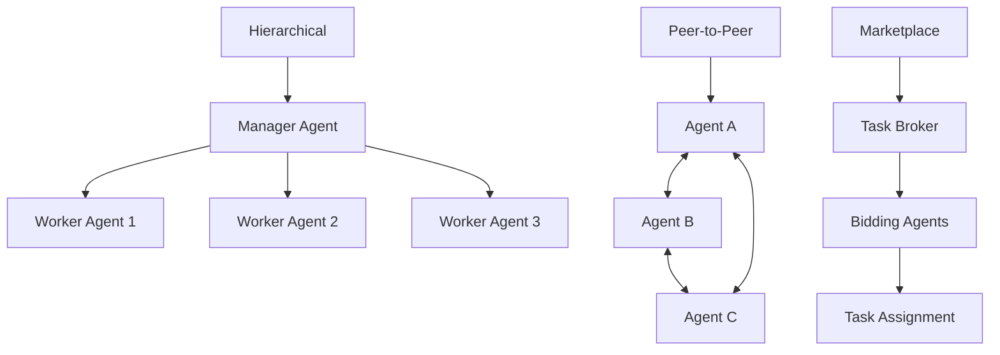

# Multi-Agent Collaboration Platform Fundamentals

Multi-Agent Collaboration Platforms (MCP) enable multiple AI agents to work together on complex tasks that exceed the capabilities of individual agents. This section covers the core concepts, architectures, and implementation strategies.

## 🤝 Core MCP Concepts

### What is a Multi-Agent Collaboration Platform?

**Definition**: A system where multiple autonomous AI agents coordinate, communicate, and collaborate to solve complex problems that require diverse skills, knowledge, or perspectives.

**Key Characteristics**:
- **Distributed Intelligence**: Processing distributed across multiple agents
- **Autonomous Agents**: Each agent operates independently with its own goals
- **Collaborative Problem-Solving**: Agents work together toward common objectives
- **Dynamic Coordination**: Flexible role assignment and task distribution

### Agent Interaction Patterns



## 🏗️ MCP Architecture Patterns

### 1. Centralized Coordination

```python
import asyncio
from typing import Dict, List, Any, Optional
from enum import Enum
import json

class AgentStatus(Enum):
    IDLE = "idle"
    BUSY = "busy" 
    OFFLINE = "offline"

class CentralCoordinator:
    """Centralized agent coordination system"""
    
    def __init__(self):
        self.agents = {}
        self.task_queue = []
        self.active_tasks = {}
        self.agent_capabilities = {}
    
    def register_agent(self, agent_id: str, capabilities: List[str]):
        """Register new agent with capabilities"""
        self.agents[agent_id] = {
            'status': AgentStatus.IDLE,
            'current_task': None,
            'last_heartbeat': asyncio.get_event_loop().time(),
            'completed_tasks': 0
        }
        self.agent_capabilities[agent_id] = capabilities
        print(f"Agent {agent_id} registered with capabilities: {capabilities}")
    
    def submit_task(self, task: Dict[str, Any]) -> str:
        """Submit task for execution"""
        task_id = f"task_{len(self.active_tasks)}"
        task['id'] = task_id
        task['status'] = 'pending'
        self.task_queue.append(task)
        return task_id
    
    async def assign_tasks(self):
        """Assign pending tasks to available agents"""
        while self.task_queue:
            task = self.task_queue[0]
            required_capabilities = task.get('required_capabilities', [])
            
            # Find suitable agent
            suitable_agent = self.find_suitable_agent(required_capabilities)
            
            if suitable_agent:
                # Assign task
                self.task_queue.pop(0)
                self.active_tasks[task['id']] = task
                self.agents[suitable_agent]['status'] = AgentStatus.BUSY
                self.agents[suitable_agent]['current_task'] = task['id']
                
                # Simulate task execution
                asyncio.create_task(self.execute_task(suitable_agent, task))
            else:
                break  # No suitable agent available
    
    def find_suitable_agent(self, required_capabilities: List[str]) -> Optional[str]:
        """Find agent with required capabilities"""
        for agent_id, agent_info in self.agents.items():
            if agent_info['status'] == AgentStatus.IDLE:
                agent_caps = self.agent_capabilities.get(agent_id, [])
                if all(cap in agent_caps for cap in required_capabilities):
                    return agent_id
        return None
    
    async def execute_task(self, agent_id: str, task: Dict[str, Any]):
        """Execute task with assigned agent"""
        print(f"Agent {agent_id} executing task {task['id']}: {task.get('description', 'N/A')}")
        
        # Simulate task execution time
        execution_time = task.get('estimated_duration', 2.0)
        await asyncio.sleep(execution_time)
        
        # Complete task
        self.agents[agent_id]['status'] = AgentStatus.IDLE
        self.agents[agent_id]['current_task'] = None
        self.agents[agent_id]['completed_tasks'] += 1
        
        task['status'] = 'completed'
        print(f"Task {task['id']} completed by agent {agent_id}")
    
    def get_system_status(self) -> Dict[str, Any]:
        """Get overall system status"""
        total_agents = len(self.agents)
        idle_agents = sum(1 for a in self.agents.values() if a['status'] == AgentStatus.IDLE)
        busy_agents = sum(1 for a in self.agents.values() if a['status'] == AgentStatus.BUSY)
        
        return {
            'total_agents': total_agents,
            'idle_agents': idle_agents,
            'busy_agents': busy_agents,
            'pending_tasks': len(self.task_queue),
            'active_tasks': len(self.active_tasks),
            'agent_details': self.agents
        }

# Example usage
async def demo_central_coordination():
    coordinator = CentralCoordinator()
    
    # Register agents with different capabilities
    coordinator.register_agent('agent_web', ['web_search', 'data_extraction'])
    coordinator.register_agent('agent_nlp', ['text_analysis', 'summarization'])
    coordinator.register_agent('agent_math', ['calculation', 'data_analysis'])
    
    # Submit tasks
    tasks = [
        {'description': 'Search web for AI news', 'required_capabilities': ['web_search']},
        {'description': 'Analyze sentiment', 'required_capabilities': ['text_analysis']},
        {'description': 'Calculate statistics', 'required_capabilities': ['calculation']},
    ]
    
    for task in tasks:
        task_id = coordinator.submit_task(task)
        print(f"Submitted task: {task_id}")
    
    # Process tasks
    await coordinator.assign_tasks()
    
    # Wait for completion
    await asyncio.sleep(3)
    
    status = coordinator.get_system_status()
    print(f"System Status: {json.dumps(status, indent=2)}")

# asyncio.run(demo_central_coordination())
```

### 2. Decentralized P2P Coordination

```python
class P2PAgent:
    """Peer-to-peer agent in decentralized system"""
    
    def __init__(self, agent_id: str, capabilities: List[str]):
        self.agent_id = agent_id
        self.capabilities = capabilities
        self.peers = {}
        self.message_queue = []
        self.reputation_scores = {}
    
    def add_peer(self, peer_id: str, peer_capabilities: List[str]):
        """Add peer agent"""
        self.peers[peer_id] = {
            'capabilities': peer_capabilities,
            'last_seen': asyncio.get_event_loop().time(),
            'trust_score': 0.5
        }
    
    async def broadcast_task(self, task: Dict[str, Any]) -> List[str]:
        """Broadcast task to suitable peers"""
        required_caps = task.get('required_capabilities', [])
        suitable_peers = []
        
        for peer_id, peer_info in self.peers.items():
            if any(cap in peer_info['capabilities'] for cap in required_caps):
                suitable_peers.append(peer_id)
        
        # Simulate broadcasting
        responses = []
        for peer_id in suitable_peers:
            if self.peers[peer_id]['trust_score'] > 0.3:  # Minimum trust
                responses.append(peer_id)
        
        return responses
    
    async def collaborate_on_task(self, task: Dict[str, Any], collaborators: List[str]):
        """Collaborate with peers on complex task"""
        print(f"Agent {self.agent_id} collaborating with {collaborators} on task")
        
        # Divide task among collaborators
        subtasks = self.divide_task(task, collaborators)
        
        # Execute subtasks
        results = {}
        for subtask_id, subtask in subtasks.items():
            if subtask['assigned_to'] == self.agent_id:
                result = await self.execute_subtask(subtask)
                results[subtask_id] = result
        
        return results
    
    def divide_task(self, task: Dict[str, Any], collaborators: List[str]) -> Dict[str, Any]:
        """Divide complex task into subtasks"""
        subtasks = {}
        
        if 'web_search' in task.get('required_capabilities', []):
            subtasks['search'] = {
                'type': 'web_search',
                'assigned_to': self.find_best_peer_for_capability('web_search', collaborators),
                'description': 'Search for relevant information'
            }
        
        if 'text_analysis' in task.get('required_capabilities', []):
            subtasks['analysis'] = {
                'type': 'text_analysis', 
                'assigned_to': self.find_best_peer_for_capability('text_analysis', collaborators),
                'description': 'Analyze gathered information'
            }
        
        return subtasks
    
    def find_best_peer_for_capability(self, capability: str, candidates: List[str]) -> str:
        """Find best peer for specific capability"""
        best_peer = self.agent_id
        best_score = 0.0
        
        for peer_id in candidates + [self.agent_id]:
            if capability in self.get_capabilities(peer_id):
                score = self.reputation_scores.get(peer_id, 0.5)
                if score > best_score:
                    best_score = score
                    best_peer = peer_id
        
        return best_peer
    
    def get_capabilities(self, agent_id: str) -> List[str]:
        """Get capabilities of agent"""
        if agent_id == self.agent_id:
            return self.capabilities
        return self.peers.get(agent_id, {}).get('capabilities', [])
    
    async def execute_subtask(self, subtask: Dict[str, Any]) -> Dict[str, Any]:
        """Execute assigned subtask"""
        print(f"Agent {self.agent_id} executing subtask: {subtask['description']}")
        await asyncio.sleep(1.0)  # Simulate execution
        return {'status': 'completed', 'result': f"Result from {self.agent_id}"}

# Example P2P system
async def demo_p2p_system():
    # Create agents
    agent1 = P2PAgent('search_agent', ['web_search', 'data_extraction'])
    agent2 = P2PAgent('nlp_agent', ['text_analysis', 'summarization'])  
    agent3 = P2PAgent('coordinator', ['task_planning', 'coordination'])
    
    # Connect agents as peers
    agent1.add_peer('nlp_agent', ['text_analysis', 'summarization'])
    agent1.add_peer('coordinator', ['task_planning', 'coordination'])
    
    agent2.add_peer('search_agent', ['web_search', 'data_extraction'])
    agent2.add_peer('coordinator', ['task_planning', 'coordination'])
    
    # Collaborative task
    complex_task = {
        'description': 'Research and analyze market trends',
        'required_capabilities': ['web_search', 'text_analysis']
    }
    
    collaborators = await agent1.broadcast_task(complex_task)
    results = await agent1.collaborate_on_task(complex_task, collaborators)
    
    print(f"Collaboration results: {results}")

# asyncio.run(demo_p2p_system())
```

## 🔄 Communication Protocols

### Message Passing Framework

```python
from enum import Enum
import uuid
from dataclasses import dataclass
from typing import Union

class MessageType(Enum):
    TASK_REQUEST = "task_request"
    TASK_RESPONSE = "task_response"  
    COORDINATION = "coordination"
    HEARTBEAT = "heartbeat"
    RESOURCE_SHARE = "resource_share"

@dataclass
class AgentMessage:
    """Standard message format for agent communication"""
    sender: str
    receiver: str
    message_type: MessageType
    content: Dict[str, Any]
    message_id: str = None
    reply_to: str = None
    timestamp: float = None
    priority: int = 1  # 1=high, 5=low
    
    def __post_init__(self):
        if self.message_id is None:
            self.message_id = str(uuid.uuid4())
        if self.timestamp is None:
            self.timestamp = asyncio.get_event_loop().time()

class MessageBroker:
    """Centralized message broker for agent communication"""
    
    def __init__(self):
        self.agents = {}
        self.message_queues = {}
        self.message_history = []
    
    def register_agent(self, agent_id: str, message_handler):
        """Register agent with message handler"""
        self.agents[agent_id] = message_handler
        self.message_queues[agent_id] = []
    
    async def send_message(self, message: AgentMessage):
        """Send message to target agent"""
        if message.receiver not in self.agents:
            print(f"Agent {message.receiver} not found")
            return
        
        # Add to queue
        self.message_queues[message.receiver].append(message)
        self.message_history.append(message)
        
        # Deliver message
        handler = self.agents[message.receiver]
        await handler(message)
    
    async def broadcast_message(self, sender: str, message_type: MessageType, 
                               content: Dict[str, Any], priority: int = 1):
        """Broadcast message to all agents"""
        for agent_id in self.agents:
            if agent_id != sender:
                message = AgentMessage(
                    sender=sender,
                    receiver=agent_id,
                    message_type=message_type,
                    content=content,
                    priority=priority
                )
                await self.send_message(message)
    
    def get_agent_messages(self, agent_id: str, limit: int = 10) -> List[AgentMessage]:
        """Get recent messages for agent"""
        return self.message_queues.get(agent_id, [])[-limit:]

class CommunicativeAgent:
    """Agent with communication capabilities"""
    
    def __init__(self, agent_id: str, broker: MessageBroker):
        self.agent_id = agent_id
        self.broker = broker
        self.broker.register_agent(agent_id, self.handle_message)
    
    async def handle_message(self, message: AgentMessage):
        """Handle incoming messages"""
        print(f"Agent {self.agent_id} received {message.message_type.value} from {message.sender}")
        
        if message.message_type == MessageType.TASK_REQUEST:
            await self.handle_task_request(message)
        elif message.message_type == MessageType.COORDINATION:
            await self.handle_coordination(message)
    
    async def handle_task_request(self, message: AgentMessage):
        """Handle task request"""
        task = message.content.get('task')
        print(f"Processing task request: {task.get('description', 'N/A')}")
        
        # Send response
        response = AgentMessage(
            sender=self.agent_id,
            receiver=message.sender,
            message_type=MessageType.TASK_RESPONSE,
            content={'status': 'accepted', 'task_id': task.get('id')},
            reply_to=message.message_id
        )
        await self.broker.send_message(response)
    
    async def handle_coordination(self, message: AgentMessage):
        """Handle coordination message"""
        coord_type = message.content.get('type')
        print(f"Coordination message: {coord_type}")
    
    async def request_collaboration(self, target_agent: str, task: Dict[str, Any]):
        """Request collaboration from another agent"""
        message = AgentMessage(
            sender=self.agent_id,
            receiver=target_agent,
            message_type=MessageType.TASK_REQUEST,
            content={'task': task}
        )
        await self.broker.send_message(message)

# Example communication system
async def demo_communication():
    broker = MessageBroker()
    
    # Create communicative agents
    agent1 = CommunicativeAgent('researcher', broker)
    agent2 = CommunicativeAgent('analyst', broker) 
    agent3 = CommunicativeAgent('writer', broker)
    
    # Agent 1 requests collaboration
    task = {
        'id': 'research_task_1',
        'description': 'Analyze market trends',
        'requirements': ['data_analysis', 'report_writing']
    }
    
    await agent1.request_collaboration('analyst', task)
    await agent2.request_collaboration('writer', task)
    
    # Broadcast coordination message
    await broker.broadcast_message(
        sender='researcher',
        message_type=MessageType.COORDINATION,
        content={'type': 'project_update', 'status': 'in_progress'}
    )

# asyncio.run(demo_communication())
```

## 🧠 Consensus and Decision Making

### Voting-Based Consensus

```python
class ConsensusManager:
    """Manage consensus decisions among agents"""
    
    def __init__(self):
        self.active_votes = {}
        self.vote_history = []
    
    def create_vote(self, proposal_id: str, proposal: Dict[str, Any], 
                   eligible_agents: List[str], vote_type: str = "majority") -> str:
        """Create new vote"""
        self.active_votes[proposal_id] = {
            'proposal': proposal,
            'eligible_agents': set(eligible_agents),
            'votes': {},
            'vote_type': vote_type,
            'status': 'active',
            'created_at': asyncio.get_event_loop().time()
        }
        return proposal_id
    
    def cast_vote(self, proposal_id: str, agent_id: str, vote: str, 
                 confidence: float = 1.0) -> bool:
        """Cast vote for proposal"""
        if proposal_id not in self.active_votes:
            return False
        
        vote_data = self.active_votes[proposal_id]
        
        if agent_id not in vote_data['eligible_agents']:
            return False
        
        vote_data['votes'][agent_id] = {
            'vote': vote,
            'confidence': confidence,
            'timestamp': asyncio.get_event_loop().time()
        }
        
        # Check if consensus reached
        self.check_consensus(proposal_id)
        return True
    
    def check_consensus(self, proposal_id: str):
        """Check if consensus has been reached"""
        vote_data = self.active_votes[proposal_id]
        
        if vote_data['status'] != 'active':
            return
        
        total_eligible = len(vote_data['eligible_agents'])
        votes_cast = len(vote_data['votes'])
        
        # Check participation threshold
        if votes_cast < total_eligible * 0.6:  # 60% participation required
            return
        
        vote_counts = {}
        confidence_weights = {}
        
        for agent_id, vote_info in vote_data['votes'].items():
            vote_option = vote_info['vote']
            confidence = vote_info['confidence']
            
            vote_counts[vote_option] = vote_counts.get(vote_option, 0) + 1
            confidence_weights[vote_option] = confidence_weights.get(vote_option, 0) + confidence
        
        # Determine winner based on vote type
        if vote_data['vote_type'] == 'majority':
            winner = max(vote_counts.items(), key=lambda x: x[1])
            if winner[1] > total_eligible / 2:
                vote_data['status'] = 'passed'
                vote_data['result'] = winner[0]
        
        elif vote_data['vote_type'] == 'confidence_weighted':
            winner = max(confidence_weights.items(), key=lambda x: x[1])
            vote_data['status'] = 'passed'
            vote_data['result'] = winner[0]
        
        if vote_data['status'] == 'passed':
            print(f"Consensus reached for {proposal_id}: {vote_data['result']}")
    
    def get_vote_status(self, proposal_id: str) -> Dict[str, Any]:
        """Get current vote status"""
        return self.active_votes.get(proposal_id, {})

# Example consensus system
async def demo_consensus():
    consensus = ConsensusManager()
    
    # Create vote
    proposal = {
        'action': 'deploy_model',
        'model_version': 'v2.1',
        'deployment_environment': 'production'
    }
    
    agents = ['safety_agent', 'performance_agent', 'security_agent', 'ops_agent']
    proposal_id = consensus.create_vote('deploy_v2_1', proposal, agents, 'majority')
    
    # Agents cast votes
    consensus.cast_vote(proposal_id, 'safety_agent', 'approve', 0.9)
    consensus.cast_vote(proposal_id, 'performance_agent', 'approve', 0.8)
    consensus.cast_vote(proposal_id, 'security_agent', 'reject', 0.7)
    consensus.cast_vote(proposal_id, 'ops_agent', 'approve', 0.85)
    
    status = consensus.get_vote_status(proposal_id)
    print(f"Vote result: {status.get('result', 'No consensus')}")

# asyncio.run(demo_consensus())
```

## 🔧 Popular MCP Frameworks

### AutoGen Framework Example

```python
# Simplified AutoGen-style implementation
class AutoGenAgent:
    """AutoGen-style conversational agent"""
    
    def __init__(self, name: str, system_message: str, llm_client=None):
        self.name = name
        self.system_message = system_message
        self.conversation_history = []
        self.llm_client = llm_client
    
    async def generate_response(self, message: str, context: List[Dict] = None) -> str:
        """Generate response to message"""
        # Add to conversation history
        self.conversation_history.append({"role": "user", "content": message})
        
        # Build prompt with context
        prompt_parts = [self.system_message]
        if context:
            prompt_parts.extend([f"{ctx['sender']}: {ctx['message']}" for ctx in context])
        prompt_parts.append(f"User: {message}")
        
        # Simulate LLM response
        response = f"[{self.name}] Response to: {message}"
        
        self.conversation_history.append({"role": "assistant", "content": response})
        return response

class GroupChat:
    """Multi-agent group conversation"""
    
    def __init__(self):
        self.agents = {}
        self.conversation_log = []
        self.turn_order = []
        self.current_speaker = 0
    
    def add_agent(self, agent: AutoGenAgent):
        """Add agent to group chat"""
        self.agents[agent.name] = agent
        self.turn_order.append(agent.name)
    
    async def initiate_discussion(self, initial_message: str, max_rounds: int = 5):
        """Start group discussion"""
        print(f"Starting group discussion: {initial_message}")
        
        current_message = initial_message
        
        for round_num in range(max_rounds):
            speaker_name = self.turn_order[self.current_speaker % len(self.turn_order)]
            speaker = self.agents[speaker_name]
            
            # Generate response
            context = self.conversation_log[-3:] if self.conversation_log else []
            response = await speaker.generate_response(current_message, context)
            
            # Log conversation
            self.conversation_log.append({
                'round': round_num,
                'speaker': speaker_name,
                'message': response,
                'timestamp': asyncio.get_event_loop().time()
            })
            
            print(f"Round {round_num + 1} - {speaker_name}: {response}")
            
            current_message = response
            self.current_speaker += 1
        
        return self.conversation_log

# Example group chat
async def demo_group_chat():
    chat = GroupChat()
    
    # Create specialized agents
    researcher = AutoGenAgent(
        "Researcher", 
        "You are a research specialist. Provide factual, well-researched information."
    )
    
    analyst = AutoGenAgent(
        "Analyst",
        "You are a data analyst. Focus on data-driven insights and trends."
    )
    
    critic = AutoGenAgent(
        "Critic",
        "You are a critical thinker. Question assumptions and identify potential issues."
    )
    
    # Add agents to chat
    chat.add_agent(researcher)
    chat.add_agent(analyst)
    chat.add_agent(critic)
    
    # Start discussion
    await chat.initiate_discussion(
        "What are the key considerations for deploying large language models in production?",
        max_rounds=6
    )

# asyncio.run(demo_group_chat())
```

## ✅ MCP Implementation Checklist

**Architecture Design**:
- [ ] Choose coordination pattern (centralized/decentralized)
- [ ] Define agent roles and capabilities
- [ ] Design communication protocols
- [ ] Plan task decomposition strategies

**Communication Layer**:
- [ ] Implement message passing framework
- [ ] Define message formats and types
- [ ] Build routing and delivery mechanisms
- [ ] Add error handling and retries

**Coordination Mechanisms**:
- [ ] Implement task assignment logic
- [ ] Build consensus protocols
- [ ] Create conflict resolution procedures
- [ ] Add load balancing capabilities

**Monitoring and Management**:
- [ ] Agent health monitoring
- [ ] Performance metrics collection
- [ ] Debug and logging systems
- [ ] Administrative interfaces

## 🚀 Next Steps

Continue with:

1. **[Communication Protocols](communication.md)** - Advanced messaging patterns
2. **[Coordination Strategies](coordination.md)** - Sophisticated coordination algorithms  
3. **[Frameworks & Tools](frameworks.md)** - Production-ready MCP frameworks

---

*Multi-Agent Collaboration Platforms represent the cutting edge of AI system architecture, enabling sophisticated problem-solving through distributed intelligence and coordinated action.*
